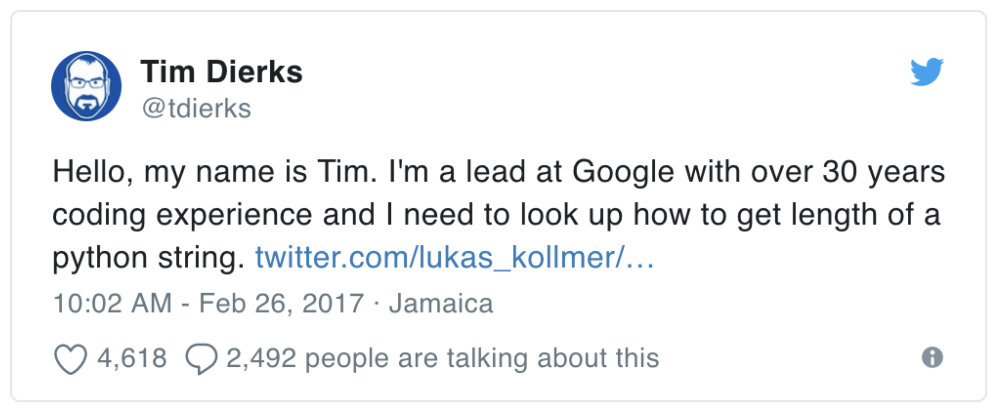

# Orientation -  Welcome to Python Programming Live Online!

## Course "Home Room"

* [https://git.generalassemb.ly/PYTHR-2021-11/course-materials](https://git.generalassemb.ly/PYTHR-2021-11/course-materials)
* **Bookmark it!**
* Source of all information about the course

## Course Overview

Throughout this course, you will:

* Learn programming fundamentals and Python basics that get you coding from day one
* Build Python programs of increasing complexity throughout the course
* Learn about data structures, functions, conditionals, and loops
* Learn the essentials of object-oriented programming
* Troubleshoot Python code
* Push your skills to the next level by working with files, modules, and web application programming interfaces
* Learn the basics of programming on the web with an introduction to web development
* Dive into an introduction to data science and data visualization
* Complete homework along the way to strengthen your skills
* [Official Syllabus](assets/syllabus.pdf)

### Prerequisites

This is a beginner-level course!

No programming experience or other prerequisites required, *except* for basic computer and internet skills:

* Working with your computer:
   * Typing skills
   * Understanding of files and folders
   * Maintaining and updating your computer
   * Managing multiple applications and windows
   * Ability to install programs
   * Usage of a web browser, how to use web sites and web apps, URLs, etc
* Working with collaborative applications such as:
   * Google Drive
   * Slack
   * Zoom
   * Etc.

## Introductions!

Please write into Slack: 

* Your Name
* Where in the World are You?
* One sentence on why you're taking this course
* ... and your favourite candy or snack!

## Your IA: Hunter Wallen!

I am a Full-Stack Software Engineer with Modivcare. I love to help other people learn about coding and spend most of my free time either skiing or building passion projects.

## And your TA: Ed Salinas!

My name Ed Salinas, and I work as a Quality and Systems Innovation Engineer at Samsung Austin Semiconductor in Austin, Texas using Python to build Web Apps and Dashboards to help our Applications and Equipment Engineers monitor the manufacturing floor and their tools.

<!--
## And your IA!

[Kihoon Sohn](https://generalassemb.ly/instructors/kihoon-sohn/18914) - Data scientist and travel hacker
-->

## And me!

[Fred Ngo](https://generalassemb.ly/instructors/fred-ngo/20578) - I'm from Toronto, Canada, I’ve been an entrepreneur and developer for over 20 years, worked at companies both big and small, lead development teams, and even founded my own software company. I am looking forward to sharing my experiences with you and guiding you on a fantastic journey into learning Python programming!

You can find me on LinkedIn at [https://linkedin.com/in/fredngo](https://linkedin.com/in/fredngo). (I will accept connection requests *after you graduate*.)

And you can find my cat Cora at [https://www.instagram.com/seriouscora](https://www.instagram.com/seriouscora)!

---

# Classroom Culture

* Welcome to the "Live Online" classroom! (Old name: "Remote" classroom)
* Different from a plain "Online" classroom, where there may not even be a live instructor!
* [GA Online Norms and Best Practices](https://docs.google.com/presentation/d/1v8UE53c0al_82DZb8Jy6xTfDdiXlkhlUxBL3n6HZaAQ/edit?usp=sharing)

## Communication

### Zoom

* Smile! You are expected to **be on camera**! This is just like being in a real classroom. :smile:
   * If you need to step away for a minute, please turn off your camera, but don't forget to come back!
* Please keep your microphone off until called upon

### Slack

Slack is the primary method of communication for the course.

We encourage you to ask questions on the Slack channel (instead of asking privately) so that everyone can benefit from the answers. If you have a question, chances are others have the same!

We typically respond fastest via Slack, and we typically respond slowest via email.

Please keep in mind that outside of class/office hours we are at our day jobs/with family or otherwise not at our computers, so may take longer to reply.

## Expectations

* What the heck did you sign up for?
* This *is* a beginner level course. No programming experience required. But...
* This is an **Accelerated Learning Environment** like all GA courses!
   * We're starting from scratch, but it's going to be **fast**!
   * We *cover more stuff and go faster than a college course*
* This is not a class where you can show up and watch like a TV show
* There will be a lot of collaborative work in the classroom -- many of the exercises will be completed in small groups or pairs.
   * We learn through doing!
* There will also be **a lot** of work outside class!
   * In a [college course](https://www.google.com/search?q=college+class+homework+hour+ratio), the standard is about a 2-3 hours of homework hours required per class hour
      * If you have 4 hours of class per week, that's 8-12 hours of homework
   * Remember that we go *cover more stuff and go faster than a college course*, so you need to invest at least as much time, so *more* than 8-12 hours per week of homework
* This **will** be the hardest thing you've ever done!

### Drop The Ego

* If Tim has to look things up, you will have to as well!
* Ask questions and ask for help
   * There are no stupid questions, you're beginners!
* Trait of Best Beginner Programmers: ***Spirit of Exploration***
   * Indeed, not just beginners, but all programmers

### Be Respective Of Everyone

* Be *on-time* to class
* Self-awareness
* Common sense
* Decency
* Respect each other's time
   * Show up if you make appointments with each other

---

# Graduation Requirements

To qualify for a **Letter of Completion**, students must adhere to all the academic policies outlined in the [Course Catalog](https://generalassemb.ly/regulatory-information).

   
The following are just highlights -- for specifics, please download and review the Course Catalog.

## Attendance

If you miss more than 3 days *regardless of reason*, you will not successfully complete the course.

You may have up to 3 **excused absences**. If you will have to miss a class due to an emergency, **notify the IA via Slack ahead of time**. Unexcused absences are **not allowed**.

You may have a 48-hour grace period for notifying the IA in case of emergency. Acceptable excuses include:

* Illness, death or critical illness to you or a family member or significant other
* Critical life emergency
* Religious observances
* Other extenuating circumstances as outlined in the Course Catalog

## Tardiness

If you arrive after class starts, you are late and will accrue one late arrival. If you leave before class ends, you will accrue one early departure. Three late arrivals or early departures = 1 absence.

## Complete Homework Assignments on Time

Assignments are due on the date/time indicated on the assignment. They will be graded by the IA/TAs about a week after submission. If the IA/TA extends to you a chance to re-submit the assignment after feedback, you will have three business days to do so.

You may have up to a three business day grace period period for extenuating circumstances (see above) if you get approval before the due date.

It’s strongly encouraged to work with your co-students outside of class on homework and assignments, but you will still turn in individual assignments.

To qualify for a Letter of Completion, you must **satisfactorily complete at least 80%** of the assigned homework.

## Complete Mid-Term Project

You'll complete a smaller mid-term project focused on web development. (There is no presenting of the mid-term project, but it is **required** to be completed to qualify for a Letter of Completion.)

## Complete Final Project

You'll complete a final project, asking you to apply your newly acquired skills to a problem of your choice.

You will have about two weeks to work on your final project. At the end of the course, you will present your results to your peers!

As the project is two weeks in duration, no grace periods apply. You are expected to start your project on time, work steadily towards completion, and meet expectations for the final project. Please communicate with us if any extenuating circumstances develop so that we can help you manage your time accordingly.

To qualify for a Letter of Completion, you must satisfactorily complete the final project and present it to your classmates.

We will talk more about the final project in due time!

---

# Other Logistics

## Exit Tickets :fire: **IMPORTANT** :fire:

* A short survey to help us better understand your learning growth
* Reviewed by the instructional team after every class

## Office Hours

Questions about class material or homework? Office Hours to the rescue!

* Office Hours are held on an appointment basis
* Etiquette for Office Hours:
   * Be ready to share your screen with the exact error message and the code that is causing that error!
   * Please limit yourself to booking **one appointment slot** at a time (buffet rules)
      * You can book another one *after* your appointment is over
* Take note of the schedule on the homepage, which is always updated to the latest information
  * The schedule is subject to change
  * The schedule excludes holidays

## Class Recordings

Class recordings are typically available the day after class -- they take a few hours to process after each class is finished.

Recordings are provided as a **courtesy** only, on a best-efforts basis, and are not an official part of GA's service delivery. They are not a substitute for attending class, and are meant for review and supplementary use.

You will find them on the **Course Schedule** once they are processed and available, under the **Recording** column. 

---

# Python Practice Resources

Here are some great resources for daily practice problems:

* [https://www.hackerrank.com](https://www.hackerrank.com)
* [https://www.codewars.com](https://www.codewars.com)
* [https://www.coderbyte.com](https://www.coderbyte.com)
* [https://www.codefights.com](https://www.codefights.com)
* [https://projecteuler.net](https://projecteuler.net)
* [https://github.com/shannonturner/python-lessons](https://github.com/shannonturner/python-lessons)

<!--

---

# How the Lessons Work

## Before Lesson

 * Mark your attendance in Slack where prompted 

* Be present in Slack
* Join the Zoom Room
* **Turn on your Camera**
* **Turn off your Phone**

## During Lesson

* Go through today's topics
* Preview homework
* End of class: **Fill out exit tickets**

## Between Lessons

* Review notes
* **Do homework**
* Visit office hours for help on homework!
* Ask questions on Slack!
-->

<!-- linked with :vhs: VHS cassette tapes. (Don't ask me what a VHS cassette tape is...) -->
