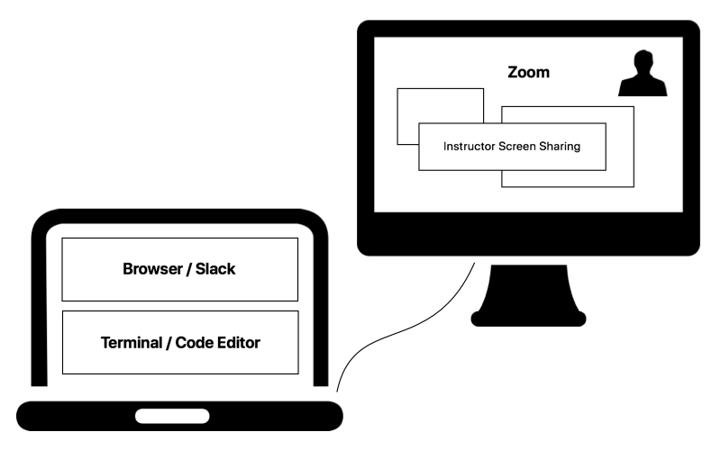

# Tools Overview

## Software

You'll need the following software:

* Zoom
   * Be sure to **update** to the latest version right after class!
   * Practice:
      * Raising Hands
      * Screen Sharing (Just locate the **Green Button**)
* Slack
   * App highly recommended, instead of using the browser
   * Download App for [Desktop or Mobile](https://slack.com/intl/en-us/downloads)
   * It is your responsibility to check your Slack messages
   * For the duration of this course, do not disable Notifications on Slack!
      * We need to be able to reach you!
   * Practice:
      * Threading
      * Emoji Response
      * Timed Answers

And later in the course:

* Code Editor
   * We use VS Code in this course
* Terminal
   * Comes preinstalled on MacOS and Linux
   * On Windows: Available via Ubuntu on WSL
* Google Chrome

## Hardware

* Your computer needs to be no older than ~5 years old (give or take)
* Headphones with an attached microphone are a **must**!
* You'll need to manage 5 applications at the same time:
   * Web Browser
   * Zoom
   * Slack
   * Replit / Code Editor
   * Terminal
* A second screen is **super highly strongly incredibly** necessary!
   * Allows you to emulate a real classroom setting, where the instructor's projector is basically a second screen
   * Most modern TVs can work in a pinch
   

<!--
      * Taking Attendance
      * Emoji Poll
-->

<!--
## Accounts

You'll also need accounts for:

* Github Enterprise - [git.generalassemb.ly](https://git.generalassemb.ly)
   * Not to be confused with [Github](https://www.github.com)!
   * Note your username/password -- you'll need to use it very often!
* [Replit](https://replit.com)
-->
