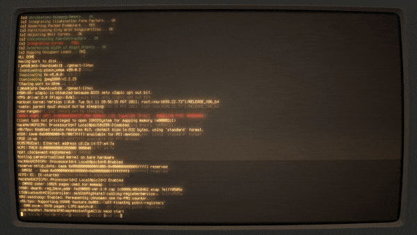
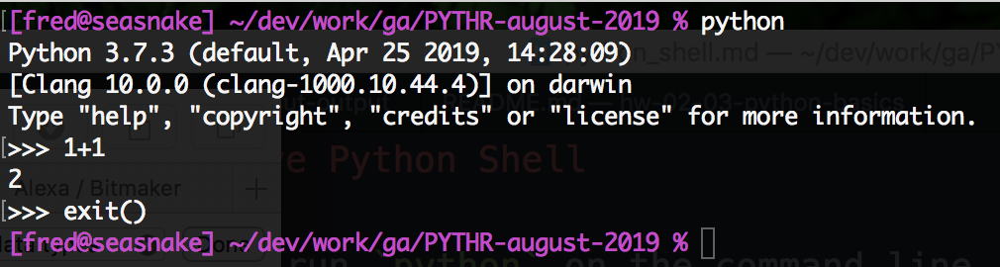

# Welcome to Programming and Python


Our journey into programming begins with learning the fundamentals of any modern programming language:  data types, variables, functions, and control flow, to start.

But first, let's get the basics out of the way.

## What is Programming?

* **Programming** is the process of solving problems through code
   * We don't solve it just once, we solve it for good
   * Like writing down a recipe!
   * We write down this "recipe" with **code**
* **Code** is a general term for instructions that computers can understand and execute
   * In other words: "Programming Language"
   * There are many types of programming languages that exist. We're starting your journey with the Python language

## Programming Languages

There are two types of programming languages: **Compiled Languages** or **Dynamic Languages**. (Different programmers may prefer different terms, but they will be similar.)

### Compiled Languages / Lower-Level Languages

* Examples: [C, C++, Fortran, Java, etc.](https://en.wikipedia.org/wiki/Compiled_language)
* Requires the programmer to manage the resources of the physical electronics hardware of a computer
* Useful when you have very limited resources or need a great deal of responsiveness/speed
* Requires a **compilation** step before the program can be used (Write :arrow_right: Compile :arrow_right: Run)
   * Compile means "build"
   * We can't immediate run the code - the computer can't understand the code directly; the code needs to be translated into **machine code** first
   * Write code, *then compile it (not quick!),* then run it
   * Find a problem? Fix the code, *wait for the code to compile,* run the code, repeat


Source: [XKCD](https://xkcd.com/303/)

### Dynamic Languages / Higher-Level Languages

* Examples: [Python, Ruby, JavaScript](https://en.wikipedia.org/wiki/Interpreted_language)
* Sometimes called "scripting" languages, as we often use them to automate tasks
* Hardware details are taken care of by the language, so that developers can solve more high-level problems
* More expressive, meaning it allows solutions to be written in terms of "what to accomplish" rather than describing each step of "how to accomplish it"
* Are **interpreted** rather than **compiled**, saving a compilation step (Write :arrow_right: Run)
   * A translater, or an **interpreter**, understands how to read the code and translate it to the computer
   * Write code, then immediately run it
   * Find a bug? Fix it, run it, repeat.
* Useful for creating programs that work across multiple platforms
* Are themselves written in a lower-level language like C

Dynamic languages are also called **scripting languages**. What's the difference between **scripting** and **dynamic** languages? According to [this article](https://www.cio.com/article/2373686/the-differences-between-dynamic-scripting-languages-and--regular--languages-no-longer-matt.html): Nothing! Those words can be used interchangeably.
    
> Meanwhile, somewhere in there, "scripting languages" turned into "dynamic languages;" if anybody makes a technical distinction between "scripting" and "dynamic," I don't know what it is.

## What is Python?

* High-level (not low-level)
* Dynamic (not compiled)
* Created with readability in mind
* General purpose - popular for many types of tasks:
   * Web development
   * Scientific computing
   * Numeric data processing
   * Scripting/Automating tasks
   * Even game development!
* Python 2 vs Python 3
   * We are using Python 3, the latest
   * Python 2 was officially retired on [Jan 1, 2020](https://pythonclock.org)
* Nearly #1 "soon"
   * [ZDNet Article, Sep 13 2021](https://www.zdnet.com/article/programming-languages-python-is-on-the-verge-of-another-big-step-forward/)

### When **NOT** to Use Python

Other programming languages exist - Python isn't great for everything!

* Mobile apps
* Braking system of your car
* Huge programs
* High-performance games

# How To Run Python Programs

For the first part of the course, we'll be using a learning platform called Replit -- let's go there now and we'll take a tour through how to use it. 

Later in the course we'll learn how to use the **command line** to run programs -- then you'll feel like you're in one of those hacker movie scenes!



Credit: https://opensource.com/article/18/2/command-line-tools-productivity

## We Do: The Replit Console

Let's locate the **Console** in Replit. This allows you to execute Python statements, one at a time, to experiment with code and see what's possible.

Let's try running each of these simple Python statements, one at a time.

Make sure you type them out yourself rather than copying and pasting. You'll learn much more that way.

```python
5 + 1
1
5
3 + 7 + 1
```

As you execute each line of code, the Console will automatically output the result of the execution of that code. As you can see, Python can do math!

Let's keep going:

```python
5 * 3
5 * 3 # multiplication uses the asterisk (*), not the letter x
```

But what's happening in that last line of code?

If you write a pound/number sign (`#`) Python will ignore everything that comes after the `#`. So you can (and should) use it to write useful **comments** throughout your code.

Comments make it easier for you to understand your code when you come back to it in future and no longer remember how it works. They also serve the same purpose for other people who might be trying to read your code.

The Console is a great way to play around with code and see what's possible.

Turns out, this tool is called a ***REPL***, which stands for **R**ead, **E**valuate, **P**rint, **L**oop (pronounced "**REH**-pull") -- and that's why Replit is called that!

---

# Additional Resources

* [Python For Beginners](http://www.pythonforbeginners.com/basics/python-variables)


<!--
## Command Line

Running Python programs is pretty straightforward and is done from the command line environment.

This is something we'll look at later in the course, but if you have a file called `my_program_file.py`, you run it with:

```zsh
python my_program_file.py
```

We'll be seeing lots of this soon.

But first let's see another way of running Python programs.

## Python REPL

Another way to run Python programs is interactively, through the Python ***REPL***, which stands for **R**ead, **E**valuate, **P**rint, **L**oop (pronounced "**REH**-pull").

If you just execute `python` on the command line (without specifying the name of a file), you are launched into a program that allows you to run Python statements interactively instead of writing them in a file. 

This is the Python REPL, and it allow us to experiment with code and see what's possible.

Let's try it. Run the command `python` on its own to start the Python REPL:



### REPL Summary

The REPL is a great way to play around with code and see what's possible. (Though you won't be able to save your program to run again later.)

You can type `exit()` or hit <kbd>Ctrl</kbd>+<kbd>D</kbd> at any time to return back to the operating system command line.

Using the Python REPL to experiment with bits of Python code as you work on future assignments and projects is an excellent habit to get into!

-->
