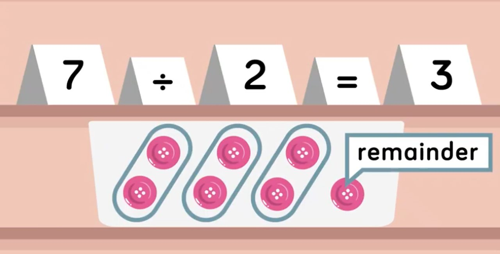

# Other Basic Data Types

Now that we strings down, let's look at the other basic data types in Python.

A **variable** can contain **any** of these types of data. That's why it's called a **variable**!

Don't forget -- if it's **data**, you an assign it to a variable.

## Integers

Whole numbers without decimal points (eg. `1`, `250`, `99999`, `-10`) are called **integers**.

Doing operations with numbers is simple. Fire up the REPL and try out the following:

### Basic Arithmetic

Python has **arithmetic operators** such as:

* `5 + 3` :arrow_right: `8`
* `5 - 3` :arrow_right: `2`
* `5 * 3` :arrow_right: `15`
* `5 ** 3` :arrow_right: `125` (raising 5 to the power of 3, i.e. multiplying 5 by itself twice)
* `7 / 2` :arrow_right: `3.5`
* `7 / 2.0` :arrow_right: `3.5`
* `7 // 2` :arrow_right: `3` (**integer division**, also called **floor division**)
* `7 % 2` :arrow_right: `1` (**modulo**/remainder)



* **Hint**: You will need to use the `%` operator at **some point** in the course...

### Comparisons

Comparisons tell you if a certain statement is true or not. We do this with **comparison operators**:

* `5 > 3` :arrow_right: `True`
* `5 > 5` :arrow_right: `False`
* `5 >= 5` :arrow_right: `True`
* `5 < 3` :arrow_right: `False`
* `5 <= 5` :arrow_right: `True`
* `2 == 2` :arrow_right: `True` (**Note:** _two_ equals symbols, not one)
* `2 == 3` :arrow_right: `False`
* `2 != 3` :arrow_right: `True`

You must *always* use **two** equals signs when doing a comparison (`==`).

**Important Note** A string with a number in it is not the same data type as an integer! For example, the string `"9"` is not the same as the number `9`. That's because they are different types of **data**, remember?

<!--
The [list of Python operators](https://www.tutorialspoint.com/python/python_basic_operators.htm) is extensive. Feel free to try some other ones out in the REPL on your own time.
-->

## Floats

Numbers with decimal points (eg. `1.5`, `150.3985`, `50.0`, `-1.5`) are called floating-point numbers, i.e. **floats**.

You can do the same arithmetic and comparions with floats that you can do with integers (see above).

Examples:

* `5.3 + 3.1` :arrow_right: `8.4`
* `2.2 == 2.2` :arrow_right: `True`
* `2.2 == 2.3` :arrow_right: `False`

**Note:** You can add/subtract/etc an integer with a float, but the result will always be a float!

```python
an_int = 3
a_float = 3.0
s = an_int + a_float # What if we add an int and a float?
print(s) #==> 6.0. Adding an int to a float will still make a float!
```

What happens if you divide two numbers?

* `5 / 2` :arrow_right: `2.5`
* `1 / 3` :arrow_right: `0.333...`

We started with two integers, how did I get a float as the result?

Well, if you think about it, it does make sense. Python doesn't know ahead of time that the result will be a whole number, even if you start out with two whole numbers. So Python just takes the easy way out and assumes quotients will always be floats.

* `6 / 2` :arrow_right: `3.0`
* `8 / 4` :arrow_right: `2.0`

<!--
**Protip:** This is called **implicit type conversion** - Python changed our numbers from ints to floats automatically. Another name for **implicit type conversion** is **Coercion**.
-->

## Booleans

Boolean data types allow us to represent the concepts of **true** and **false**.

In Python the first letter is capitalized: `True` and `False`.

Boolean expressions are a basic idea in programming and allow computers to evaluate statements as being either true or false.

We already saw these `True` and `False` results when we compared two values together earlier!

<!-- Boolean expressions work with **logical operators**: `and`, `or`, and `not`. -->

As a **data type**, you can of course assign it to a variable if you wish:

```python
student_graduated = False
store_is_open = True
```

For now, it's enough that we know that booleans exist. We'll talk about booleans again soon -- it's so important that there's a whole lesson devoted to it!

## None

`None` is a special data type in Python indicates the absence of a value. It represents nothingness.

It's important to emphasize that `None` is not the same thing as 0 (zero)! 

| Situation | Code |
| --- | --- |
|  | `num_of_wheels = 4` |
|  | `num_of_wheels = 0` |
|  | `num_of_wheels = None` |

Since `None` *is* a data type, of course we can assign `None` to a variable as well.

The difference between Zero and Nothing actually crosses over to the realm of pretty hardcore math and philosophy. Here's an article on the difference [between Zero and Nothing](https://realphysics.blogspot.com/2006/12/zero-vs-nothing.html), if you'd like to read more.


---

# Checking Data Type

Use `type(something)` to check what data type you're working with. Try these in the REPL:

```python
type(8)
type(8.0)
type('Hi')
type(True)
type(False)
type(8 > 7)
type(None)
```

---

# Converting Between Data Types

Remember how Python *implicitly* converted the result of any math you do that involves a float, to a float?

Instead of relying on Python to implicitly convert data, it is sometimes useful to *explicitly* convert data between data types.

* `int(something)`: converts `something` to an integer
* `float(something)`: converts `something` to a float
* `str(something)`: converts `something` to a string
* `bool(something)`: converts `something` to a boolean
* etc

```python
int('1') 
float(1)
str(1)
bool(1)
```

Explicit type conversion is basically like saying directly to Python, "I want this float to become an integer!"

<!-- **Protip:** Another name for **explicit type conversion** is **Type Casting**. -->

The reason that we sometimes have to explicit convert data is because the computer can't read my mind.

If I am adding two numbers together, I might actually *want* the result actually be a string, for example:

<!-- 
```python
one = 1
two = 2
one + two #==> 3
str(one) + str(two) #==> '12'
```
-->


```python
sign = 7 + 1 + 9                #==> 17
sign = '7' + '1' + '9'          #==> '719'
sign = str(7) + str(1) + str(9) #==> '719'
```

## Adding Different Data Types

If you want to **add** two pieces of data together (or any other operation), they have to be the same type!

This will give you an error:

```python
song = 'Mambo #' + 5
print(song) #==> TypeError
```

But if you convert the number 5 into a string first, then we can create the [proper song title](https://bestlifeonline.com/songs-with-a-number-in-the-title/):

```python
song = 'Mambo #' + str(5)
print(song) #==> Mambo #5
```

This is another reason you sometimes have to convert data types!

---

# Additional Resources

* [Operators Cheatsheet](http://python-reference.readthedocs.io/en/latest/docs/operators/)


<!-- 
# Q&A and Summary

We learned a lot today!

* We learned about basic data types.
* We created, used, and re-assigned variables.
* We used the numerical operators `+ - / * // %`
* We did some complex stuff with the `print` function!
-->
