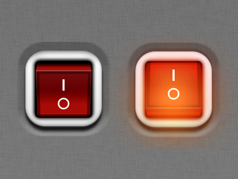

# Intro to Control Flow

One of the most important abilities of a computer program is the ability to control the order of the statements of the program being executed.

There are two ways a computer can accomplish this **Control Flow**.

## Type 1 - Making Decisions

If you've ever looked at a [flowchart](https://en.wikipedia.org/wiki/Flowchart) and you see a decision point, this is basically what we're talking about.

* You have to decide **if** you have been naughty or nice
* You have to figure out **if** you have a stamp or not
* This is the first type of **Control Flow** -- changing what the program does based on a decision
* We call this an **if statement** -- we'll be talking about this today.

## Type 2 - Looping

The second type of Control Flow is looping -- we'll look at this in a future lesson.

<!--
Consider the following recipe for _**French Toast à la GA**_.

1. Dip the bread in eggs
2. If the bread is thicker, dip the bread again until it's soaked through
3. Pan fry for 3 minutes
4. Check if the bread is brown on the bottom. If not, keep frying the bread until it's brown
5. Flip the bread
6. Repeat steps 3 and 4
7. Serve and Enjoy!

Have you ever seen a recipe that requires a step to be possibly repeated?

* You have to decide **if** the bread is thick, and then dip it again
* You have to decide **if** the bread is brown on the bottom, and keep cooking it **until** the bread is brown
* You have to **repeat** steps 3 and 4
* This is the second type of **Control Flow** -- possibly repeating steps based on a decision
* We call these **loops**
-->

## Booleans to the Rescue

Both types of Control Flow requires the program to make decisions. But how does a program make a decision?

### Binary

You may have heard that computers operate in **binary** -- that is, they operate on the concept of Ones (`|`) and Zeros (`O`). You can equate that to "On" or "Off". And the reason for that is because a computer is really basically "just" a bunch of electronic switches that can be On or Off. A computer essentially operates with long streams of simple On/Off decisions.

By the way: Interesting factoid from [Wikipedia](https://en.wikipedia.org/wiki/Power_symbol#cite_note-berkreport-1):

> English words were replaced with the universal symbols line "|" and circle "o" (typically without serifs) to bypass language barriers

### Yes and No

In English, the most simple type of answer to a decision is simply 'Yes' or 'No'.

And if you think about it, the idea of **binary** is just the same idea of **boolean**!

'Yes' and 'No' maps directly onto binary and the idea of booleans like this:

| English | Electricity | Binary | Boolean |
| --- | --- |--- | --- |
| Yes | On | 1 | `True` |
| No | Off | 0 | `False` |

Booleans are a very important topic. Now let's take a deeper look at it and then we will see how it applies to Control Flow.

---

# Additional Resources

* [Wikipedia: Control Flow](https://en.wikipedia.org/wiki/Control_flow)
