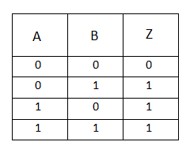
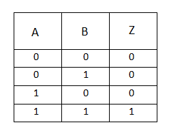
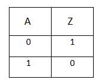

# Booleans

## `True` and `False`

"Yes" in computer-speak is **True**, and "No" in computer-speak is **False**.

The boolean data type allow us to represent the concepts of **True** and **False**.

In Python the first letter is always capitalized: `True` and `False`.

They are a basic data type, so of course we can assign them to variables:

```python
store_open = True
student_graduated = False
```

Now that we know how a computer represents "Yes" and "No", we can bring in comparisons and logic.

## Comparison Operators

Comparison operators takes two pieces of data and compares them. Mostly we'll be comparing strings and numbers.

* Equality: `==`
* Inequality: `!=`
* Less than: `<`
* Greater than: `>`
* Less than or equal to: `<=`
* Greater than or equal to: `>=`

When you compare two values, you get a boolean result.

Results from comparisons can be saved in a variable, if you wish:

```python
current_time = 1000 # 10am
closing_time = 1700
store_open = current_time < closing_time
print(store_open)
#==> store_open contains True

current_time = 1800 # It's now 6pm
store_open = current_time < closing_time
print(store_open)
#==> tore_open contains False
```

...or you can use the results directly without saving into a variable!

```python
print('3 < 5 is...', 3 < 5)         #==> True
print('13 >= 13 is....', 13 >= 13)  #==> True
print('50 > 100 is...', (50 > 100)) #==> False
```

> **Note:** Parentheses in an expression just gives a computation more "priority" according to PEMDAS.

## Logical Operators

Booleans can be *combined* with **logical operators**. The three most common are:

* `or`
* `and`
* `not`

### Truth Table for `or`

`or` checks if either side is `True`.

In the following table, `Z = A or B`



In this example, I'm happy if I get chicken for dinner, **OR** if I get pizza for dinner.

(Or **both** chicken and pizza!!!)

```python
got_chicken = True
got_pizza = False
happy = got_chicken or got_pizza
print(happy)
#==> True

got_chicken = False
got_pizza = True
happy = got_chicken or got_pizza
print(happy)
#==> True

got_chicken = True
got_pizza = True
happy = got_chicken or got_pizza
print(happy)
#==> True

got_chicken = False
got_pizza = False
happy = got_chicken or got_pizza
print(happy)
#==> False
```

### Truth Table for `and`

`and` checks if **both** sides is `True`.

In the following table, `Z = A and B`



In this example, I'm so demanding that I'm only happy if I get **BOTH** ice cream and bubble tea for dessert. Just one will not satisfy me.

```python
got_ice_cream = True
got_bubble_tea = False
happy = got_ice_cream and got_bubble_tea
print(happy)
#==> False

got_ice_cream = False
got_bubble_tea = True
happy = got_ice_cream and got_bubble_tea
print(happy)
#==> False

got_ice_cream = False
got_bubble_tea = False
happy = got_ice_cream and got_bubble_tea
print(happy)
#==> False

got_ice_cream = True
got_bubble_tea = True
happy = got_ice_cream and got_bubble_tea
print(happy)
#==> True
```

### Truth Table for `not`

`not` simply inverts the value of a boolean.

In the following table, `Z = not(A)`



```python
store_open = True
print(store_open)      #==> True
print(not(store_open)) #==> False
```

```python
student_graduated = False
print(student_graduated)      #==> False
print(not(student_graduated)) #==> True
```

### Compound Boolean Expressions

If you have three or more terms that you want to combine together with `and` or `or`, it's totally possible! These **boolean expressions** can get very complicated indeed.

Imagine, for example:

```python
got_chicken = True
got_pizza = False
got_ice_cream = False
got_bubble_tea = False

happy = (got_chicken or got_pizza) and (got_ice_cream or got_bubble_tea)
```

####  We Do: Class Question

What is the value of `happy`?

<details>
<summary>Answer (SPOILER!)</summary>

In this particular case, happy will be `False`
</details>

#### Another Example: Carnival Ride


Credit: [Alamy Stock Photo](https://www.alamy.com/sign-showing-how-tall-a-child-must-be-to-ride-a-carnival-ride-at-the-image5726695.html)

* You must be this tall: 45"
* Under 48" must be accompanied by an adult

```python
height = 48
accompanied_by_parent = False

can_go_on_ride = (height >= 48) or (height >= 45 and accompanied_by_parent == True)
print(can_go_on_ride)
```

or more simply:

```python
height = 48
accompanied_by_parent = False

can_go_on_ride = (height >= 48) or (height >= 45 and accompanied_by_parent)
print(can_go_on_ride)
```

Python helps us write shorter code here: When your variable contains a boolean, you do not have to compare it with (`==`) explicitly!

#### Truth Table Generator

Compound boolean expressions becomes a little harder to think about, so you can use a [truth table generator](https://www.dcode.fr/boolean-truth-table) to see what the possibilities are. There are many such tools on the web.

## Expressions

Notice that whenever you do a comparison, or some sort of mathematical equation, or use a logical operator, you end up with a **result**.

Any statement that can be evaluated into a **result** is what we call an **expression**. Expressions can be inserted in place of any value! 

```python
print(3 < 5) # Prints the result of True, the expression here is 3 < 5
print(5 + 1) # Prints the result of 6, the expression here is 5 + 1

got_chicken = True
got_pizza = False
print(got_chicken or got_pizza) # Prints the result of True, the expression here is got_chicken or got_pizza
```

As you can see, `print()` can accept an **expression** as the thing to be printed, and Python will automatically calculate the value to be printed *before* the printing is done.

## Truthiness and Falsiness

Perk up here! This is probably the most important idea of today's lesson.

Something that's `True` is always true, right?

> Yes, I totally cleaned my room.<br />*(Just don't look under the bed…)*

Besides the absolutes black and white of `True` and `False`, there is also a fuzzier concept of "**truthiness**" and "**falsiness**".

Sometimes, we need "**truthy**" and "**falsy**". They're not explicitly `True` or `False`, but basically *behave in the same way*.

To know if some piece of data is truthy or falsy, you can convert it to a boolean, with `bool()`. If the piece of data converts to `True`, it is truthy. If it converts to `False`, then it is falsy.

* All numbers are Truthy except 0

   ```python
   bool(5)       #==> True
   bool(-5)      #==> True
   bool(0)       #==> False
   bool(0.0)     #==> False
   ```

* All strings are truthy except the empty string

   ```python
   bool('Hello') #==> True
   bool('')      #==> False
   ```

* The special `None` datatype is **always** falsy.

   ```python
   bool(None)    #==> False
   ```

Another way to think about truthy or falsy is the idea of "presence" (truthy) vs "absence" (falsy). It just means "Is there anything there?"

In Python, the only values that are falsy are:

* `False`
* `None`
* `0` :arrow_left: Integer zero 
* `0.0` :arrow_left: Float zero
* `""` :arrow_left: The empty string

These last three things are also falsy, but these are concepts we won't be talking about for a while, so just put that in your back pocket for now:

* `[]` :arrow_left: The empty list
* `()` :arrow_left: The empty tuple
* `{}` :arrow_left: The empty dictionary
