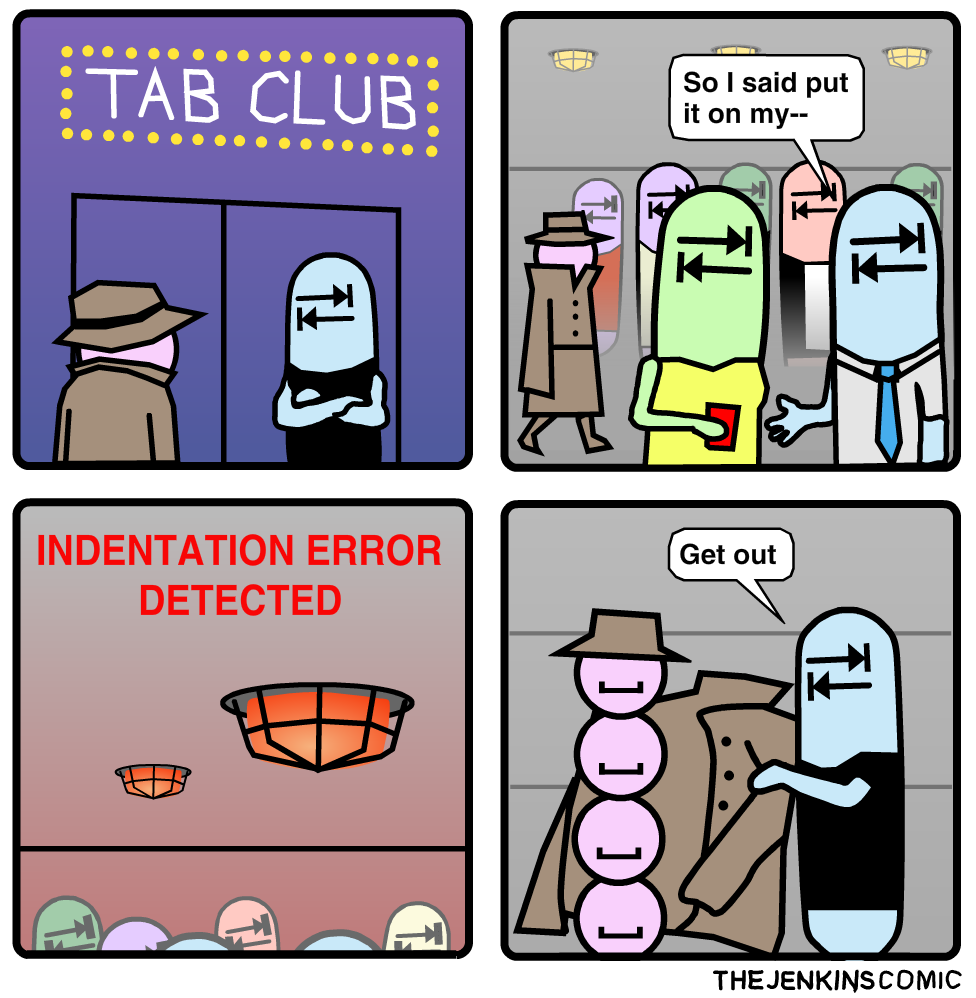

# `if` Statements

Now that we know all about **expressions**, it's time to tackle the `if` statement. 

The `if` statement is how decisions are made in Python.

Simple example:

```python
temperature = 100

if temperature >= 75:
    print("It's too hot!")
    print("I'm melting!")
```

> **Protip**: Between the `if` and the `:`, you must insert an **expression** that evaluates to either a  truthy or falsy value.

Note that the `print` statements are indented in by 4 spaces! What this says is that the two `print` statements will be executed **only** if the temperature is greater than 75 degrees -- i.e. if that **expression** evaluates to a truthy value.

All the lines that are indented are considered part of the same **block** of code that will be executed together, *if* the expression is truthy.

## Indentations

Indentation matters in Python, which is an oddity among computer languages. But it also makes it a good beginner language as it helps you build good habits.

Proper indentation is **very important**. If you don't indent your code properly during a coding job interview, for example, you will likely not get hired.

*Lines that are not indented together are not considered the same block of code!*

In this case, `Bye now!` will be printed *regardless* of the result of the `if` expression evaluation.

```python
temperature = 100

if temperature >= 75:
    print("It's too hot!")
    print("I'm melting!")
print('Bye now!')
```

The number of spaces you use technically doesn't matter as long as it's consistent, but Python's inventor (Guido van Rossum) [prefers 4 spaces](https://www.python.org/dev/peps/pep-0008/#indentation).

### Vertical Spacing

Vertical spacing, on the other hand, doesn't matter. We would typically write the above as:

```python
temperature = 100

if temperature >= 75:
    print("It's too hot!")
    print("I'm melting!")

print('Bye now!')
```

So that visually speaking, your mind can see the difference between these two separate conceptual units of the code.

### Polyglot (Mixed-Language) Environments

While the official Python guidelines recommend 4 spaces, at companies with mixed-language environments it's very popular to use 2 spaces regardless of language. For example, Google [uses 2 spaces](https://developers.google.com/edu/python/introduction#indentation).

(It's quite possible to use Python, HTML, CSS, JSON, YAML, Ruby, Javascript, and more languages, all in the same company!)

In the end, you'll work with whatever the standard is at the company where you work. It will be either 2 or 4.

> I will use 2 spaces from now on as I also personally work with many different languages. I will accept either 2 or 4 spaces for your work. But you must be **consistent**.

### Tabs vs Spaces

Python will work with tabs instead of spaces, but in modern times tabs are not considered acceptable unless you're dealing with extremely old code (tabs tended to be used more in the 80s and 90s, an era influenced by typewriters).

You may not mix spaces with tabs; Python will error out.

The major advantage of using spaces is to facilitate teamwork by ensuring that your code **looks the same** no matter whether it is open on any of the hundreds/thousands of different code editors on a Mac or PC or linux!

And if you need another reason to use spaces instead of tabs... Developers Who Use Spaces Make More Money Than Those Who Use Tabs (https://stackoverflow.blog/2017/06/15/developers-use-spaces-make-money-use-tabs/)

Luckily, most modern code editors will automatically convert tabs to spaces these days, so the point is starting to be moot.

(Caution: Here Be Monsters and Religious Wars!)



Credit: https://thejenkinscomic.wordpress.com/2020/04/29/tab-club/

## `else`

What about when the temperature is just right? Use the `else` block:

```python
temperature = 100

if temperature >= 75:
  print("It's too hot!")
  print("I'm melting!")
else:
  print("It's just right!")
  print('How relaxing!')

print('Bye now!')
```

Change the value for the `temperature` variable and see what happens with your program.

The idea here is that if your **expression** evaluates to truthy, the first block will be executed, whereas if the expression evaluates to falsy, the `else` block will be executed.

The following all operate the same, by the way.

```python
if 100 >= 75:
  print("It's too hot!")
  print("I'm melting!")
else:
  print("It's just right!")
  print('How relaxing!')

print('Bye now!')
```

```python
if (100 >= 75):
  print("It's too hot!")
  print("I'm melting!")
else:
  print("It's just right!")
  print('How relaxing!')

print('Bye now!')
```

```python
too_hot = (100 >= 75)

if too_hot == True:
  print("It's too hot!")
  print("I'm melting!")
else:
  print("It's just right!")
  print('How relaxing!')

print('Bye now!')
```

```python
too_hot = (100 >= 75)

if too_hot:
  print("It's too hot!")
  print("I'm melting!")
else:
  print("It's just right!")
  print('How relaxing!')

print('Bye now!')
```

```python
if True:
  print("It's too hot!")
  print("I'm melting!")
else:
  print("It's just right!")
  print('How relaxing!')

print('Bye now!')
```

You see that it's starting to look like a substitution game.

## `elif`

What about printing a message when it's too cold? We need more conditions. Here's where `elif` comes in useful -- it stands for "else if".

```python
temperature = 100

if temperature >= 75:
  print("It's too hot!")
  print("I'm melting!")
elif temperature < 50:
  print("It's pretty cold!")
  print('Brrrr!')
else:
  print("It's just right!")
  print('How relaxing!')

print('Bye now!')
```

> **Note**: We can have as many `elif`s as we'd like, *but only one `else`*.

### We Do

How would you change the program to add another message when it's freezing?

<details>
<summary>Answer (SPOILER!)</summary>

```python
temperature = 100

if temperature >= 75:
  print("It's too hot!")
  print("I'm melting!")
elif (temperature >= 32 and temperature < 50):
  print("It's pretty cold!")
  print('Brrrr!')
elif temperature < 32:
  print("It's freezing!")
else:
  print("It's just right!")
  print('How relaxing!')

print('Bye now!')
```

or

```python
temperature = 100

if temperature >= 75:
  print("It's too hot!")
  print("I'm melting!")
elif temperature < 32:
  print("It's freezing!")
elif temperature < 50:
  print("It's pretty cold!")
  print('Brrrr!')
else:
  print("It's just right!")
  print('How relaxing!')

print('Bye now!')
```

**Note**: Each `if` statement branch is examined **in priority sequence** from top to bottom.

</details>


## More than one Comparison

Another example:

```python
answer = input('Do you like cats? ')

if answer == 'yes':
  print('Purrrr')
else:
  print('Hisss!')
```

But what if the user entered `y` or `Y` or `YES`?

To handle it, you'll have to use the Logical Operators we learned about earlier:

```python
answer = input('Do you like cats? ')

if (answer == 'yes') or (answer == 'YES') or (answer == 'y') or (answer == 'Y'):
  print('Purrrr')
else:
  print('Hisss!')
```

When the meaning is clear, you can omit the parentheses:

```python
answer = input('Do you like cats? ')

if answer == 'yes' or answer == 'YES' or answer == 'y' or answer == 'Y':
  print('Purrrr')
else:
  print('Hisss!')
```

That conditional is getting very long. If you want to split it across lines, you can put parentheses around the whole thing:

```python
answer = input('Do you like cats? ')

if (answer == 'yes' or answer == 'YES' or
  answer == 'y' or answer == 'Y'):
  print('Purrrr')
else:
  print('Hisss!')
```

(To shorten the conditional expression, you can also convert whatever the user types to lower case. That's something we'll see later.)

What you **cannot** write is this:

```python
answer = input('Do you like cats? ')

if (answer == 'yes' or 'YES' or 'y' or 'Y'): # This is WRONG
  print('Purrrr')
else:
  print('Hisss!')
```

That is not proper Python and will not give you the answer you expect! 

Remember that when you tie expressions together using `and` and `or`, *each of them* must evaluate properly on its own.

## Truthiness and Falsiness

### You Do: Exercise 1 (Timed Answer)

[2 minutes]

What do you think the following code will print? Why?

**Hint:** This is tricky and you'll have to get creative. Recall the idea of "truthiness".

```python
foo = 5
bar = 1

if foo > 13:
  print('Flip')
elif bar:
  print('Flop')
else:
  print('Fly')
```

<details>
<summary>Answer (SPOILER!)</summary>

It prints "Flop".

Since `bar` contains a positive integer, it evaluates to `truthy` as a conditional expression
</details>

### Truthy and Falsy Expressions in `if` Statements

As you saw in the last exercise, when you use a variable containing some non-boolean value as the condition expression of the `if` statement, Python *automatically determines the truthiness or falsiness of the expression*!

So, this code:

```python
some_num = 9001

if some_num:
  print('some_num is truthy!') # This line is executed
else:
  print('some_num is falsy!')
```

is exactly the same as this code:

```python
some_num = 9001

if bool(some_num) == True:
  print('some_num is truthy!') # This line is executed
else:
  print('some_num is falsy!')
```

So you don't have to convert the value to boolean explicitly and the compare to `True`/`False`, Python will do that for you *implicitly*!

Another example with a float:

```python
my_float = 0.0

if not(my_float) == True:
  print('the condition is truthy!') # This line is executed
else:
  print('the condition is falsy!') 
```

which is the same thing as:

```python
my_float = 0.0

if not(my_float):
  print('the condition is truthy!') # This line is executed
else:
  print('the condition is falsy!') 
```

An example with a string:

```python
if 'hello':
  print('any string with actual content is truthy!') # This line is executed
else:
  print("this line won't execute")
```

An example with an empty string:

```python
some_str = ''

if some_str:
  print("this line won't execute")
else:
  print('the empty string is falsy') # This line is executed
```

Another example with an empty string:

```python
some_str = ''

if not(some_str):
  print('the empty string is falsy') # This line is executed
else:
  print("this line won't execute")
```

Example with combinations:

```python
gym_open = True
spaces_left = 50
lockdown = True

if gym_open and spaces_left > 0 and not(lockdown):
  print("We're gonna pump you up!")
  spaces_left = spaces_left - 1
else:
  print("You shall not pass")
```

* Depending on the values of `gym_open`, `spaces_left`, and `lockdown`, you can trigger one output or the other -- experiment with the values and see what happens!
* Remember that it is not necessary to write `gym_open == True`, `pandemic == False`, or `not(pandemic) == True`! Python will automatically figure out that `gym_open` and `pandemic` are booleans and act accordingly

### You Do: Exercise 2 (If Time Permits -- Otherwise Take Home Exercise)

This is your first team exercise! We will do this **extreme programming** style, that means **pair programming**!

Team up with a partner. Decide who is the driver and who is the navigator. The driver will share their screen and operate the keyboard, while the navigator will direct the driver on the best course of action.

Now, lets compares some variables and prints out statements accordingly.

#### Problem 1:

[3 minutes]

```python
a = 8
b = ''
```

Check if either `a` is truthy **or** `b` is truthy.

If *any* of them is truthy, print "`Either a or b are truthy`"

<details>
<summary>Answer (SPOILER!)</summary>

Technically correct: 

```python
if (bool(a) == True) or (bool(b) == True):
  print('Either a or b are truthy')
```

Better:

```python
if a or b:
  print('Either a or b are truthy')
```
</details>

#### Problem 2:

[3 minutes]

```python
x = 0
y = 'Hello!'
```

Check if both `x` is falsy **and** `y` is falsy.

If both of them are falsy, print "`Both x and y are falsy`"

<details>
<summary>Answer (SPOILER!)</summary>

Technically correct:

```python
if (bool(x) == False) and (bool(y) == False):
  print('Both x and y are falsy')
```

Better:

```python
if not(x) and not(y):
  print('Both x and y are falsy')
```
</details>

### Problem 3:

[5 minutes]

Switch driver/navigator roles again!

```python
j = 3
k = 0
```

Check if either `j` or `k` is falsy. If one is, print out "`Either j or k is falsy`"
   * Then, only if either `j` or `k` is falsy, check if `j` is greater than `k`.
      * If it is, print out "`j is greater than k`"
   * **Hint:** You'll have to put another `if` statement inside the first `if` statement!

<details>
<summary>Answer (SPOILER!)</summary>

```python
if not(j) or not(k):
  print('Either j or k is falsy')
  if j > k:
    print('j is greater than k')
```
</details>
