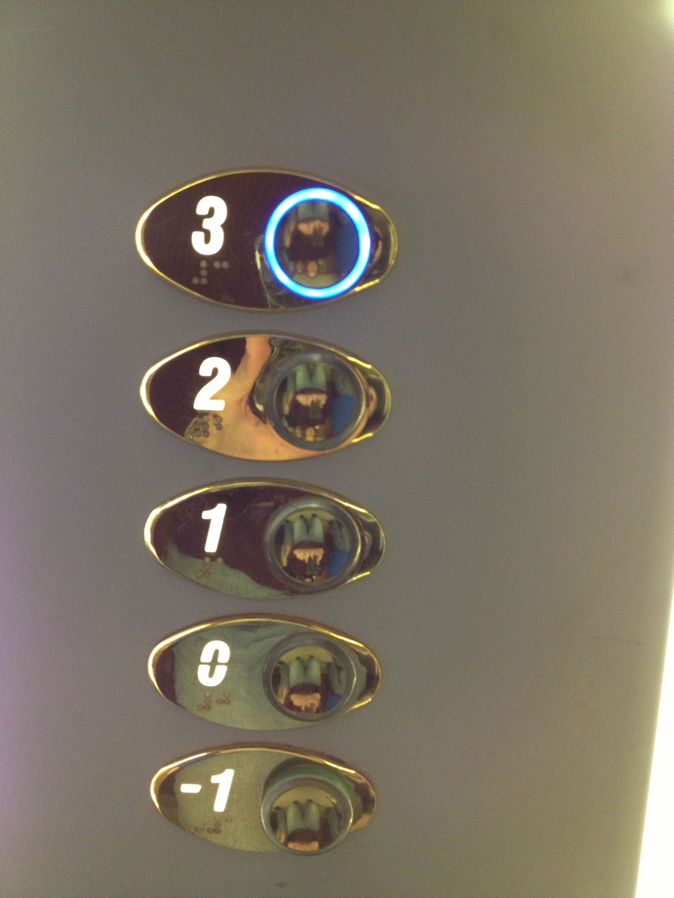

# Lists

So far, we've seen that variables can hold a single item.

```python
friend = 'Brandi'
color = 'red'
```

What if you need to hold multiple colors?

```python
color_1 = 'red'
color_2 = 'yellow'
color_3 = 'green
```

But what if you have 10,000 colors? It's untenable to declare 10,000 variables.

This is where **lists** come into play.

**Lists** can hold *multiple items* - and those items can be anything!

* Declaring lists

   ```python
   colors = ['red', 'yellow', 'green']
   students = ['Brandi', 'Zoe', 'Steve', 'Aleksander', 'Dasha']
   fruits = [] # This list is empty
   ```

* A list of strings

   ```python
   colors = ['red', 'yellow', 'green']
   ```

* A list of numbers

   ```python
   nums = [4, 7, 9, 1, 4]
   ```

* A list containing both strings and numbers

   ```python
   stuff = ['red', 7, 'yellow', 1, 4]
   ```

* All sorts of stuff!

   ```python
   stuff = ['red', 7, True, 3.14159, None]
   ```

In the same way that you recognize strings by the quotation marks around them, you can recognize a list by the square brackets that surround it.

Lists are also a **type of data**, i.e. **Data Type**, and therefore, you can assign a list to a variable!

Lists are a **complex data type**, as opposed to the **basic data types** that we've seen so far: integers, floats, strings, and booleans. That means, we can put other data inside lists! (Whereas you cannot put another piece of data inside an integer, for example.)

---

# Aside: Counting from Zero

Computers and Programming Languages universally start counting from zero!

Strange, right?

Actually, it's only strange if you're from the US/Canada!

In many countries, it's a fairly normal concept. This is an elevator from Ireland, for example:



Whereas in the US/Canada, the "2nd floor" is the floor above ground level!

Not that hard to understand really -- another example: when we are born, we are actually 0 years old, and only after 1 year has passed, we are 1 year old, right? (Unless you're Korean or Thai...)

---

# Accessing List Elements

## Index

The **index** means the location of an *element* in the list.

**Important**: Just like European elevators, indices start counting at 0!

| Index | 0 | 1 | 2 | 3 | 4 |
| :---: | :---: | :---: | :---: | :---: | :---: |
| Value | `"Brandi"` | `"Zoe"` | `"Steve"` | `"Aleksander"` | `"Dasha"` |

```python
students = ['Brandi', 'Zoe', 'Steve', 'Aleksander', 'Dasha']
print(students[0]) # Prints 'Brandi'
print(students[1]) # Prints 'Zoe'
print(students[4]) # Prints 'Dasha'
```

## We Do

1. Create a **list** with the names `'Holly'`, `'Juan'`, and `'Ming'`
1. Print the value at index 2
1. Create a **list** with the following items: `2`,`'four'`, `6`, and `'eight'`
1. Print the value at the beginning of the list

## Negative Index

You can use a negative index to access elements from the *back* of the list, where `-1` is the very end of the list!

```python
print(students[-1]) # Prints 'Dasha'
print(students[-3]) # Prints 'Steve'
print(students[0])  # Prints 'Brandi' -- 0 is the *start* of the list!
```

---

# Modifying List Elements

You can modify the contents of a particular element by referencing it with its index value!

```python
students = ['Brandi', 'Zoe', 'Steve', 'Aleksander', 'Dasha']

students[1] = 'Zoey'
print(students) # Prints ['Brandi', 'Zoey', 'Steve', 'Aleksander', 'Dasha']

students[2] = students[2] + 'n'
print(students) # Prints ['Brandi', 'Zoey', 'Steven', 'Aleksander', 'Dasha']
```

The only way to modify the contents of a list is to *access it via its index*!

This is a **critical** idea to understand. Are you sure you understand this concept of modifying the internals of a list? Again -- the **only way** to modify an element inside a list is to *access it via its index*.

## We Do: Class Question

How could you change the entire student list?

<details>
<summary>Answer (SPOILER!)</summary>

* One way is to modify each element, one by one:

```python
students[0] = 'Joe'
students[1] = 'Jack'
students[2] = 'Jill'
students[3] = 'Jane'
students[4] = 'Bill'
```

* The other way is to completely re-assign the variable to a new list:

```python
students = ['Joe', 'Jack', 'Jill', 'Jane']
```
</details>


---

# Lists Inside of Lists!?

Yup, you can even put lists inside lists:

```python
some_list = [
  3.14159,
  [1, 2, 3],
  'joe',
  [
    'four', 
    5, 
    'six',
    ['a', 'b', 'c']
  ]
]

print(some_list[3][1])
#==> 5
print(some_list[3][3][2])
#==> 'b'
```

As you can see, a list can contain any type of data, even other lists!

One common scenario where you may need this kind of **data structure** is a game with a board, like Tic-Tac-Toe:

```python
ttt_board = [
  ['X',  None, None],
  ['X',  'O',  'O'],
  [None, None, None]
]

# It's O's turn
ttt_board[2][0] = 'O'

print(ttt_board)

# ttt_board = [
#   ['X', None, None],
#   ['X', 'O', 'O'],
#   ['O', None, None]
# ]
```

In real life programming scenarios, the number of levels of sub-lists can get to be 10 or even more!

---

# Built-in List Operations

Now that we know what lists are, what can we do with them?

## Length of a List with `len()`

Reintroducing `len()`! Not only can `len()` tell us the length of a string...

`len()` can also tell us how long a list is!

```python
students = ['Brandi', 'Zoe', 'Steve', 'Aleksander', 'Dasha']
num_students = len(students)
print('There are', num_students, 'students in the course')
#==> 5
```

* You put the list between the parentheses after the word `len`
* `len()` is a *built-in function*
* `len()` can be performed on any list, no matter what's in it
* `len()` can also be used on strings, as you may remember!
   * Example: `len('hello')` returns 5

## Adding an Element with `.append()`

Did you forget to add something to a list? No problem; you can use `.append()`.

`.append()`: Adds an element (that you provide) to the end of the list

```python
students = ['Brandi', 'Zoe', 'Steve', 'Aleksander', 'Dasha']
students.append('Sonyl')
print(students)
#==> ['Brandi', 'Zoe', 'Steve', 'Aleksander', 'Dasha', 'Sonyl']
```

Suppose a new student joins our course. We can add them to the end of the list with `append`, which is a function built directly into a list.

Notice it is called with a dot after the list, unlike the other function we've used, `len`. The reason for that will be revealed in a few days!

## Adding an Element with `.insert()`

What happens if we want to add something somewhere else? We can use `.insert()`, which specifies where (i.e., to which index) we want to add the element.

`.insert()`: Adds to any point in the list. You have to provide the element, and an index

```python
students = ['Brandi', 'Zoe', 'Steve', 'Aleksander', 'Dasha', 'Sonyl']
students.insert(1, 'Sanju')
print(students)
#==> ['Brandi', 'Sanju', 'Zoe', 'Steve', 'Aleksander', 'Dasha', 'Sonyl']
```

## Removing elements with `.pop()`

What if someone leaves our course? We need to remove them from the list. We can do this with `pop`.

Pop drops the last thing off the list. It gives us back the value that it removed. This is called a **return value**. We can take that value and assign it to a new variable, `student_that_left`. 

`.pop()`: Removes an item from the end of the list

```python
students = ['Brandi', 'Sanju', 'Zoe', 'Steve', 'Aleksander', 'Dasha', 'Sonyl']
student_that_left = students.pop()
print('The student', student_that_left, 'has left the course.')
#==> 'The student Sonyl has left the course.'
print(students)
#==> ['Brandi', 'Sanju', 'Zoe', 'Steve', 'Aleksander', 'Dasha']
```

## Removing elements with `.pop(index)`

What if someone specific leaves the course?

We can do this with `.pop()` again. Here, we can give `.pop()` the index we want removed. It gives us back the value that it removed. We can take that value and assign it to a new variable, `student_that_left`.

`.pop(index)`: Removes an item from the list, from the provided index

```python
students = ['Brandi', 'Sanju', 'Zoe', 'Steve', 'Aleksander', 'Dasha']
student_that_left = students.pop(2) # Remember to count from 0!
print('The student', student_that_left, 'has left the course.')
#==> 'The student Zoe has left the course.'
print(students)
#==> ['Brandi', 'Sanju', 'Steve', 'Aleksander', 'Dasha']
```

<!--
## Exercise 2: Pop, Insert, and Append

(5 mins)

Partner up! Choose one person to be the driver and one to be the navigator.

You can do this exercise inside the REPL, or you can do the exercise in a file, if you prefer. Up to you!

Do the following:

1. Declare a list with the names of your classmates
1. Print out the length of that list
1. Print the name at index 2 on the list (that would be the "third name", in plain English)
1. Remove the very first name on the list (what index would that be?)
1. Re-add the name you deleted to the end of the list

<details>
<summary>Answer (SPOILER!)</summary>

```python
students = ['Brandi', 'Sanju', 'Zoe', 'Steve', 'Aleksander', 'Dasha']
print(len(students))
print(students[2])
deleted_classmate = students.pop(0)
students.append(deleted_classmate)
print(students)
```
</details>
-->

---

# Numerical List Operations

If you have a list containing only numbers, you can perform some special numerical operations on it.

## Sum

`sum()`: Adds the entire list together.

```python
team_members_count = [7, 2, 4, 3]
total_company_size = sum(team_members_count)
print('The size of our company is', total_company_size)
#==> 16
```

## Max/Min

We might want to simply know what is the largest or smallest item in a list. In this case, we can use the built-in functions `max()` and `min()`.

`max()` or `min()`: Finds highest (or lowest) number in the list.

```python
team_batting_avgs = [.328, .299, .208, .301, .275, .226, .253, .232, .287]
print('The highest batting average is', max(team_batting_avgs))
#==> 0.328
print('The lowest batting average is', min(team_batting_avgs))
#==> 0.208
```

## Exercise: Everything Regarding Lists

[5 mins]

Partner up! Choose one person to be the driver and one to be the navigator.

You'll totally have to reference the class notes to do this. That's normal!

Create a `list_practice.py` file. In it:

1. Create a variable called `numbers`. Initialize it to be a list with the numbers `2`, `4`, `6`, and `8`
1. Print the element of the list with the largest value
1. Pop off the last element in the list; re-insert it at index `2`
1. Pop off the number at index `1` in the list
1. Append the number `3` to the list
1. Print out the average number (divide the sum of the list by its length)
1. Print the list

The expected output is:

```
Max: 8
Average: 4.75
Final list: [2 8 6 3]
```

<details>
<summary>Answer (SPOILER!)</summary>

```python
numbers = [2,4,6,8]
print(max(numbers))
el = numbers.pop()
numbers.insert(2, el)
numbers.pop(1)
numbers.append(3)
print(sum(numbers)/len(numbers))
print(numbers)
```
</details>

---

# (If Time Permits) One More Thing: Copying Simple Data Types vs Complex Data Types

This is slightly more advanced, but it's an important concept about list behaviour.

Lists are the first example we've seen of **complex data types** -- in contrast with **basic data types** that we've already seen like integers, floats, strings, and booleans.

Complex data types different in behaviour to basic data types in regards to their *copying behaviour*.

When it comes to basic data types, you can make a **copy** of the data contained within a variable by simply declaring another one and assigning it the same value. Of course, when you modify the copy, the original won't be modified, which should be what you expect!

Following this example closely:

```python
v = 'Fred'
v_copy = v
print(v) #==> Fred
print(v_copy) #==> Fred

v_copy = 'Jill'
print(v_copy) #==> Jill
print(v) #==> Fred
```

Same with *entire lists*:

```python
v = [1,2,3]
v_copy = v
print(v) #==> [1,2,3]
print(v_copy) #==> [1,2,3]

v_copy = [4,5,6]
print(v_copy) #==> [4,5,6]
print(v) #==> [1,2,3]
```

However, this behaviour holds true only for **basic data types** (str, int, float, bool), and for ***entire lists***!

The copying behavior changes when you try to change only a subelement of a list:

```python
v = [1,2,3]
v_copy = v
print(v) #==> [1,2,3]
print(v_copy) #==> [1,2,3]

v_copy[0] = 9000
print(v_copy) #==> [9000,5,6]
print(v) #==> [9000,2,3]
```

Notice that `v` **and** `v_copy` both changed!

This is because Python is *optimizing* its memory usage by *reusing* the same list, but just giving it two different names. We call this *referencing*. It's not a true copy. It's basically just like a "Desktop Shortcut" (if you are used to Windows) to the item.

So in actuality, `v_copy` and `v` both **reference** the same list in the computer's memory.

The reason why Python does this is: What if you were dealing with a list of a million pieces of data? It would take a very long time to make a real copy if you inadvertently wrote `v_copy = v`. Hey, it could happen, and it does happen all the time in real life! So, Python just gives the original list another name instead. 

If you want to truly make a real copy of a list (let's call it a **clone** instead), you have to use the `.copy()` syntax:

```python
v = [1,2,3]
v_copy_for_realz = v.copy()
print(v) #==> [1,2,3]
print(v_copy_for_realz) #==> [1,2,3]

v_copy_for_realz[0] = 9000
print(v_copy_for_realz) #==> [9000,5,6]
print(v) #==> [1,2,3]
```

`.copy()` will make you a **clone**, or a **deep copy**, of the list, and once you have a clone, the two lists can start to become different from each other.

---

# Additional Resources

* [Python Lists - Khan Academy Video](https://www.youtube.com/watch?v=zEyEC34MY1A)
* [Google For Education: Python Lists](https://developers.google.com/edu/python/lists)
* [Python-Lists](https://www.tutorialspoint.com/python/python_lists.htm)
