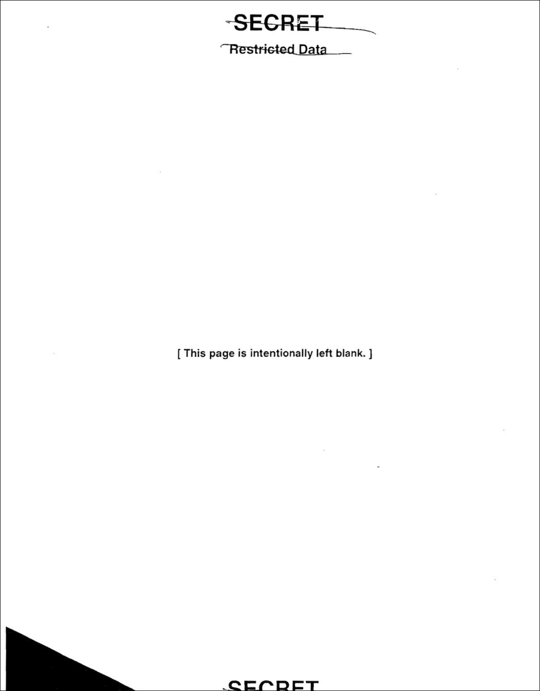

# The `while` Loop

Python provides two kinds of loops:

## `for`

* You just learned!
* Loops a finite number of times

## `while`

* You're about to learn!
* The loop can run an indeterminate number of times
* Checks if something is `True` and runs until it's set to `False`
* Basically, a `while` loop is Groundhog Day. The day repeats for Bill Murray until...

  <details>
  <summary>Answer (SPOILER!)</summary>
  The day repeats for Bill Murray until he is no longer a bad person!
  </details>

  

# `while`

We won't always have the luxury of a collection of items for controlling how many times to run a loop. Frequently, you won't know how many times your loop will need to run. This is what the `while` loop is for.

`for` loops are perfect for when you have a specific number of times you need the loop to run. In most cases, that number is the length of an array.

A `while` loop is useful when there’s no way of knowing how many times the loop will need to repeat — like a game loop that stops when a character dies.

It's a loop that will continue to iterate **while a given condition is true**. 

These loops are quite useful for data sets of unknown sizes, or for when we need to loop until some value changes.

```
<initialize a variable>

while <an expression involving that variable is truthy>:
  run some code
  if you're done, set the <variable> so that the <expression> evaluates to falsy
  # if the expression becomes falsy, the loop automatically terminates
  # otherwise, the loop will automatically re-iterate
```

For example:

```python
i = 0

while i < 3:
  print('i is now:', i)
  i += 1 # Same as i = i + 1
```

Let's mentally *unroll* the loop. The above code would be equivalent to:

```python
i = 0

# Do we start the loop? 0 < 3, so, Yes

print('i is now:', i) # i is now: 0
i += 1                # i becomes 1

# Do we continue the loop? 1 < 3, so, Yes

print('i is now:', i) # i is now: 1
i += 1                # i becomes 2

# Do we continue the loop? 2 < 3, so, Yes

print('i is now:', i) # i is now: 2
i += 1                # i becomes 3

# Do we continue the loop? 3 < 3 -- Ruh roh. Stop the loop!
```

Expected Output:

```
i is now: 0
i is now: 1
i is now: 2
```

Outside of our `while` loop, we create the variable `i`, which we'll use in our condition. We then start our loop. We loop "while `i` is less than 3." Then, in the loop, we print `i` and add one to its value.

Once the value of `i` reaches 3, the loop condition evaluates to false and the loop finishes.

Note that the number 3 itself never prints!

### Another Example

How about our [favourite childhood song](https://en.wikipedia.org/wiki/99_Bottles_of_Beer):

```python
bottles_of_beer = 99

while (bottles_of_beer > 0):
  print(f'{bottles_of_beer} bottles of beer on the wall... {bottles_of_beer} bottles of beer,')
  bottles_of_beer -= 1 # Same as bottles_of_beer = bottles_of_beer - 1
  print(f'Take one down, pass it around, {bottles_of_beer} bottles of beer on the wall')
  print('~~~~~')
```

## Infinite Loops (Don't do this at Home)

`while` loops present a potential "gotcha" in programming: the infinite loop. Because the `while` loop only stops when a condition becomes false, it's possible to write loops that never stop!

Here's an example of an infinite loop, which is not good:

```python
while True:
  print('Wheee!')
```

If your program ever goes into an infinite loop, hit <kbd>⌃Control</kbd>+<kbd>c</kbd> -- that's a general "escape hatch" for all sorts of computing situations.

## Be Careful!

Infinite loops creates a serious bug in your code where the loop never stops so that the rest of your program can continue, so your program will freeze indefinitely.

The way to avoid this is to **always** remember to update your conditional variable inside your loop block.

Don't *ever* do:

```python
# Oops, we forgot to update the conditional variable
a = 0
while a < 10:
  print(a)
```

And don't *ever* do:

```python
# Oops, we didn't update the conditional variable inside the loop
a = 0
while a < 10:
  print(a)
a += 1
```

Your program will run forever!

## Exercise: Filling a Glass of Water

[2 minutes]

Let's fill a glass of water. Create a new file, `water.py`. Inside the file, declare:

* A variable for the current water level inside a glass
* Another variable for the capacity of the glass

Start with this:

```python
water_level = 0
capacity = 12

while ???
```

What we want to do is to add water to the glass, one unit at a time, until the glass reaches capacity.

Can you write the `while` loop?

<details>
<summary>Answer (SPOILER!)</summary>

```python
water_level = 0
capacity = 12

while water_level < capacity:
  water_level += 1 # Here is where we add more water

print('The water level is', water_level)
```
</details>

## (If Time Permits -- If not, Take Home Exercise) Exercise: A Guessing Game

[5 minutes]

Now, get with a partner! Let's write a number guessing game.

Decide who will be driver and who will be navigator.

Here's what you have to do:

* Set a variable, `answer` to `'5'` (yes, a string!)
* Prompt the user for a guess and save it in a new variable, `guess`
* Create a `while` loop, which will end when `guess` is equal to `answer`
* Remember the `while` loop is not finished if the guess is wrong. Inside the loop, ask the user for another guess as long as the guess is wrong.
* After the `while` loop is finished, print "You got it!"

Discuss with your partner: Why do we need to make an initial variable before the loop?

**Hint:** Remember that `input()` always gives you back a string!

<details>
<summary>Answer (SPOILER!)</summary>

```python
answer = '5'
guess = input("Guess what number I'm thinking of (1-10): ")
while guess != answer:
  guess = input('Nope, try again: ')
print('You got it!')
```
</details>

---

# (If Time Permits) Other Ways of Controlling a Loop

## Passing

The `pass` statement is like a placebo: it simply executes without any effect.

Think of `pass` as something like 'This page is left intentionally blank'.



This may seem odd, and we'll cover why we would want to `pass` in a future class.

An example of `pass` in action:

```python
for number in range(5): # 0, 1, 2, 3, 4
  pass
  print(number)

print('Out of the loop')
```

Prints:

```
Number is 0
Number is 1
Number is 2
Number is 3
Number is 4
Out of the loop
```

## "Continuing" -- i.e. Skipping an Iteration

There are times when you may want to skip the rest of a single iteration.

The `continue` statement allows you to do just that!

When the `continue` statement is triggered, the loop jumps to the next iteration *right away*, without executing the rest of the block beneath the `continue` statement.

```python
for number in range(5): # 0, 1, 2, 3, 4
  if number == 2:
    continue
    print('The number is currently 2 - This will not be printed!')
    print('Neither will this be printed!')
  print(number)

print('Out of the loop')
```

Prints:

```
Number is 0
Number is 1
Number is 3
Number is 4
Out of the loop
```

Basically, a `continue` acts like an "Advance to Go" card in Monopoly!


The `continue` statement works in both `for` loops and `while` loops.

## "Breaking" -- i.e. Exiting

There are times when you may want to break out of the loop before the final condition has been met.

Perhaps the input from another part of the program has satisfied another, separate condition that makes the rest of the loop unnecessary. Enter the `break` statement:

```python
for number in range(5): # 0, 1, 2, 3, 4
  if number == 2:
    break
    print('The number is currently 2 - This will not be printed!')
    print('Neither will this be printed!')
  print(number)

print('Out of the loop')
```

Prints:

```
Number is 0
Number is 1
Out of the loop
```

Basicall, a `break` causes a premature ending of the loop. Maybe we agreed to play 500 turns of Monopoly, but then after a few turns mom calls out "Dinner's ready!"... No choice but to take a `break`!

The `break` statement works in both `for` loops and `while` loops.

## `continue` vs `break`


