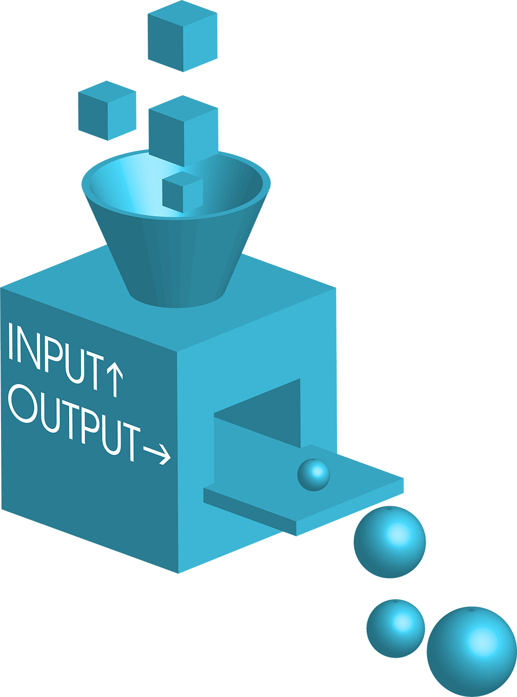
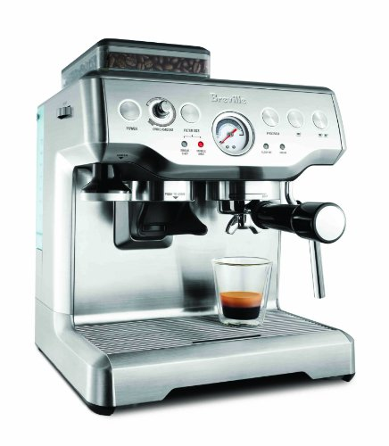

# Functions

What's a **function**?

Well, it turns out you've already been using them, you just didn't know that's what they were called.

* `print()`: To display information on the terminal
* `input()`: To accept input from a user
* `type()`: For determining the data type of a piece of data
* `len()`: To determine the length of a string or a list
* Even `int()`, `float()`, `str()` are all functions! (Used for converting data types)

Loosely speaking, a **function** is a *reusable piece of code*, built to do one job, that you can use *over and over*.


Credit: [Know Your Meme](https://knowyourmeme.com/memes/you-had-one-job)

Whenever you want the job to be done, all you have to do is **call** (or **execute**) the function:

* You **call** `print()` whenever you want to display something on the terminal
* You **call** `input()` whenever you want to ask the user to type in something
* You **call** `type()` whenever you want to examine the data type of a piece of data
* You **call** `len()` whenever you need the length of a string or list
* You **call** `int()`, `float()`, `str()` to convert data types

These are examples of **built-in** functions. Somebody already wrote this code for you, and you get them for free with Python! They basically just sit around in the background and wait, until you **call** them to do their work.

**IMPORTANT**: You **call** a function by putting parentheses `()` after their name, like `print()` and `input()`. This distinguishes them from variables, which do not have parentheses placed after them (for example:  `my_name` or `holidays`).

## Specialization and Delegation

Interestingly, you don't need to know *how* the function is built or how it does it job. It's on a "need-to-know basis"!

Is it weird to use something when you don't know how it's built? No! We do it everyday! You **call** on the services of your car, your elevator, your plumber, your dentist, your mechanic, your accountant, every day, without knowing how they do their jobs. Same with functions.

This is directly related to how humans learned to *specialize* and *delegate*, which allowed civilization to be built!

It turns out you don't have to do *everything*, you can trust others to do what they say they will. Same with programming.

Soon we'll learn how to write functions ourselves, but for now let's take a deeper look into how we use thse existing built-in functions.

---

# Arguments

Have you noticed that whenever you use `print()`, you put the piece of data you want it to print *inside the parentheses*?

```python
print('Hello User')
print('How are you?')
```

The value that you pass into a function is called an **argument**.

Clearly, whatever data you pass in the parentheses will be printed to the terminal. The same with `input()`, as you've seen already!

```python
user_name = input('Please enter your name: ')
print('Hello', user_name)
```

When converting data types or examining data types, you also pass in an **argument** -- and whatever you pass in will be processed by the function:

```python
a_float = float(9000)                   #==> a_float is now 9000.0
an_int  = int(3.14159)                  #==> an_int is now 3
print('Cats have ' + str(9) + ' lives') #==> Cats have 9 lives
print(type(True))                       #==> <class 'bool'>
```

Another example of a built-in function that accepts an argument is `len()`, which we've seen already:

```python
print(len('Hello')) #==> 5
```

Some functions can accept *multiple* arguments, like `print()`! You've seen this before. You just separate the arguments with commas.

```python
print('All', 'will', 'be', 'printed')
#==> Prints 'All will be printed'
```

Basically, arguments are the ***inputs*** to a function, which it needs to use to do its job.

---

# Our First Function

> Let's create a new file called `first_function.py`

Now that we know about functions and how to call them with arguments, let's write our first function!

We **define** functions using the `def` keyword.

Let's write a function whose one job is to print `hello` to the screen.

```python
def say_hello():
  print('Hello')
```

Note the indentation, just like `if` statements! The indented code forms the **body** of the function, i.e. the code that will be executed when the function is **called**.

Run your file with `python first_function.py`.

Notice that when we run your code, nothing happens from the user's point of view. Nothing is shown to the user.

* Just like `print()` and `input()`, a user-written function must be **called** before the code in it will run!
* To **call** the function, you just write its name plus parentheses:

```python
def say_hello():
  print('Hello')

say_hello()
```

* We can call it as many times as we like!
* The function cannot be used until you write it!
* You can put any code you like inside functions, even `if` statements and loops!

## Multi-Line Functions

How many lines of code can a function have? As many lines of code as you'd like! Just indent each line.

```python
def say_hello():
  print('Hello!')
  print('Bonjour!')

say_hello()
```

Remember that indentation is extremely important, and all of the indented code forms the **body** of the function.

## Functions Can Call Other Functions

```python
def say_hello():
  print('Hello!')
  print('Bonjour!')

def main():
  say_hello()
  say_hello()
  say_hello()

main()
```

There's nothing special about the name `main` -- that's just a convention that programmers use for the top-level function of a program. Imagine many functions each calling each other. By calling `main()`, the entire program is kick-started like dominos.

---

# Our Second Function, with an Argument!

Now, let's see how we can accept an argument into a function.

Let's write a function whose job is to doubles the argument.

```python
def double(num):
  result = num * 2
  print(result)

double(5) #==> prints 10
double(3) #==> prints 6
```

You see that the arguments of `5` and `3` are doubled and then printed.

Notice that the `num` variable inside the parentheses of the function acts as a placeholder. It *represents* the argument that will eventually be passed into the function. `5` in the first call, and `3` in the second call.

We call `num` a **parameter**. You can freely use any valid name you like.

Think about calling a broker to buy a stock. (Yes, they did this back in the 80s and 90s.) To them it's just a symbol. They don't care what stock you want to buy, but you have to tell him whether it's IBM or AAPL or whatever. They'll buy whatever stock you tell them to buy.

## Variables inside Functions

When you declare a variable inside a function (like `result` above), that variable is visible and usable **only inside the function**.

```python
def double(num):
  result = num * 2
  print(result)

double(5) #==> prints 10
double(3) #==> prints 6
print(result) # ERROR!
```

Think about everything inside the function as the *private thoughts of an individual* -- only that individual can access those thoughts.

This ties into the idea of **Variable Scopes**, which we have a whole another lesson on later!

Typically, if the meaning is clear, we would skip the intermediate variable tho:

```python
def double(num):
  print(num * 2)

double(5) #==> prints 10
double(3) #==> prints 6
```

## **Parameter** vs **Argument**

Let's get back to the two new words we just learned.

There is a subtle difference between them:

* **Parameter:** The placeholder that's defined in a function's declaration
* **Argument:** The actual value passed into the function when the function is later called

In practice programmers will use the words interchangably, so the meaning may only be clear with context!

## Case of the Missing Argument

What happens if you forget to pass in an argument?

```python
double()
# --> TypeError: double() missing 1 required positional argument: 'num'
```

## Partner Exercise: Total Bill Calculation

[5 mins]

Partner up! Choose one person to be the driver and one to be the navigator.

Let's imagine that you work in a cafe, and you've been asked to calculate total bills for customers including sales tax. "No problem", you say, "I know Python!"

(Let's say that the sales tax rate in your state is 10%, just to make life easier.)

Someone orders a latte, so let's calculate the bill for that:

```python
latte_price = 5.0
sales_tax_rate = .10
total_amount = latte_price + (latte_price * sales_tax_rate)
print(total_amount) #==> Prints 5.50
```

Then someone else orders a muffin, so let's calculate the bill for that:

```python
muffin_price = 3.0
sales_tax_rate = .10
total_amount = muffin_price + (muffin_price * sales_tax_rate)
print(total_amount) #==> Prints 3.30
```

You start to realize that you're repeating yourself a lot! Every time someone orders something, you have to write (basically) the same four lines over and over again.

In programming, we call this WET - Write Everything Twice.

You don't want to to be WET. You want to be DRY -- Don't Repeat Yourself. One of the most important uses of functions is to put repetitive code inside of it, so that you can use it over and over again.

With your partner, write a function that prints the total (including tax) if you pass it the base price, like this:

```python
def calculate_total(price):
  # Your code here

calculate_total(5.0) # Prints 5.50
calculate_total(3.0) # Prints 3.30
```

<details>
<summary>Answer (SPOILER!)</summary>

```python
def calculate_total(price):
  sales_tax_rate = .10
  total_amount = price + (price * sales_tax_rate)
  print(total_amount)

calculate_total(5.0)  # Prints 5.50
calculate_total(3.0)  # Prints 3.30
```
</details>

---

# Return Values

> Heads up! This is the most important idea of the day.

Remember that the whole point of writing functions is to *specialize* and *delegate*. Think about real life -- when you engage a specialist of some sort, the go off and do their job, and then they come back to you and hand you their work product. 

Imagine you're the boss of some company:

* You ask your bookkeeper to process all of your income, expenses, etc. They come back a litte later with your accounting books
* You hand the books over to your accountant and ask them to produce financial statements, they come back a little while later and hand them to you
* You hand the financial statements over to your graphic designer, who goes off and designs a nice investor's report around it, and brings it back to you a bit later

Look what's happening here -- each worker *gives you back* some piece of work that you then *pass on* to the next worker. In other words, each worker **return**s some result, which you can then pass on to another worker.

We want to achieve the same idea, with functions being able to pass along their work to other functions. Remember that each function does **one job**. The function should calculate its result and then **return** the result to whoever is calling the function. Then they can decide what to do with the result.

Think of functions as machines, which should take some **inputs**, processes them, and then provides you with an **output**.



Let's return to the previous example of calculating the total price of an item including the sales tax.

```python
def calculate_total(price):
  sales_tax_rate = .10
  total_amount = price + (price * sales_tax_rate)
  print(total_amount)

calculate_total(5.0)  # Prints 5.50
```

If we remove the `print` statement, what happens?

```python
def calculate_total(price):
  sales_tax_rate = .10
  total_amount = price + (price * sales_tax_rate)

calculate_total(5.0)  # Nothing is displayed to the user
```

That makes sense because what's the **one job** of `print()`? To display the argument to the user.

Let's now consider `calculate_total()` to be a machine that takes an input `price` and returns the total amount as an output. We use the `return` keyword to return the total amount.

```python
def calculate_total(price):
  sales_tax_rate = .10
  total_amount = price + (price * sales_tax_rate)
  return total_amount

calculate_total(5.0)  # Still nothing is displayed to the user
```

Now the `calculate_total()` function is *returning* the result, but we haven't done anything with the result!

Here's how to use the returned result. We can save it in a variable!

```python
bill = calculate_total(5.0)
print(f'The total is ${bill}')  #==> The total is $5.50
```

Actually, you have already done a similar technique with `input()` before!

```python
user_age = input('How old are you? ')
print(f'You are {user_age} years old')
```

The input that the user provides is *returned* by the `input()` function, and the result is saved in the `user_age` variable.

If you wish to, you can completely bypass the intermediate variable, and just insert the expression into the curly braces in the string interpolation:

```python
print(f'The total is ${calculate_total(5.0)}')  #==> The total is $5.50
```

**Note**: If you wish to use the return value in your program **later**, you must remember it in a variable!
**Note**: You don't **have** to return a value from your function. It all depends what the function is supposed to do! If you return nothing, then `None` is automatically returned from your function.

## Functions as Machines

If you're confused by all this `return` business, again, think about functions like machines.

Any useful machine needs to accept some raw materials, processes them, and then gives you some finished product.

For example, think about this coffee maker.



* The **inputs** to the machine (water, coffee beans, electricity maybe) are analogous to function **arguments**
* The **output** of the machine (espresso) is analogous to the **return value** of a function
* In order to use the output (espresso) of the machine some time later, you have to make sure there's a cup to catch it in -- Like saving it into a variable!

So when you are writing a function, imagine that you are constructing a machine that will process the given inputs (arguments/parameters) and turn those raw materials into some sort of finished output (return value).

## You Do: Practicing Returns

[5 mins]

* Define a function, `add_two`, that takes a parameter `number`
* The function should add `2` to the `number` parameter
* Save the result in a new variable `total`
* Then, the function should `return` that `total`
* In the main program, call the `add_two` function with an argument of your choice
   * Save the return value in a new variable named `result`
* Finally, print the result **in the main program**

<details>
<summary>Answer (SPOILER!)</summary>

```python
def add_two(number):
  total = number + 2
  return total

result = add_two(3)
print(result)
```
</details>

---

# Multiple Functions


As I mentioned before, one of the most important ideas behind writing functions is to **have them work together**!

Imagine building an assembly line for a race car, where the jobs of putting together each part of a car is delegated to different functions.

The work product of each function is then passed on to another function, by having a manager (`main`) oversee the returned work product of each station and passing it onto the next station.


In the following code, the end product will be the string `\ō͡≡o˞̶`

```python
def make_body():
  return 'ō͡≡o'

def add_bumper(wip):
  bumper = '˞̶'
  return wip + bumper

def add_spoiler(wip):
  spoiler = '\\'                      # Note the escaped backslash
  return spoiler + wip

def main():
  stage1 = make_body()                # the stage1 variable contains ō͡≡o
  stage2 = add_bumper(stage1)         # the stage2 variable contains ō͡≡o˞̶
  final_product = add_spoiler(stage2) # the final_product variable contains \ō͡≡o˞̶

  print(final_product)

main()
```

Note that **not all functions** need to `return` a value -- for example the `main()` function above simply runs through some steps and then finally prints the final product to the user. There's nothing to return. It all depends on **the purpose** of the function you write.

In the old days of computer programming, we used to call these types of functions that simply executes some steps without returning a value a **procedure**, although that word is not used often these days.

---

# Exiting a Function

## The `return` Statement Exits a Function

The `return` statement *exits a function* right away. All code after a `return` is skipped. What do you think the following will print?

```python
def mystery():
  return 10
  print('What have we here?')
  return 5

my_number = mystery()
print(my_number)
```

<details>
<summary>Answer (SPOILER!)</summary>

The answer is 10. `What have we here?` is not printed at all because the function exits right away on the `return 10` line.
</details>

What happens if we use `return` without a value, instead of `return 10` on the first line? Let's see!

```python
def mystery():
  return
  print('What have we here?')
  return 5

my_number = mystery()
print(my_number)
```

<details>
<summary>Answer (SPOILER!)</summary>

The answer is `None`
</details>

## You Do: What Will Happen?

What do you think will print out?

```python
def add_bonus_points(score):
  if score > 50:
    return score + 10
  else:
    return score + 25

total_points = add_bonus_points(55)
print(total_points)
```

<details>
<summary>Answer (SPOILER!)</summary>

The answer is 65
</details>

As you can see, you can put any code in a function, even `if` statements!

We can also re-write the previous code fragment like this -- they are equivalent:

```python
def add_bonus_points(score):
  if score > 50:
    return score + 10
  return score + 25

total_points = add_bonus_points(55)
print(total_points)
```

## Premature Exiting

As we saw before, can write `return`, by itself, as a way to exit the function and prevent any code that follows from executing. It's kind of like aborting a mission.

When we call this next function and pass in `True` as an argument for the `muted` parameter, the "Now playing" sentence never prints.

```python
def rock_and_roll(muted):
  song = "Sweet Child O' Mine"
  artist = "Guns N' Roses"

  if muted:
    return

  print('Now playing:', song, 'by', artist)

rock_and_roll(True)
```

Here, we use `return` as a way to exit a function. We don't actually return any value (i.e. `None`, or nothing, is returned!).

(There is an implicit `return None` at the end of every function -- you don't have to write it!)

## You Do: Quick Knowledge Check

Looking at this code, what is the return value if we pass in an argument of `10` for the `x` parameter?

```python
def another_mystery(x):
  if (x < 8):
    return 8

  y = x
  y += 3 # This notation means the same thing as y = y + 3

  if (y < 15):
    return y

  return 100
    
print(another_mystery(10))
```

<details>
<summary>Answer (SPOILER!)</summary>

13
</details>

---

# Multiple Parameters

Our cafe is getting successful, and we have locations opening all across the country. However, each state has a different sales tax rate! The first function we wrote is no longer good enough.

But it turns out a function can have as many parameters as needed!

Here, we added a second parameter, `tax_rate`:

```python
def calculate_total(price, tax_rate):
  total_amount = price + (price * tax_rate)
  return total_amount

print(calculate_total(5.5, 0.10))  # 'price' is 5.5;  'tax_rate' is 0.10; This line will print 6.05
print(calculate_total(4.75, 0.12)) # 'price' is 4.75; 'tax_rate' is 0.12; This line will print 5.32
```

* The first argument that's provided, `5.5`, will correspond with the first parameter we provided for the function, `price`
* The second argument, `0.10`, will correspond with the second parameter, `tax_rate`

To have a function accept more than one parameter, use a comma-separated list in the function declaration:

```python
def some_function(parameter_1, parameter_2, parameter_3, parameter_4):
  ...
```

## Parameter Ordering

With parameters, order matters! Programs don't automatically understand what argument should go into what parameter - they assign the values in order.

```python
def greetings(first_name, last_name, year, city):
  return f'Hello, {first_name} {last_name} born in {year} from {city}'

print(greetings('Bruce', 1939, 'Gotham', 'Wayne'))
#==> Hello Bruce 1939 born in Gotham from Wayne
# What the heck????
print(greetings('Bruce', 'Wayne', 1939, 'Gotham'))
#==> Hello Bruce Wayne born in 1939 from Gotham
# Ahhhh, better
```

Unlike a human, computers can't use the variables' names to figure out what they're for!

Order matters!

If you tell the function that Bruce's last name is 1939, it will believe you! This is why it's important for parameters to have descriptive names, such as `first_name` and `year` — so that we as the humans running the program can pass the right arguments.

---

# (If Time Permits, Otherwise Take-Home) More Complicated Examples

## Where's Waldo?


In this example, the `where_is()` function looks through a `group` to find the *index* of `'Waldo'`:

```python
def where_is(target, group):
  i = None

  for j in range(len(group)):
    if group[j] == target:
      i = j
      break

  return i
  
def main():
  people = ['Elizabeth', 'Bronte', 'Waldo', 'Jill', 'Nisha', 'Ben']
  person = 'Waldo'
  position = where_is(person, people)
  print(f'{person} was found in position: {position}')

main()
```

The output, of course, would be:

```
Waldo was found in position: 2
```

## Short Names

In this example, the `short_names()` function will determine, from an input list, which names are considered "short" (in this case, 4 letters or less):

```python
def short_names(names, short_threshold):
  short_list = []

  for name in names:
    if len(name) <= short_threshold:
      short_list.append(name)

  return short_list

def main():
  people = ['Elizabeth', 'Bronte', 'Waldo', 'Jill', 'Nisha', 'Ben']
  people_with_short_names = short_names(people, 4)

  print('These are the people with the shortest names:')
  for name in people_with_short_names:
    print(name)

main()
```

In the above example, the output would be:

```
These are the people with the shortest names:
Jill
Ben
```


---

## Summary + Q&A:

Can you now:

* Identify when to use a function?
* Write and call a function with arguments?
* Return a value from a function?
