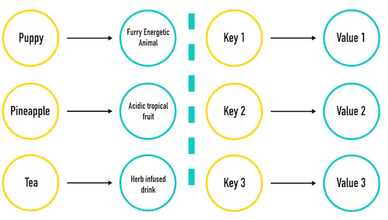

# Dictionaries

Think about dictionaries — they're filled with words and definitions that are paired together.

Programming has an idea just like this!

* Dictionaries hold **keys** (words) and **values** (the definitions)
* In a real dictionary, you can look up a word and find the definition
* In a Python dictionary, you can look up a key and find the value
* In other languages, this data structure may be called a **Hash**, a **Map**, or an **Associative Array**



## We Do: Declaring a Dictionary

Just like you can look up any word in the dictionary to get the definition, you can just use a key in a dictionary to find the value.

This is known as a **key-value pair**.

Hence the definition of a **dictionary**: a set of key-value pairs.

Here's an example:

```python
my_dictionary = {
  'Puppy': 'Furry, energetic animal', 
  'Pineapple': 'Acidic tropical fruit', 
  'Tea': 'Herb-infused drink'
}
```

You can also write the whole thing on one line, but its not very readable:

```python
my_dictionary = {'Puppy': 'Furry, energetic animal', 'Pineapple': 'Acidic tropical fruit', 'Tea': 'Herb-infused drink'}
```

Best practice: Declare your dictionaries across multiple lines for readability!

## We Do: Accessing Dictionary Elements

Printing the whole dictionary:

```python
print(my_dictionary)
```

How to access a specific entry in the dictionary:

```python
my_dictionary['Puppy']
```

And then to print that entry:

```python
print(my_dictionary['Puppy'])
#==> Prints "Puppy"'s value: 'Furry, energetic animal'
```

Here's the general syntax:

```python
name_of_dictionary = {'key1': 'value1', 'key2': 'value2', 'key3': 'value3'}
print(name_of_dictionary[key_to_look_up])
```

Watch out:

* Curly braces
* Colons between keys and values
* Commas between entries. The commas can be hard to see

This is basically just like a real dictionary!

## What's the Data Type of a Dictionary?

`type()` also works with dictionaries:

```python
print(type(my_dictionary))
#==> <class 'dict'>
```

## We Do: Dictionary Syntax

What if a value needs to change?

We can reassign a value by referencing it with its key:

```python
my_dictionary['Puppy'] = 'Happy, furry, energetic animal'
```

This is analogous to accessing an element of a list via its index!

What if we have new things to add? It's the same syntax as changing the value, just with a new key:

```python
my_dictionary['Yoga'] = 'Peaceful'
```

Changing values is case sensitive — be careful not to add a new key!

## Dictionary Quick Tips

* You can't have the same key twice.
   * Imagine having two `Puppy` in a real dictionary, it would be confusing as heck! 
   * If you try to have the same key twice, the last value will be the one that's kept (it will overwrite the value of that key)
* Printing a key that doesn't exist gives an error
* Keys can be a string or number
* You can look up a value by the key — but you can't easily look up the key by its value (just like a real dictionary!)
* Use meaningful key names: `my_zip_code` is better than `some_numbers`
* Dictionaries are **ordered** in the order that you insert key/value pairs (**not alphabetically** like real dictionaries)!
   * That's fine -- The typical use case for a dictionary is when you already know the key for the value you want

## Deleting from a Dictionary

You can also delete a key/value pair from a dictionary. Remember `.pop()`? It works in a dictionary as well. This time, instead of supplying it with an index position argument, you supply the key instead.

As a side bonus, as before with lists, `.pop()` will **return** the removed value.

```python
element = my_dictionary.pop('Tea')
print(element)       #==> Herb-infused drink
print(my_dictionary) # Tea is now gone from the dictionary
```

## Quick Review: Dictionaries

We can:

* Declare a dictionary
* Print a dictionary
* Print the value associated with any key
* Change the value associated with a any key
* Delete a key/value pair from a dictionary

---

# Looping Through Dictionaries

Like a list, we can also loop through the items in a dictionary with a `for` loop.

The difference is, instead of iterating over each element in the collection, the `for` loop gives you the **key** inside the iteration variable. You can then use the key to access the value.

```python
my_dictionary = {
  'Puppy': 'Furry, energetic animal',
  'Pineapple': 'Acidic tropical fruit',
  'Tea': 'Herb-infused drink'
}

for word in my_dictionary:
  print(word)                # Print the word
  print(my_dictionary[word]) # Print the definition
```

Think of it like: Take the Webster's dictionary, and for every *word* (key) in the dictionary, print the *definition* (value).

Another example, printing *both* the key and value together in one line:

```python
for word in my_dictionary:
  print(word, ':', my_dictionary[word])
```

**Bonus Question:** How would you remove the space before the colon, but keep the space after the colon?

<details>
<summary>Answer (SPOILER!)</summary>

Using an `f`-string, of course!
</details>

## You Do: Partner Exercise: Dictionary Practice

[5 Minutes]

You know the drill: Grab a partner and pick a driver!

* Create a new file, `dictionary_practice.py`
* Declare a dictionary called `my_word`
* The word is `Mississippi`
* Add a *key* for each letter in your word, with a *value* of how many times that letter appears in the word:

```python
my_word = {'m': 1, 'i': 4, 's': 4, 'p': 2}
```

Write a loop that prints a formatted string, for each key/value pair:

Expected output:

```
The letter m appears in my word 1 times
The letter i appears in my word 4 times
The letter s appears in my word 4 times
The letter p appears in my word 2 times
```

<details>
<summary>Answer (SPOILER!)</summary>

```python
my_word = {'m': 1, 'i': 4, 's': 4, 'p': 2}

for letter in my_word:
  print(f'The letter {letter} appears in my word {my_word[letter]} times')
```
</details>

**Bonus (if you have extra time)**:

* If it only appears one time, instead print `The letter m appears in my word once`
* If it appears two times, instead print `The letter p appears in my word twice`
* If it appears more than two times, print `The letter x appears in my word y times`

<details>
<summary>Answer (SPOILER!)</summary>

```python
my_word = {'m': 1, 'i': 4, 's': 4, 'p': 2}

for letter in my_word:
  times = my_word[letter]
  if times == 1:
    print(f'The letter {letter} appears in my word once')
  elif times == 2:
    print(f'The letter {letter} appears in my word twice')
  else:
    print(f'The letter {letter} appears in my word {times} times')
```
</details>

## Other Ways of Looping Through a Dictionary

### `.values()`

Instead of iterating through the keys of a dictionary, you can iterate through the values.

```python
for v in d.values():
  print(v)
```

Example:

```python
my_dictionary = {
  'Puppy': 'Furry, energetic animal',
  'Pineapple': 'Acidic tropical fruit',
  'Tea': 'Herb-infused drink'
}

for v in my_dictionary.values():
  print(v)
```

The output is:

```
Furry, energetic animal
Acidic tropical fruit
Herb-infused drink
```

### `.items()`

This one is extremely useful! It allows you to retrieve *both* the key *and* the value, in the same loop.

> The syntax is a little funny, but this is the preferred way of looping through a dictionary!

```python
for k, v in d.items():
  print(k, ':', v)
```

Example:

```python
my_dictionary = {
  'Puppy': 'Furry, energetic animal',
  'Pineapple': 'Acidic tropical fruit',
  'Tea': 'Herb-infused drink'
}

for k, v in my_dictionary.items():
  print(f'{k}: {v}')
```

The output is:

```
Puppy: Furry, energetic animal
Pineapple: Acidic tropical fruit
Tea: Herb-infused drink
```

---

# Lists inside Dictionaries, Dictionaries inside Lists!

A typical usage of dictionaries in real-life programs is to hold a group of associated data, like the information regarding a car. This makes the data structure more understandable than just a plain list.

For example, here's some information regarding my car:

```python
freds_car = [
  'Ford', 
  'Focus',
  'blue',
  54019,
  ['Fred', 'Jill', 'Joe'],
  2015
]
```

But by presenting this information within a dictionary instead, you gain much more context!

```python
freds_car = {
  'make': 'Ford',
  'model': 'focus',
  'details': {
    'color': 'blue',
    'mileage': 54019,
    'drivers': ['Fred', 'Jill', 'Joe']
  },
  'year': 2015
}
```

See how you can put anything you like as a value inside a dictionary or list, even other dictionaries and lists!

Can you imagine that you could have multiple cars in a neighborhood?

```python
freds_car = {
  'make': 'Ford',
  # ... too lazy to type the rest...
  'year': 2015
}

hyuns_car = {
  'make': 'Toyota',
  # ... too lazy to type the rest...
  'year': 2019
}

kendricks_car = {
  'make': 'Tesla',
  # ... too lazy to type the rest...
  'year': 2020
}

neighborhood_cars = [freds_car, hyuns_car, kendricks_car]
```

**Class Question:** What's another way you could write a list of dictionaries, **without** declaring the intermediate variables of `freds_car`, `hyuns_car`, and `kendricks_car`?

<details>
<summary>Answer (SPOILER!)</summary>

```python
neighborhood_cars = [
  {
    'make': 'Ford',
    'model': 'focus',
    'details': {
      'color': 'blue',
      'mileage': 54019,
      'drivers': ['Fred', 'Jill', 'Joe']
    },
    'year': 2015
  },
  {
    'make': 'Toyota',
    # ... too lazy to type the rest...
    'year': 2019
  },
  {
    'make': 'Tesla',
    # ... too lazy to type the rest...
    'year': 2020
  }
]
```
</details>

Just to complete the discussion, we saw in the list lesson that lists can contain other lists, so it's not surprising that lists can also contain dictionaries:

```python
complex_list = [
  'a value',
  {'key1' : 'value 1', 'key2' : 'value 2'},
  ['now', 'a', 'list']
]
```

---

# If Time Permits, otherwise Take Home Exercises

## You Do: Most Popular Word

[5 Minutes]

Write a function, `max_val()`, that takes a dictionary as a parameter and returns the maximum value of any of the keys in the dictionary.

Assume that the argument dictionary's values will always be non-null integers.

Starter code (fill in the question marks!):

```python
def max_val(???):
  ???

input_dict = {
  'a': 2,
  'b': 3,
  'c': 1
}

print(max_val(input_dict)) ###> Prints 3
```

<details>
<summary>Answer (SPOILER!)</summary>

```python
def max_val(d):
  max_num = None
  for k in d:
    if max_num == None or d[k] > max_num:
      max_num = d[k]
  return max_num
```
</details>

**Bonus**: have the function return the maximum value, _and_ the key associated with that value, wrapping both of those values in a new dictionary.

<details>
<summary>Answer (SPOILER!)</summary>

```python
def max_val(d):
  max_num = None
  max_key = None
  for k in d:
    if max_num == None or d[k] > max_num:
      max_num = d[k]
      max_key = k 
  return { 'max_num': max_num, 'max_key': max_key }
```
</details>

---

# Summary and Q&A

Dictionaries:

* Are another kind of collection, instead of a list
* Use **keys** to access **values**, not indices!
* Should be used instead of lists when you'd prefer more meaningful keys than just index numbers

```python
my_dictionary = {
  'Puppy': 'Furry, energetic animal',
  'Pineapple': 'Acidic tropical fruit',
  'Tea': 'Herb-infused drink'
}
```

---

# Additional Resources

* [Strings, Lists, Tuples, and Dictionaries Video](https://www.youtube.com/watch?v=19EfbO5D_8s)
* [Python Data Structures: Lists, Tuples, Sets, and Dictionaries Video](https://www.youtube.com/watch?v=R-HLU9Fl5ug)


<!--

---

# List Types

* Lists, sets, tuples, and dictionaries are easily confused with each other
* It's useful to know what datatype is inside a variable
* As a reminder: The `type()` function tells us what a variable is: set, tuple, list, integer, string, dictionary - anything!

Try it:

```python
unique_colors_1 = set(['red', 'yellow', 'green', 'red'])
print('unique_colors_1 is', type(unique_colors_1))

unique_colors_2 = ['red', 'yellow', 'green', 'red']
print('unique_colors_2 is', type(unique_colors_2))

unique_colors_3 = ('red', 'yellow', 'green', 'red')
print('unique_colors_3 is', type(unique_colors_3))

my_number = 2
print('my_number is', type(my_number))

my_string = 'Hello!'
print('my_string is', type(my_string))
```

-->
