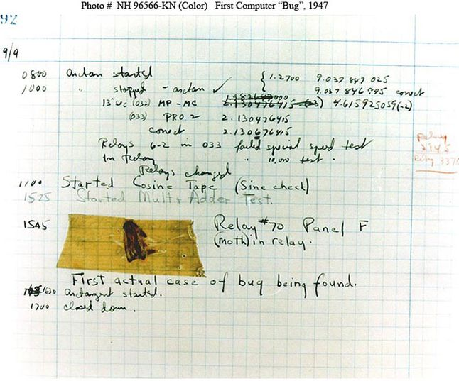

# Debugging Principles and Techniques

<!-- ## Lesson Objectives

*After this lesson, you will be able to...*

* Troubleshoot common types of errors
* Implement basic exception handling
* Troubleshoot logic errors -->

The idea in this lesson is to get you comfortable recognizing errors and solving them, not to memorize them!

The goal is to get you to notice the error message and decode what it's saying.

---

# Discussion: Python Error Messages

By now, you've seen some error messages. What do you think has happened here?

```python
x = 5
y = 0
print(x / y)
```

```python
Traceback (most recent call last):
  File "python", line 3, in <module>
ZeroDivisionError: division by zero
```

How could it be fixed?

## Making Errors Into Friends

Errors are pretty bad -- when your program encounters an error, it'll completely crash out and stop execution. That's pretty frustrating!

But we'll walk through some common errors together and you'll see:

* Errors sometimes say exactly what's wrong
* Some errors have very common causes
* Errors may say exactly how to fix the issue
* Python errors are very helpful and have clear messages (compared to some other programming languages anyway)

Basically, error messages are just a way of Python saying: "Hey, I don't know what to do here, I need some help."

With that in mind -  Did Python do a good job of informing us what the issue was earlier?

---

# Common Errors

Let's go through some common errors and see how to fix them.

Here is a helpful table of common errors. This table is for your reference, don't try to memorize it!

| Error Type| Most Common Cause |
| --- | --- |
| `AttributeError` | Attempting to access a non-existent attribute |
| `ImportError` | A module you tried to import doesn't exist |
| `IndexError` | You attempted to access a list element that doesn't exist |
| `IndentationError` | Indenting code in an invalid way |
| `IOError` | Accessing a file that doesn't exist |
| `KeyError` | Attempting to access a non-existent key in a dict |
| `NameError` | Attempting to use a module you haven't imported/installed |
| `OverflowError` | You made a number larger than the maximum size |
| `RuntimeError` | The error doesn't fit into any other category |
| `SyntaxError` | A typo, such as forgetting a colon |
| `TypeError` | Using two different types in an incompatible way |
| `ValueError` | When you are trying to convert bad keyboard input to a number |
| `ZeroDivisionError` | Dividing By Zero |

We'll take a look at a few of the most common ones from that list.

## We Do: `IndexError`

Let's take a look at this:

```python
race_runners = ['Yuna', 'Bill', 'Hyun']
print('The winners are:', race_runners[1], race_runners[2], race_runners[3])
```

Obviously this code causes a crash, but by looking at it, can you tell what the intention was? Which element do you think the programmer was trying to access?

**Protip #1**: Remember that lists are indexed starting at zero!

**Protip #2**: Index errors typically happen when you attempt to access a list index that doesn't exist.

**Protip #3**: What line produced the error? (Unfortunately sometimes the error is not exactly on the line reported -- Python can only do so much!)

## You Do: Fix a `NameError`

* Run the code to get the error
* What kind of error is it? What is the error message?
* Now Fix it!

```python
my_nums = 5
print(my_num)
```

<details>
<summary>Answer (SPOILER!)</summary>

* We most commonly get a `NameError` if we use a variable:
  * Without defining it
  * Before defining it
</details>

## `KeyError`

Accessing a key in a dictionary that doesn't exist.

Commonly caused by:

* A misspelling
* Mixing uppercase and lowercase
* or simply not remembering what keys are available in the dictionary

```python
my_favorites = {
  'food': 'Lobster Rolls',
  'song': 'Bohemian Rhapsody',
  'flower': 'Iris',
  'color': 'Green',
  'movie': 'The Princess Bride',
  'programming_language': 'Python'
}

# This is okay!
print('My favorite color is', my_favorites['color'])

# This is NOT okay! (Case sensitivity!)
print('My favorite color is', my_favorites['Color'])

# This is NOT okay! (Key doesn't exist)
print('My favorite restaurant is', my_favorites['restaurant'])
```

The error message tells you exactly what key is missing!

## `SyntaxError`

Let's run the code together. What happens? How can we fix it?

```python
my_age = 13

if my_age = 18:
  print('I may vote.')
else:
  print('I may not vote.')
```

* Remember that `=` and `==` are for different purposes!

## `TypeError`

`TypeError` and its message tell us:

```python
my_num = 5 + '10'
print(my_num)
#==> TypeError: unsupported operand type(s) for +: 'int' and 'str'
```

What do we learn from this error message? Have you already learned a way to fix this?

<details>
<summary>Answer (SPOILER!)</summary>

* We're trying to combine different types in a way that doesn't make sense to Python
* The error was caused when using the `+` operator on two incompatible types: `string` and `integer`
</details>

## `IndentationError`

This is a common problem for beginners!

```python
def foo():
  print('bar')
   print('baz')
```

You'll get an `IndentationError: unexpected indent`.

This error may be caused by:

```
Notenoughindentation
    Mismatched  indentation
Mixing tabs and   spaces!
```

## `ValueError`

Most commonly caused by trying to convert a bad string into a number.

```python
# This is okay!
my_num = int('10')

# This throws a ValueError
my_num = int('Moose')
```

<!--
## `RuntimeError`

This is the worst error to see!

* When no other error type fits
* You need to rely on the error message content
* May be used for custom errors that the programmer writes

Basically a `RuntimeError` is like if I said to you: "Please eat the piano"

You can understand what's being asked, but can't actually do that!

This is an error that comes up when no other error type fits the situation. You will need to rely heavily on the content of the error message rather than getting much of a hint from the type alone.
-->

---

# Catching Errors

Sometimes, we might have to write code that you reasonably expect might trigger an Error:

```python
my_num = int(input('Please give me a number: '))
```

What if the user types a string like `'Moose'`?

That would trigger a `ValueError` - the program will be trying to make an int out of the string `'Moose'`. If that happens, it will cause the program to stop and an error to be shown to the user!

But, we have to reasonably expect that a user of your program is gonna try to be a wiseguy and type in something other than a number!

You have to anticipate and prepare for possible errors, and then have your program respond with a smooth message instead of a crashing. We call that **catching errors**.

## Try-Except

A `try`-`except` block is the way we can catch errors in Python.

Let's try to make the last program work more smoothly for the user:

```python
my_num = None

while my_num == None:
  try:
    my_num = int(input('Please give me a number: '))
  except ValueError as e:
    print('That was not good input, please try again!')
    print('The error was', e)

print('Thanks for typing the number', my_num)
```

With a try-except block, we can catch:

* One error (`except ValueError:`)
* Multiple errors (`except (ValueError, KeyError):`)
* Any/every error (`except:`)

Always try to specify the error, if possible!

* Note that `e` is just a variable name!
* You can catch every possible error by leaving the specified error blank, however, this is generally not a great practice because it tells your co-workers very little about how you were thinking about what the exceptional circumstances could be when you wrote the code

---

# Bugs

Python's Errors and error messages are really helpful when we've got bad syntax, or are trying to access something that doesn't exist.

However, not every programming problem can by caught by Python!

**Do not try to run the code below YET**!

```python
my_num = 1

while my_num < 10:
  print(my_num)
  my_num + 1
```

* Can anyone say what is wrong with this code?
* What might happen if you run it?

<details>
<summary>Answer (SPOILER!)</summary>

The last line should be `my_num += 1`

* An itty-bitty typo - just one character in this case - caused an enormous problem!
* Can you tell what the original intention of the code was? What went wrong? Why did the code go into an infinite loop? How can we fix this code?
</details>

There are many errors like this where there is *nothing syntactically wrong* with the code, but there is an error in the logic, or a typo that changes the meaning of the code, as we saw with the infinite loop.

These are **logic mistakes** which lead to **bugs**. Even though the syntax of the code is not in question, there's an error in the *logic* of the code!

By the way, remember that when you find yourself in an infinite loop, you can hit <kbd>⌃Control</kbd>+<kbd>c</kbd> in the terminal to stop it.

## Bugs

Logic errors in code are known as **bugs**.

This is the first ever bug found in a computer program... In actual fact not an error (bug) in the code itself!



## Discussion: Another Infinite Loop

It's easy to accidentally make an infinite loop. What's the problem here?

```python
i_am_hungry = True
fridge_has_food = True

while i_am_hungry or fridge_has_food:
  print('Opening the fridge!')
  i_am_hungry = False
```

<details>
<summary>Answer (SPOILER!)</summary>

Using `or` when you meant `and` (or vice versa) is a common cause of pain!
</details>

## Infinite Infinite Loops!

There are many, many ways to accidentally create an infinite loop!

Most common infinite loops are a result of:

* A `while` loop's condition never becomes `False`
* Forgetting to increment a counter variable
* Logic inside the loop that restarts the loop
* Bad logic in a `while` loop's condition (e.g., putting `or` instead of `and`)

Be careful to check your termination conditions!

These are common, and you really have to watch out for it.

## Discussion: More Logic Mistakes

Let's take a look at another logic mistake.

Here, we want to find the average of `8` and `10`. The answer should be `9`, because `8 + 10 == 18`, then `18 / 2 == 9`

```python
x = 8
y = 10
avg = x + y / 2

print('avg is', avg) 
```

What happened and why?

<details>
<summary>Answer (SPOILER!)</summary>

Remember PEMDAS from grade school! (Or BEDMAS if you're Canadian.)

There is an order of operations for mathematical operations.

```
Parentheses
Exponents
Multiplication
Division
Addition
Subtraction
```

</details>

This is another **Logic Mistake**. Even though the syntax of the code is not in question, there's a mistake in the *logic* of the code!

Unfortunately, logic mistakes are very common, and they **do not result in an error message**.

You'll have to **debug** logic mistakes to find the source of the problem.

---

# Debugging

**The Oldest Debugging Tool: Print Statements**

You may have already figured out what the problem is in the previous example, but in a more complex example, you might not know!

**Pro Tip**: If something is wonky and you don't know why, starting `print`ing.

* Use `print` statements on each line to peek at intermediate values
* To figure out where the problem is, break the code down into smaller steps and print out each step

```python
x = 8
y = 10

s = x + y
print('sum is', s)

q = s / 2
print('quotient is', q)

avg = x + y / 2
print('avg is', avg)
# Now we know there must be a problem with the step where we calculate `avg`
```

By splitting up the statement into smaller parts, we simplified the logic of each line and was able to zoom into the problem area. You can then fix your problem (in this case, by adding parentheses) and be on your way!

**Protip:** Don't forget to remove the print statements used for debugging from your final program.

---

# Summary and Q&A

* Python has many common built-in errors
* Use `try`-`except` syntax to catch an expected error
* Logic issues don't throw errors, so be careful!
* Use `print` statements to walk through your code line-by-line

## Debugging: It Could be a lot Worse!

At least it's not **real** bugs...


---

# Homework

Go through the **Introduction to Debugging** chapter of the **Foundations of Python Programming** ebook.

The chapter has a total of 8 pages, each of them containing a few interactive problems.

Start from [Page 1](https://runestone.academy/runestone/books/published/fopp/Debugging/intro-DebuggingGeneral.html) and use the arrows on the bottom to go to the next page, until you finish all 8 pages.

Do all of the interactive debugging problems. 

Focus in particular on Chapter 3.8: Know Your Error Messages!

Nothing to submit -- just go through the problems, answer them, check your answer, and learn from the problems! 

---

# Additional Resources

* [List of Built-In Errors](https://www.tutorialspoint.com/python/standard_exceptions.htm)
* [Error Flowchart PDF](https://www.dropbox.com/s/cqsxfws52gulkyx/drawing.pdf)
* [Try-Except Documentation](http://www.pythonforbeginners.com/error-handling/python-try-and-except)
* [A deep dive into try/except clauses](https://jeffknupp.com/blog/2013/02/06/write-cleaner-python-use-exceptions/)
* To get advanced, add [logging](https://fangpenlin.com/posts/2012/08/26/good-logging-practice-in-python/) to your code
* To get very advanced, include [unit tests](http://www.diveintopython.net/unit_testing/index.html); the [pytest module](http://pythontesting.net/framework/pytest/pytest-introduction/) is great
