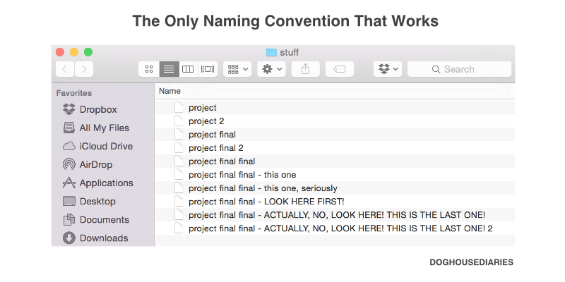

# Git

## What is Version Control?



Source: [The Dog House Diaries](http://thedoghousediaries.com/5964)

Version Control:

* A system that records changes to a set of files, over time
* It lets you travel back in time. You can restore any past version of your work, so there's no need to be afraid of experimenting with your code and breaking things

## What is Git?

* Industry-standard Version Control software
   * It's small and fast
* In Git, each project is called a **repository**, or **repo**
* A repo consists of:
   * All project files and folders (directories)
   * The history of each file
* A project's version history is made up of a series of **commits**
   * Think of them as "snapshots" or "saved games"
* **Important:** *Do not place a Git Repo inside another Git Repo!*
   * Each repo is considered a separate unit

Git is used by real programmers and companies *every day* to produce real software. It's large and complicated but very important to learn to be part of the programming world! It's a *huge* topic!

To survive, we're only going to learn the *bare minimum* necessary for us to do the course!


> You don't wanna know what came before Git...

## What is Github?

Git and [Github](https://github.com) are *two different things*, but closely related.

To put it simply:

* Git is the software you run on your laptop to work with code projects in repos
* Github is a website where you can store your repos "in the cloud"

If you've ever used a service like Dropbox or iCloud to store your photos "in the cloud", it's very similar except instead of synchronizing photos, you're synchronizing code!

The difference is that Git/Github doesn't do its synchronization work automatically like iCloud does with photos. You as the programmer must direct it to do its work, that's because coding requires much more fine-grained control than photos! You must control the syncing of each code file yourself.

In addition storing code for you online, Github allows you to collaborate on code with other developers. It's kind of like a Programmer Social Network.

## What is Github Enterprise?

### Github - [github.com](https://github.com)

For everybody in the world to use, for free!

### Github Enterprise - [git.generalassemb.ly](https://git.generalassemb.ly)

A private Github just for one particular organization -- In this case, General Assembly. This is part of how Github makes money -- by selling a copy of itself to companies. I'm sure many of you have used a comapny-specific "Gmail" at work as well -- same idea, your company pays Google for an instance of Gmail.

We'll be storing our course work, homework assignments, etc. in GA's Github Enterprise.

But... we'll still call it "Github".

# Workflow for Our Course

There are different Git workflows depending on each company. For our course, we'll use a simplified educational Git workflow, but the basics are all the same and will carry over when you begin to use Git in a more professional context.

Let's practice some Git!

## Beginning of an Assignment

1. Go to the assignment's page on Github.

   * Let's try this now. In a new window/tab, open [Homework #0](https://git.generalassemb.ly/PYTHR-2021-11/hw-00-git-submission-practice)

1. Click the **Use this template** button in the repo

   

1. **Important**: At this point you'll see an error message. You'll have to *change to your name* in the **Owner** dropdown. Select _your_ username, not PYTHR-xxxx-yy (you don't have any control over the course account)

   

   * In the **Repository name** field, you should just use the same assignment name: `hw-00-git-submission-practice`
  
1. If you forget to do all of the first 3 steps to make a copy of the assignment repo, you won't be able to complete the assignment successfully, since you don't have permission to modify the original files!

1. Open your Terminal. You should already be in the directory for all of your dev work. Check what directory you're in with:

   ```zsh
   pwd
   ```

1. **Clone** _your_ copy of the assignment repo onto your computer using the command line
   * Click the **Clone or download** button in the repo
   * Copy the URL (we'll call this the `github url`)
   * Use the URL with the `git clone` command, like so:

   **Protip:** :exclamation: Replace `YOUR_USERNAME` with your actual Github user name :exclamation: 

   ```zsh
   git clone https://git.generalassemb.ly/YOUR_USERNAME/hw-00-git-submission-practice.git
   ```

   * Remember to clone _your_ repo, not the instructor's, so that you can make changes to it!

1. Navigate inside the folder of the newly cloned assignment repo:

   ```zsh
   cd hw-00-git-submission-practice
   ```

1. From here, let's follow the instructions in the assignment

---

# Homework Submission Procedures

Now that we've "finished" HW#0, we'll go over the submission procedures. Notice that it's Homework #0, so this homework won't be officially graded!

* Go to the **assignment's main repo** (not your copy!)
   * You can locate this in the course Master Calendar
* Click the **Issues** tab
* Click the **New Issue** button
* In the Title field, fill in your name
* In the comment field, copy and paste the URL to your assignment repo
* Click Submit new issue and you've submitted your assignment!
* Bookmark this new Issue page, and come back to check it later
   * The IA or TA will grade your assignment and provide you some feedback

---

# Git Quick Start Guide

Here are some common commands for your reference.

## While Working on the Assignment

As you work on your project, you should occasionally check the status of the repo:

```zsh
git status
```

## Making Commits

After you make some changes and you feel like you need to "save your game", you will need to make a **commmit**.

Here's how you make a commit.

### Untracked and Unstaged


New files start as **untracked** until you tell Git that they now exist.

First, we use `git status` to examine the status of our repo, and then `git add` to add the changes.

```zsh
git status
git add --all
```

If you've made any changes to existing files, they will be considered **unstaged**.

To tell Github about changes to existing files, you execute `git add --all` just like with new files.

### Staged

After **adding**, these changes are now considered to be **staged**.


Staged files are ready to be **committed**!

### Committed

To **commit** changes, we execute:

```zsh
git status
git commit -m 'some commit message'
```


This will take a snapshot of the changes in time, and create a "save point".

The `-m` is used to add a message. It's important to add a good commit message, so that your coworkers can understand what your changes are all about! Here's an [example](https://github.com/rails/rails/commit/d38578afbf072fc5ce660b536e2d3747a2e3ead5#diff-97a448cc4d2b0489377edbe66c9f4cd71f023dbf4fa0222d000359b6c2b5b573) of a good, informative commit message that is present in a real-life project.

### Back to Unstaged

Once you've made a commit, the stage is clear again and the repo is back to an **unstaged** status.


### Summary

The `git status` step is optional but highly helpful when you're just starting out!

```zsh
git status
git add --all
git status
git commit -m 'add a comment'
```

You can now begin the process again, and make as many commits as you'd like. 

## To View The Past

To display all the commits:

```zsh
git log
```

If it gets long, press `q` to exit the list of commits.

## Syncing with Github

### Pushing

These commits you've been making to the local repository are just that -- on the local repository. If you want to "back up" your changes to the cloud on Github, you have to **push** your code to Github (aka The "origin").

```zsh
git push
```

<!-- The words `origin master` have to do with the idea of *branches*, which we will not be covering in this course. In the full time course, this topic takes an entire 2-hour lecture to cover! -->

### Pulling

This is not something we'll need to do in this course as we won't have a chance to collaborate with other developers in a single git repo. But if you are collaborating with others on the same repo, then you also have to occasionally **pull** new stuff they've written:

```zsh
git pull
```

<!--
Starting next lesson, you'll perform a `git pull` at the beginning of every lesson on this very repository -- so that you can get the latest course materials written by your instructor!

(We'll go through that next class.)
-->

<!--

# Other Fundamental Git Concepts

Other git concepts which are important, but we won't cover in this course (as we don't need them) are:

* Working with collaborators
* Forking
* `git clone` vs `git init`


---

# BONUS: Other Fundamental Git Concepts

## Collaborators

In the real world, most code projects are done in teams.

Github allows you to add collaborators to a repo so that you can invite others to work on the same code. Collaborators can work on the code in a repo, but are not considered an owner of the repo.

To add a collaborator, from the repo page on Github: `Settings` :arrow_right: `Collaborators & teams`

In this course, we'll **not** need to add any collaborators.

Even if you might choose to discuss work with your classmates, you'll be always be working on and handing in assignments in your own repos.

But as you continue on your journey towards becoming a developer, you'll definitely add collaborators to your projects eventually or join another project as a collaborator!

## Forking

What if the project you're interested in working on won't add you as a collaborator? You can **fork** the project!

When you fork someone else's repo, you copy an independent version of that project to *your* account. Even though you may not have been a collaborator in the original project, you can make changes and push to *your fork*!

The fork has the same history as the original repo, but from that point on, the two repos diverge. When you push to your fork, the original repo is unaffected.

To get the forked repo on to your computer, run `git clone <github url>` like you would any other repo. 

In this course, we'll generally be *forking* assignments and working on our *own fork* of the assignment!

Once you've forked a repo, you go into the Standard Git Workflow as described above.

## `clone` vs `init`

You will only ever do one of `git clone` _or_ `git init` - never both.

* If a project already exists on Github and you want a copy on your computer, you use `git clone <github url>`.
* If you're starting a _brand new_ project on your computer, and no files exist yet on Github, you use `git init`.

In this course, we'll **not** be using `git init`.

The only reason you might need git init in this course is if you come up with an amazing project idea during a flight to Hong Kong, and you don't have internet access to be able to create a project on Github, and you just gotta *start your project on your laptop right now!* 

-->

---

# Additional Resources

* [Git Tutorial: Setting Up a Git Repository](https://www.atlassian.com/git/tutorials/setting-up-a-repository)
* [Git Tutorial: Saving Changes](https://www.atlassian.com/git/tutorials/saving-changes)
* [Git Tutorial: Inspecting a Repository](https://www.atlassian.com/git/tutorials/inspecting-a-repository)
* [Try Git: A Course on Code School](https://www.codeschool.com/courses/try-git)
* [How to undo the last Git commit?](http://stackoverflow.com/questions/927358/how-to-undo-the-last-git-commit)
* [Git Guide](http://rogerdudler.github.io/git-guide/)
* [Create a Repository on Github](https://help.github.com/articles/create-a-repo)
