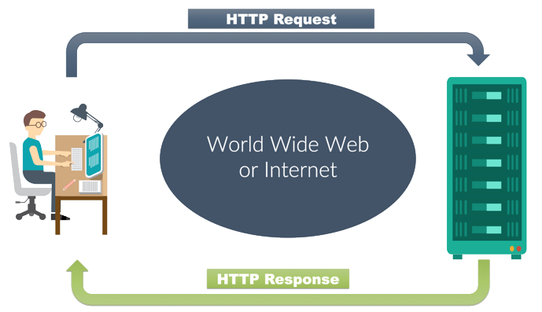

# Intro to HTTP

So far we've been learning the fundamentals of programming:

* Data Types
* Functions
* Control Flow
* Data Structures: e.g. Lists, Dictionaries, etc.
* Screen and File I/O
* Object Oriented Programming
* Modules and Libraries

It is now time to apply these fundamentals towards introducing a major field in programming: Web Development!

To do that, we need to take a step back and learn a little bit about how the Internet and the World Wide Web works.

## The Web vs The Internet

Did you know that the web isn't the internet? The web is just *part* of the internet!

There are many parts of the internet that doesnt run on the web! For example: Skype, Zoom, WhatsApp, BitTorrent, or even basic Email. (These tools may *also* have web sites too, but their primary functioning doesn't run on the *web*.)

The internet is divided up into different parts, and each part uses its own **protocol**.

The part of the internet that we are concerned about -- the **World Wide Web** (**WWW**) -- runs on a protocol called **HTTP**. It stands for **HyperText Transfer Protocol**. We're not going to worry the other parts of the internet in this course!

## Requests and Responses



When you click on a link or on a web page, your intention is to read the page that resides at that link.

The web browser makes a **request** to the **web server** that houses that page, somewhere on the internet.

The web browser receives the request, and fulfills that request by putting together the data for the page and then sending it back across the internet, in a **response**.

Typically this response is in the form of **HTML** (**HyperText Markup Language**), which is the language used for writing web pages.

When your web browser receives the HTML response, it doesn't just show you the raw HTML (because it is indecipherable to most normal people using the web), it shows you the *result* of interpreting the HTML into a readable, displayable web page.

Most of the time, all of this takes about a fraction of a second.

But just like a server at a restaurant, if there are lots of clients, the server might take longer to serve requests than normal, as it tries to fulfill requests in the order received to the best of its ability.


In Computer Science speak, this idea is called a **Client-Server Architecture**. Clients send **requests** to the **server**. The server fulfills the requests with **responses**.

---

# HTTP

HTTP is the protocol that is used for web sites and web apps. Again, it stands for **HyperText Transfer Protocol**, since it was basically invented to move **HTML** around.

What is a Protocol? A structured, specific way of doing things. For example, in debates at various Legislatures, in the courtroom, at a state dinner, Law & Order episodes. You have to adhere to the rules -- i.e. follow protocol. Even on the phone!

HTTP is the formalized way of asking for something (request) on the web, and a formal way to respond to that ask (response), again over the web.

It's not even a piece of universal code, instead it's written up in a [white paper](https://tools.ietf.org/html/rfc2616) as an agreed upon way that computer programs should speak to each other over the web. Developers then read this paper and implement the protocol in their respective languages/frameworks/apps.

On a day-to-day basis, you don't have to worry about HTTP because the web browser implements the **client side** of HTTP, and websites implements the **server side**, so all you have to do is know how to use your web browser to get the data that you want.

Luckily, later on when we start writing programs that use HTTP, we can also download libraries and modules that have already implemented the protocol, so all we have to do is just use it!

## HTTP Requests

### Types of Requests

So what can you do with a request?

There are several types of requests that are possible across the web. These are:

| Method | Action | Example | 
| --- | --- | --- |
| GET | (R)ead data | Look at your friends' instagrams | 
| POST | (C)reate data | Post a new instagram |
| PATCH/PUT | (U)pdate data | Edit an instagram you posted previously |
| DELETE | (D)elete data | Delete an instagram you posted previously |

These are the 4 most important types of requests and together they are called **[CRUD](https://en.wikipedia.org/wiki/Create,_read,_update_and_delete)**, an acronym all programmers are familar with.


One way in which a program can get a lot done is to build upon data sources that are publicly available via the web. As we are interested in retrieving (GETting) data from these publicly available data sources, **GET** is the type of request we'll be using first.

We'll look at the other types of requests later.

<!-- Since we don't need the other types of requests for now, we won't be talking about them. But if you ever want to become a web developer, then you will learn the other types of requests as well! -->

(There are also more esoteric requests than just those 4, which you'll learn about some day if you decide to become a web developer.)

One last thing: These are called **HTTP Request Methods**. Don't be confused by the word "method" -- these are *not the same as "methods" that we learned in Object Oriented Programming*!

(English is full of these [Homonyms](https://examples.yourdictionary.com/examples-of-homonyms.html) -- a word that has multiple meanings, like *bat*. Terrible, isn't it?)

### What's in a GET Request?

Basically, a request is a big string that the web browser puts together and sends across the internet.

This big string contains:

* The HTTP Request Method
* A URL
* HTTP Version
* Optionally Some **Headers** (Extra information sent along with the request)

The structure of the string looks like this:

```
[http request method] [URL] [http version]\n
[header 1]\n
[header ...]\n
[header n]\n
```

Example:

```
GET https://en.wikipedia.org/wiki/Cat HTTP/1.1
Accept: text/html
Accept-Language: en-US
... (some more headers) ...
User-Agent: ... Chrome/76.0.3809.132 ...
```

Think about Headers like the extra information you have to supply the server, like at a restaurant when you order steak (I want a steak, medium rare, with a side of fries). You don't have to supply this information, but then the information you get back might not be exactly what you actually wanted.

The structure of POST, PATCH/PUT, and DELETE requests will have similarities and differences!

## HTTP Responses

Now that we know how to put together a GET request, how about the response?

### What's in a Response to a GET request?

When a server receives a GET request, it deals with it and then sends back a **response** (again just a big string) containing:

* HTTP Version
* A Status Code
* The reason for the status
* Optionally Some Headers (Extra information sent along with the response)
* A Body

The structure of the string looks like:

```
[http version] [status] [reason]\n
[header 1]\n
[header ...]\n
[header n]\n
\n
[response body]\n # Typically HTML
```

Example:

```
HTTP/1.1 200 OK
content-language: en
content-type: text/html
... (some more headers) ...
date: Mon, 23 Sep 2019 20:10:35 GMT

<!DOCTYPE html>
<html>
...
</html>
```

Again, the structure of responses sent back for other types of request will differ slightly, but it's not important for now.

#### Status Codes

Has anyone ever seen these kinds of errors when surfing the web?

* [404](https://www.google.com/search?q=404%20not%20found&tbm=isch)
* [500](https://www.google.com/search?q=500%20internal%20server%20error&tbm=isch)

These numbers are called **Status Codes** -- Basically they are simply a reason for the success or failure in trying to fulfill your request (Like on cop TV shows: 10-31 is a "Crime in Progress" and 10-55 is for "Intoxicated Driver").

The **Status Code** is part of the **Response** and is divided up into 5 groups:

| Code | Group |
| --- | --- |
| 1xx | Informational |
| 2xx | Success |
| 3xx | Redirection |
| 4xx | Client Error |
| 5xx | Server Error |

Here are some of the more important status codes to know:

| Code | Reason |
| --- | --- |
| [200](http://http.cat/200) | OK |
| [403](http://http.cat/403) | Forbidden |
| [404](http://http.cat/404) | Not Found |
| [429](http://http.cat/429) | Too Many Requests |
| [500](http://http.cat/500) | Internal Server Error |

<!--
| [301](http://http.cat/301) | Moved Permanently |
| [302](http://http.cat/302) | Moved Temporarily |
-->

A full list of HTTP Status Codes and explanations are on Wikipedia: [List of HTTP status codes](https://en.wikipedia.org/wiki/List_of_HTTP_status_codes)

### Summary of GET Requests vs Response to a GET

| | GET Request | Response to a GET |
| :--- | :--- | :--- |
| Headers | :white_check_mark: | :white_check_mark: |
| Status Code | :x: | :white_check_mark: |
| Body | :x: | :white_check_mark: |

---

<!--
# Chrome Developer Tools

Let's explore HTTP requests and responses with the Chrome Developer Tools.

* In Chrome, open up the developer tools by right clicking anywhere and selecting "Inspect"
* Then, select the "Network" tab. It should look something like this:
   
   
* If you don't see the network tab as an option, you might have to click the >> arrows at the top to reveal more tabs.
* In the address bar, type in [https://en.wikipedia.org/wiki/Cat](https://en.wikipedia.org/wiki/Cat) and hit enter to navigate there

You should see that the Network tab has logged a few HTTP requests and responses.

* For each request, you should see a `Status`, `Type`, `Initiator`, `Size`, and `Time`.
* Some requests are for CSS, Javascript, and images that are referenced by the HTML.

Click on the word `Cat` in the `Name` column on the far left. Select the `Headers` tab to view the headers that were attached to the request (and the ensuing response).

---

-->

# The `requests` Module

The whole reason for learning HTTP is so that we can write programs that are able to fetch information that is publicly available over the web. So it's time to see how this works in Python!

To make HTTP requests, we'll require the assistance of the `requests` module ([documentation](http://docs.python-requests.org/en/master/user/quickstart/)).

Unfortunately it's not part of the Standard Library, so we'll have to install it.

In your terminal:

```zsh
pip install requests
```

Now that it's installed, head over to the REPL by entering `python` by itself in your terminal.

We can now import the requests module and try to make a request. Let's make a request to the Wikipedia page for Cats: [https://en.wikipedia.org/wiki/Cat](https://en.wikipedia.org/wiki/Cat).

```python
import requests

url = 'https://en.wikipedia.org/wiki/Cat'
response = requests.get(url)
```

The response from Wikipedia will be stored in the `response` variable!

Now, we can inspect the response. Remember that in the REPL, you don't have to explicitly `print` anything, you can just put the name of the variable by itself to inspect its internals:

```python
response
```

and we get this:

```python
<Response [200]>
```

We can look at the resulting response body:

```python
response.text
```

and we get this:

```html
'<!DOCTYPE html>\n<html class="client-nojs" lang="en" dir="ltr">\n<head>
... snip ...
</html>'
```

We can even look at the response headers:

```python
response.headers
```

and the output:

```python
{'Date': 'Mon, 23 Sep 2019 21:13:19 GMT', 'Content-Type': 'text/html; charset=UTF-8', 'Content-Length': '160088', 'Connection': 'keep-alive', 'Server': 'mw1266.eqiad.wmnet', 'X-Content-Type-Options': 'nosniff', 'P3P': 'CP="See https://en.wikipedia.org/wiki/Special:CentralAutoLogin/P3P for more info."', 'X-Powered-By': 'HHVM/3.18.6-dev', 'Content-language': 'en', 'Last-Modified': 'Mon, 23 Sep 2019 19:56:40 GMT', 'Backend-Timing': 'D=183368 t=1569269620152416', 'Vary': 'Accept-Encoding,Cookie,Authorization,X-Seven', 'Content-Encoding': 'gzip', 'X-Varnish': '747478894 681067908, 611644204 550891193', 'Age': '3579', 'X-Cache': 'cp1085 hit/4, cp1081 hit/3', 'X-Cache-Status': 'hit-front', 'Server-Timing': 'cache;desc="hit-front"', 'Strict-Transport-Security': 'max-age=106384710; includeSubDomains; preload', 'Set-Cookie': 'WMF-Last-Access=23-Sep-2019;Path=/;HttpOnly;secure;Expires=Fri, 25 Oct 2019 12:00:00 GMT, WMF-Last-Access-Global=23-Sep-2019;Path=/;Domain=.wikipedia.org;HttpOnly;secure;Expires=Fri, 25 Oct 2019 12:00:00 GMT, GeoIP=CA:ON:Toronto:43.64:-79.40:v4; Path=/; secure; Domain=.wikipedia.org', 'X-Analytics': 'ns=0;page_id=6678;https=1;nocookies=1', 'X-Client-IP': '174.88.108.55', 'Cache-Control': 'private, s-maxage=0, max-age=0, must-revalidate', 'Accept-Ranges': 'bytes'}
```

How about the request? We never actually constructed a request object, we simply called the `requests.get()` function!

It turns out that the `requests.get()` function will internally construct a request object, and, for convenience, it attaches that request object to the response object so you can access it later if you need to.

```python
response.request
```

and the output should be:

```pythoon
<PreparedRequest [GET]>
```

We can inspect the request headers as well:

```python
response.request.headers
```

and the output should be:

```python
{'User-Agent': 'python-requests/2.22.0', 'Accept-Encoding': 'gzip, deflate', 'Accept': '*/*', 'Connection': 'keep-alive'}
```

Don't forget to exit the REPL when we're done:

```python
exit()
```