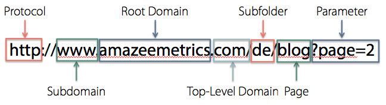

# APIs: Part 1

<!-- ## Lesson Objectives

*After this lesson, you will be able to...*

* Describe what an application programming interface (API) is and why we might use one
* Identify common APIs on the web
* Call an API

---

-->

# Discussion: Web Magic


The Guggenheim Museum's developers didn't build that map themselves, as it was created by Google. What if you want a Google Map embedded in your web app to show people where they can visit you? You aren't going to make that map yourself, so somehow you have to ask Google to do it for you.

Well, Google has a way you can get that map — all you have to do is "use the Google Maps API"!

## APIs

An **API** (Application Programming Interface) is a service that provides a feature or data that you can use in your programs.

Do you think you've ever used an app that takes advantage an API?

100%! If you've ever seen a website or an app:

* That has Google Maps embedded in it (e.g. Yelp, Airbnb)
* That sends you a SMS text message or an email
* That processes credit card transactions
* That shows live weather info
* That shows live stock market info

## Data APIs

There are a variety of APIs available. Of the two kinds of APIs (feature vs data), we will focus on APIs that provide data. 

Why recreate data when we don't have to? Think about a past projects that would have been easier if you could pull in data already gathered elsewhere. In fact, APIs can provide us with data that we would otherwise not be able to create ourselves, like weather or stock market info.

To use an API, you simply send a request to a URL and that API will return data to your program.

Here are just a few examples of APIs you can use.

| API | Sample URL — put in a new tab! |
|------|------------|
| **OpenWeatherMap: The current weather in London** | `https://samples.openweathermap.org/data/2.5/weather?q=London,uk&appid=b6907d289e10d714a6e88b30761fae22` |
| **The Star Wars API: Request R2-D2 info** | `https://swapi.dev/api/people/3` |
| **People In Space API**| `http://api.open-notify.org/astros.json` |

<!--
| **<a href="https://financialmodelingprep.com/developer/docs/" target="_blank">Financial Modelling Prep</a>** | https://financialmodelingprep.com/api/v3/quote/AAPL?apikey=demo |
-->

## Data Formats: HTML vs JSON

When we opened these URLs, you might have noticed that the pages look funny. That's because most APIs will *not* send back the requested data in HTML. APIs normally send back a different type of format which we'll talk about soon.

The reason is to make life easier for you as a developer! Think about what would happen if the data comes back as HTML -- it's a big string you would then have to sift through to get at the exact information that you want. Say the temperature on a [page from weather.com](https://weather.com/en-US/weather/today/l/USNY0996:1:US). That's a lot of work! (In web development, we call this "web scraping".)

Luckily, HTTP (despite the name) is capable of transporting more than just HTML around. In fact, you can move many types of formats of data around the web -- Think about how your bank can give you your account information in HTML, or PDF, or CSV (for spreadsheets). You just have to ask it to!

For APIs, the most common data formats are JSON (new school) and XML (old school).

XML is out of the scope of our course and we'll be sticking with JSON!

<!-- 
## XML

**XML** stands for **eXtensible Markup Language**, and is one of the first serialized data formats (itself based on HTML).

These days it's considered messy and cumbersome, but it's still around because many systems have been built with it in the past. It looks something like this:

```xml
<QuoteApiModel>
  <Data>
    <Status>SUCCESS</Status>
    <Name>Apple Inc</Name>
    <Symbol>AAPL</Symbol>
    <LastPrice>217.73</LastPrice>
    <Change>-3.23</Change>
    <High>222.56</High>
    <Low>217.473</Low>
    <Timestamp>Fri Sep 20 00:00:00 UTC-04:00 2019</Timestamp>
  </Data>
</QuoteApiModel>
```

Source: [http://dev.markitondemand.com/MODApis/Api/Quote/xml?symbol=AAPL](http://dev.markitondemand.com/MODApis/Api/Quote/xml?symbol=AAPL)

Conveniently, many APIs publish data in multiple formats and let you specify which you'd like! For example, the markitondemand.com API we just used allowed us to choose between XML and JSON. (Look carefully at the URL for each!)


XML is out of the scope of our course and we'll be sticking with JSON!

## JSON

**JSON** stands for **JavaScript Object Notation**. The format was first invented by the Javascript language but has since been adopted by all languages as a universal standard for APIs on the web.

Here's an example of what that same data on AAPL looks like:

```json
{
  "Data":{
    "Status":"SUCCESS",
    "Name":"Apple Inc",
    "Symbol":"AAPL",
    "LastPrice":217.73,
    "Change":-3.23000000000002,
    "High":222.56,
    "Low":217.473,
    "Timestamp":"Fri Sep 20 00:00:00 UTC-04:00 2019"
  }
}
```

Source: [http://dev.markitondemand.com/MODApis/Api/Quote/json?symbol=AAPL](http://dev.markitondemand.com/MODApis/Api/Quote/json?symbol=AAPL)

You can see that compared to XML, JSON uses far less number of characters, actually making it faster to send across the web!

-->

## JSON

**JSON** stands for **JavaScript Object Notation**. The format was first invented by the Javascript language but has since been adopted by all languages as a universal standard for APIs on the web.

Here's an example of the data about R2-D2 that we saw earlier:

```json
{
  "name": "R2-D2", 
  "height": "96", 
  "mass": "32", 
  "hair_color": "n/a", 
  "skin_color": "white, blue", 
  "eye_color": "red", 
  "birth_year": "33BBY", 
  "gender": "n/a", 
  "homeworld": "https://swapi.dev/api/planets/8/", 
  "films": [
    "https://swapi.dev/api/films/1/", 
    "https://swapi.dev/api/films/2/", 
    "https://swapi.dev/api/films/3/", 
    "https://swapi.dev/api/films/4/", 
    "https://swapi.dev/api/films/5/", 
    "https://swapi.dev/api/films/6/"
  ], 
  "species": [
    "https://swapi.dev/api/species/2/"
  ], 
  "vehicles": [], 
  "starships": [], 
  "created": "2014-12-10T15:11:50.376000Z", 
  "edited": "2014-12-20T21:17:50.311000Z", 
  "url": "https://swapi.dev/api/people/3/"
}
```

Source: [https://swapi.dev/api/people/3](https://swapi.dev/api/people/3)

That snippet of JSON sure *look* like a single Python dictionary, doesn't it? 

***But it's NOT.***

The key difference is:

* JSON is really just a huge string, written in a very specific format (for example, the keys have to be in double quotes), and the string just happens to be written to superficially *look* like a dictionary. 
* Whereas a Python dictionary is a type of container that can contain other types of data. In other words, a **data structure**, not a string.

But is there a way to convert JSON strings to Python data structures? You betcha!

# The `json` Module

Python uses the `json` module to decode JSON strings into Python data structures (dictionaries and lists).

The `json` module has the following functions:

* `loads`: converts JSON into Python data structures
* `dumps`: convert Python data structures into JSON strings

Let's open up the REPL and try converting a json string into a Python data structure:

```python
import json

ga_json_str = '{ "school": "GA", "course": "Python", "assignments": ["TPS Reports", "Movies", "Temperature Converter"] }'
type(ga_json_str)
#==> <class 'str'>

ga_dict = json.loads(ga_json_str)
type(ga_dict)
#==> <class 'dict'>

ga_dict['school']
#==> 'GA'
```

Let's try the other side now and convert a dictionary to a json string:

```python
info_dict = { 'address': '123 Main St', 'staff': ['Josh', 'Betty', 'Keiko'] }
type(info_dict)
#==> <class 'dict'>

info_json_str = json.dumps(info_dict)
type(info_json_str)
#==> <class 'str'>
```

# Decoding JSON with the `requests` Module

It turns out that the `requests` module that we saw earlier automatically uses the `json` module internally, so we typically won't even have to do the conversion manually when dealing with APIs!

Let's try this in the REPL:

```python
import requests

url = 'https://catfact.ninja/facts'

response = requests.get(url)
response
response.headers
response.text
response.request.headers

type(response.text)
response_data = response.json()
type(response_data)
response_data.keys()
response_data['data'][0]['fact']
```

## You Do: JSONPlaceholder API

[5 minutes]

This is the <a href="https://jsonplaceholder.typicode.com/" target="\_blank">JSONPlaceholder API</a>, which allows you to generate fake user information for testing purposes.

Let's do this in a file called `jsonplaceholder.py`.

* Make a request to this URL: `https://jsonplaceholder.typicode.com/users/1`
* Display the name, username, email, city, and the longitude (lng) that came back from the API

<details>
<summary>Solution (SPOILER)</summary>

```python
import requests

response = requests.get('https://jsonplaceholder.typicode.com/users/1')
response_data = response.json()

print(response_data['name'])
print(response_data['username'])
print(response_data['email'])
print(response_data['address']['city'])
print(response_data['address']['geo']['lng'])
```
</details>

## (Take Home Exercise) You Do: Astronauts

[5 minutes]

Make a request to the Astronaut API `http://api.open-notify.org/astros.json`, which tells us the people currently aboard the International Space Station. Print the name of only the first astronaut.

<details>
<summary>Solution (SPOILER)</summary>

```python
import requests

response = requests.get('http://api.open-notify.org/astros.json')
response_data = response.json()

print(response_data['people'][0]['name'])
```
</details>

# Intro to API Authentication

* While many APIs are free to use, even if free, they may want to track your usage
   * This is done to regulate usage and prevent abuse
* Some APIs also *rate-limit*, meaning they have caps on the free data allowed during a given time period
* In order to do this, some APIs provide to you a **key** that uniquely identifies you, the developer requesting data
* When you are consuming APIs that require a key, it's up to you to store those keys somewhere private
   * Treat them like passwords
   * They are the only proof that you are you and you are allowed to call that API, after all

Let's take a look at the Giphy API. If we try to request this URL:

```
http://api.giphy.com/v1/gifs/search?q=funny+cat
```

we get the response: `{"message":"No API key found in request"}`!

Now, if we add a **key** as a **URL parameter**:

```
http://api.giphy.com/v1/gifs/search?q=funny+cat&api_key=dc6zaTOxFJmzC
```

It works!

See the weird bunch of random characters? That's the **key**!

## URL Syntax

From: [AmazeeMetrics](https://www.amazeemetrics.com/en/blog/seo-tutorial-optimal-url-structure-for-seo/)



* The main API URL is `http://api.giphy.com/v1/gifs/search`.
* `?` delineates a page's base URL from any additional **parameters**
  * The `?` is standard! For example, this searches Google for "banana," with `q` short for *query*: `https://www.google.com/search?q=banana`
  * Here's another one! This searches Amazon for "banana:" `https://www.amazon.com/s?k=banana` (In this case Amazon used `k` for *keyword*)

## Key Safety

**Important**: A key is basically a password!

Just as you would never write down your password anywhere that someone else can see it, never publish your key to GitHub! This particular `api_key` is an example key, that's why I can safely publish it in this repo.

In the next lesson, we'll talk more about authentication and how to protect your keys and make sure they are not published to Github!

# Miscellaneous

## GUI Tools

To help you explore an API, you might want to use a GUI tool.

I recommend [Insomnia](https://insomnia.rest), as it's small and fast.

(Another popular one among developers is [Postman](https://www.getpostman.com), but personally I find it a little bloated.)

## Publicly Available APIs

Here is a couple of lists of Publicly available APIs that might be interesting to you:

* [github.com/public-apis/public-apis](http://github.com/public-apis/public-apis) (free!)
* [Any-API](https://any-api.com/) - Documentation and Test Consoles for over 1400 Public APIs (may not be free)

## API Wrappers

Sometimes people have written *wrappers* for common APIs.

What's a Wrapper? Basically they are functions/classes that do the most common things you may want to do with certain APIs, so you don't have to manually do the HTTP requests yourself.

Certainly well worth using, if there is a wrapper for an API you are interested in!

* Here's a [List of Python API Wrappers](http://github.com/realpython/list-of-python-api-wrappers)
* Here's [Another List](http://www.pythonforbeginners.com/api/list-of-python-apis)

The only downside to using a wrapper -- you're dependent on the wrapper author to fix any bugs in the wrapper code! (But this applies to using any library.)

That's also why open-source development is so popular: If the wrapper is open-source, you may also be able to fix bugs yourself and contribute the fix back to the community.

You'll be using an example of a wrapper as part of your homework today.
