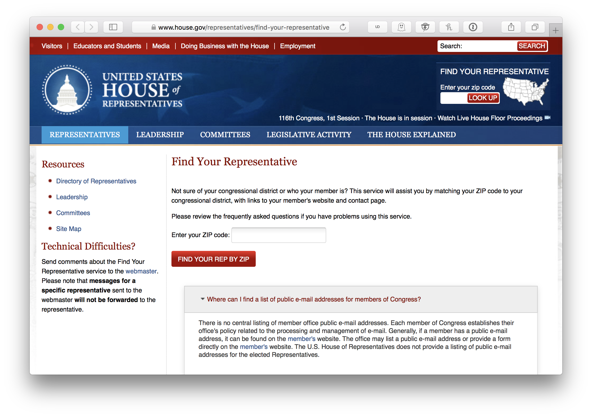

# APIs: Part 2

<!-- 
## Lesson Objectives

*After this lesson, you will be able to...*

* Authenticate with an API
* Save API Keys to the Environment with Dotenv
* Have Git ignore certain files so that they are not accidentally pushed to Github (with `.gitignore`)

--- -->

# API Authentication

Let's continue our discussion of API authentication. Authentication with an API is done in different ways!

* Sometimes you put a key in the params in an URL
* Sometimes you have to put keys in the request headers
* Sometimes you have to authenticate via a special protocol (such as Oauth)
* Or some other way!

The only way to know how is to read the documentation of each API, as they are all different! Unfortunately there is no one standard way.

## (Easiest) Parameter Authentication

This is the simplest type of authentication.

We saw this when we authenticated with the Giphy API and the Weather API (in your homework) before.

With no key:

```
http://api.giphy.com/v1/gifs/search?q=funny+cat
```

we get the response: `{"message":"No API key found in request"}`!

With an attached key:

```
http://api.giphy.com/v1/gifs/search?q=funny+cat&api_key=dc6zaTOxFJmzC
```

then we get the data we were looking for.

Remember that you should never publish API keys to github or any other publically accessible webpage! So am I am committing a cardinal sin here? Never fear: This particular API Key is a ***demo*** API Key and is safe to publish for educational purposes.

## (Medium) Header Authentication

With header authentication, the key(s) you must provide to the service (sometimes more than one) needs to be placed in the **request headers** of the request.

Recall that an HTTP request looks like:

```
[http request method] [URL] [http version]\n
[header 1]\n
[header ...]\n
[header n]\n
```

Example:

```
GET https://en.wikipedia.org/wiki/Cat HTTP/1.1
Accept: text/html
Accept-Language: en-US
... (some more headers) ...
User-Agent: ... Chrome/76.0.3809.132 ...
```

The list of headers in the example above has `Accept`, `Accept-Language`, and `User-Agent`. With **Header Authentication**, we'll need to *add more headers*.

We'll demonstrate by way of an example with the Oxford Dictionaries API.

### Oxford Dictionaries

If you are interested in using Oxford Dictionary's API, you have to sign up for an account and get a "App ID" and "App Key". Be sure to sign up for the *Prototype* level account, which is free up to 1000 requests per month.

Here's the [Oxford Dictionaries API Documentation](https://developer.oxforddictionaries.com/documentation).

### With Insomnia

First let's try this out in Insomnia. We will add custom headers to the request and see how the API reacts. This will be demoed in class.

### The `requests` Module

Now let's see how we can authenticate using the `requests` module.

Let's implement the following in a file called `oxford/word.py`:

```python
import requests

word = 'Cat'
url = f"https://od-api.oxforddictionaries.com:443/api/v2/entries/en-us/{word.lower()}"

response = requests.get(url)

print(response.text)
```

You'll see that some text comes back from the service: `Authentication parameters missing`

As we saw when experimenting with the API using Insomnia, the Oxford Dictionaries API uses **header authentication** -- how do you insert custom headers into the request?

By using the optional `headers` keyword argument when calling the `requests.get()` function:

```python
import requests

app_id = 'c2e7b1fe'
app_key = 'b41be5b3b08f91ebe3d849570f15c52a'

word = 'Cat'
url = f"https://od-api.oxforddictionaries.com:443/api/v2/entries/en-us/{word.lower()}"

headers = { 'app_id': app_id, 'app_key': app_key }
response = requests.get(url, headers = headers)

print(f"{word}:", response.json()['results'][0]['lexicalEntries'][0]['entries'][0]['senses'][0]['definitions'][0])
```

Remember you should never publish API keys, so don't forget to remove them before you commit your changes! Again, I am using a demo API id/key, which is safe for me to publish for educational purposes.

## (Hard!) Other Authentication Mechanisms

Some APIs such as [Twitter](https://developer.twitter.com/en/docs/basics/authentication/api-reference) require you to authenticate via **OAuth**, a complicated dance involving an exchange of *tokens*. Other APIs have their own specific authentication mechanism. These authentication mechanisms are out of the scope of this course.

It's annoying, but no two APIs work exactly the same! Unfortunately, the only way to know how a particular API works is to *read its documentation* carefully. In professional life, we programmers spend *a lot of time* reading documentation!

---

# Protecting your API Keys

## The Environment

All computer programs execute within the *environment* of your computer operating system.

On your command line, run the `env` command and you'll see a list of **environment variables** that exist within your environment.

You didn't know it at the time, but now, you may recall that during Installfest, we set up a `DEV` environment variable that contains the path to the folder where we do all the work for this course! You can see the contents of the variable by using the `echo` command in your terminal:

```zsh
echo $DEV
```

and then if you want to go into the development folder:

```zsh
cd $DEV
```

Nifty eh?

A few points:

* Environment Variables are always `CAPITALIZED`
* On the command line, we use the `$` to specify that it's an environment variable

These environment variables *are not variables that are declared by Python*, instead they are part of your *operating system*.

However, your program can access these bits of data. In Python, we use the `os` module.

Let's put aside for the moment *how* you define these environment variables and assume they exist. So, assuming that your environment already has the `OXFORD_DICT_ID` and `OXFORD_DICT_KEY` environment variables defined, then Python can get at them, like this:

```python
import requests
import os

app_id = os.environ.get('OXFORD_DICT_ID')
app_key = os.environ.get('OXFORD_DICT_KEY')

# ... same code as before ...
```

Notice now that the secret strings no longer appear in your code! Instead, they'll be embedded in the *environment*. Then you won't be able to accidentally publish them to github anymore, as none of your files will have the secret strings baked into them!

So the question becomes: how do you add environment variables to your environment?

## Manually via `.zprofile` / `.bash_profile` / `.bashrc`

It is possible to configure your secrets manually using your Command-Line shell program. 

Unfortunately, they way to do it will be slightly different depending on whether you're on Linux or Windows or MacOS, or even what version of MacOS you're on. 

| OS | Shell | Configuration File | 
| --- | --- | --- |
| Windows (using Git Bash) | `bash` | `.bash_profile` |
| MacOS < Catalina | `bash` | `.bash_profile` |
| MacOS => Catalina | `zsh` | `.zprofile` |

<!--
| Ubuntu Linux<br />(Default Installation) | `bash` | `.bashrc` |
| Ubuntu Linux<br />(Our Custom Installation) | `zsh` | `.zprofile` |
-->

It's too complex, so we're not going to do that.

It's best to use a module like...

## `dotenv`

To install dotenv:

```zsh
pip install python-dotenv
```

Now, create a `.env` hidden file in the same directory as your program.

Inside it, put:

```zsh
OXFORD_DICT_ID = 'c2e7b1fe'
OXFORD_DICT_KEY = 'b41be5b3b08f91ebe3d849570f15c52a'
```

Update your code to `import dotenv` and `dotenv.load_dotenv()`:

```python
import requests
import os
import dotenv

dotenv.load_dotenv()
 
app_id = os.environ.get('OXFORD_DICT_ID')
app_key = os.environ.get('OXFORD_DICT_KEY')

# ... same code as before ...
```

Dotenv will automatically read in the `.env` file and add the contents to your environment. Then, the environment variables are available to your program via `os.environ.get()` calls.

## `.gitignore`

Now that you have your secrets securely stored away in an `.env` file, we can prevent that file from being committed and pushed to Github by adding a `.gitignore` file, with the following contents:

```zsh
.env
```

This tells Git to ignore files with that name. You can add anything else you want Git to ignore in this list as well!

A popular file to add to your `.gitignore` is the [infamous `.DS_Store` file](https://www.aorensoftware.com/blog/2011/12/24/death-to-ds_store/), which are basically junk files that MacOS litters all over the place for its own nefarious purposes... the continual thorn to a programmer's side (Only applicable if you're using a Mac, obviously).

**Protip:** You **must** `git add` and `git commit` this `.gitignore` file, so that Git can remember what files it's supposed to ignore!

**Protip:** By excluding the `.env` file, you are making sure that these environment variables exist *only on your machine*. So if you move to a new computer, you'll have to move the `.env` file to your new computer to make sure your new computer also have these environment variables.

---

# [Take Home] BONUS STRETCH: A Bigger API Example

The original idea here was to find and use an API to get the email addresses of every member of the US House of Representatives so that we can spam them with email, but apparently such an API, or even such data, doesn't exist!



So... since I'm Canadian, let's use the [Canadian House of Commons data](https://represent.opennorth.ca/api/) instead!

If you read the documentation carefully, you'll see that "Results are paginated 20 per page by default". Canada has 338 Members of Parliament in the House of Commons. In order to fetch the data for all of them, we'll have to deal with *pagination*.

In addition, the documentation states "Represent is free up to 60 requests per minute", so we should be *polite* (how Canadian) in requesting data. We'll sleep for one second between each request.

As an exercise for the student -- read, understand, and run the complete program below!

```python
import requests
import time

API_BASE_URL = 'https://represent.opennorth.ca/representatives/house-of-commons/'

# Deals with Pagination
NUM_MEMBERS = 338
MEMBERS_PER_PAGE = 20

# Fake connecting to some email service to send an email to a particular name
def send_email(name, email):
  print('To:', email)
  print(f'Dear Rep. {name}, I am writing today about blah blah blah...\n')

# Assumes that mailing_list is a list of dictionaries,
# each with 3 keys: 'first_name', 'last_name', and 'email'
def spam_all(mailing_list):
  for target in mailing_list:
    full_name = f"{target['first_name']} {target['last_name']}"
    email = target['email']
    send_email(full_name, email)

# Returns a list of reps -- each rep is a dictionary with 3 keys:
# 'first_name', 'last_name', and 'email'
def fetch_reps():
  offset = 0
  reps = []

  while (offset < NUM_MEMBERS):
    print('Making a request from:', offset, 'to', offset + MEMBERS_PER_PAGE)
    url = f'{API_BASE_URL}?offset={offset}'
    response = requests.get(url)
    reps += response.json()['objects']
    offset += MEMBERS_PER_PAGE
    time.sleep(1)

  print('Got:', len(reps), 'representatives\n')
  return reps

def main():
  reps = fetch_reps()
  spam_all(reps)

main()
```
