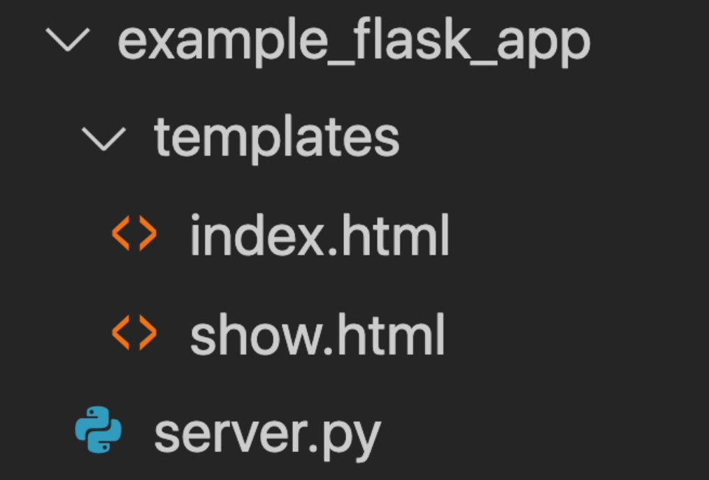

# Web Development with Flask

<!-- 
## Lesson Objectives

*After this lesson, you will be able to...*

* Use Flask to render templates with local variables and programming logic
* Understand the structure of a CRUD App in Flask

---
-->

# Two Paths for Flask Applications

We got started down the road with Flask by creating a simple API that users can make requests to, and the API then responds with data in JSON format.

But recall that HTTP (HyperText Transfer Protocol) was built to *transport HyperText*! That means, of course, that instead of respond with JSON data, you can respond with HTML pages!

If your app respond with HTML pages, now we're talking about developing a **web app**.

The takeaway is that Flask can be used to:

* Create APIs that allows resources (i.e. data) to be managed, or:
* Power web apps that render dynamic HTML pages

## What's a Web App?

In simple terms, a web app is a web site that presents dynamic information, which you can interact with! Have you ever used:

* Instagram
* Facebook
* Youtube
* Twitter
* Github
* Gmail

These are all web apps!

We can distinguish w*eb apps* from *web sites* by how *dynamic* they are.

* For example, a restaurant's *web site* typically does not change very much. The same menu information is there yesterday that is there today (typically), until they go and raise the prices every year or so. This is a *web site*
* However, your twitter feed will look completely different one hour from now! So, Twitter is a *web app*

Today we'll learn how to write web apps with Flask!

---

# HTML Crash Course

To learn how to write web apps, we must learn a little bit about HTML - HyperText Markup Language.

## Tags

* HTML is made up of tags
* Tags tell the browser how to interpret the content

```html
<h1>Hello World!</h1>
```

* Most tags have an **opening tag** and a **closing tag**
   * In the example above, `<h1>` is the **opening tag**
   * `</h1>` is the **closing tag**

## HTML Basics

This is the **minimally valid HTML document** -- Every HTML document must have these tags.

```html
<!DOCTYPE html>
<html>
  <head>
    <title>My awesome page</title>
  </head>
  <body>
    <p>Hey there!</p>
  </body>
</html>
```

* The document type is always on the first line. For HTML documents it is always `<!DOCTYPE html>`
   * This is not actually HTML but it's a way of telling the web browser that an HTML document begins on the next line
* The `<html>` tag always encloses the entire document
* The `<head>` tag contains content that machines are interested in
* The `<body>` tag contains content that humans are interested in

In this crash course, we will only be interested in what goes inside the `<body>` tag

## Common Tags

| Element | Description | Example |
| --- | --- | --- |
| `h1` | Main headings | `<h1>The Explorer</h1>` |
| `h2`-`h6` | Subheadings | `<h2>Articles</h2>` |
| `p` | Paragraph of text | `<p>This is a really cool site</p>` |
| `a` | "Anchor" tag for links to other urls | `<a href="http://google.com">Search for Stuff</a>` |
| `img` | Image | `` |
| `li` | List Item | See below |
| `ul` | Unordered List | See below |
| `ol` | Ordered List | See below |

* Note how the `img` tag is special in that it does not have a closing tag! We call this a **self-closing tag**

### List Examples

#### Unordered List

The list items will have bullet points:

```html
<ul>
  <li>Monday</li>
  <li>Tuesday</li>
  <li>Wednesday</li>
</ul>
```

#### Ordered List

The list items will be numbered:

```html
<ol>
  <li>Monday</li>
  <li>Tuesday</li>
  <li>Wednesday</li>
</ol>
```

---

# Web Apps in Flask

We've seen that Flask is capable of responding to requests with JSON, but it can also respond to requests in HTML!

All you need to do is put your HTML files inside a folder named `templates` that's at the same level as your Flask Python file.



Soon we'll see why these HTML files are called "templates".

## Responding with HTML

To get Flask to respond with HTML, we use the `render_template` function.

Let's put the following inside `first_webapp/templates/example.html`:

```html
<!DOCTYPE html>
<html>
<head>
  <title>My Awesome Page</title>
</head>
<body>
  <h1>Welcome!</h1>
</body>
</html>
```

And the following goes inside `first_webapp/server.py`:

```python
from flask import Flask, render_template

app = Flask(__name__)

@app.route('/example')
def example_view_function():
  return render_template('example.html')

app.run()
```

Now, when you hit `http://127.0.0.1:5000/example`, you'll see the HTML page with the 'Welcome!' message!

## Template Syntax

And now, we can finally talk about why these HTML files are also called **templates**.

If we modify the `example.html` file like so:

```html
<body>
  <h1>Welcome, {{user_name}}!</h1>
</body>
```

and we modify the `render_template()` call in `server.py` like so:

```python
return render_template('example.html', user_name='Professor X')
```

When you reload the page (don't forget to stop and restart your program), you'll see the message: `Welcome, Professor X!`

Flask has the ability to *fill-in-the-blanks*, basically just like `f`-strings, but the syntax is slightly different. This ability makes these HTML files **templates**!

In Flask, we use double curly braces to denote **template variables**. Then, all you have to do is to supply keyword arguments matching these template variables in the call to `render_template()`. Flask will take care of the rest! (Actually, Jinja will take care of it. Jinja is the **templating library** provided by Flask.)

## Programmable Logic and Control Flow in Templates

Besides injecting variables, templates are also useful for their ability to use programmable logic and control flow, such as ifs and loops, in an HTML page.

In Jinja templates, we can set programming lines apart from actual HTML text with the following syntax:

```html

  <p>{{number}}</p>

```

and it also allows you to reference dictionary keys with the dot notation! So, this will work:

```html
<li>{{some_dict['key']}}</li>
```

but this will also work, which is a bit shorter and neater:

```html
<li>{{some_dict.key}}</li>
```

We'll take a look at all of these in the next example.

---

## Recap: RESTful Routes

Before we get started with a larger example, we'll need to review the idea of RESTful routing.

These are called the **RESTful routes**.

The first five routes are applicable when you are making an API app (with no user interface), and the last two (**new** and **edit**) are also necessary when you are creating a full web app with a user interface for inputting data:

| Action Name | Method | Path | Purpose | CRUD |
| --- | --- | --- | --- | --- |
| **index** | **GET** | `/movies` | Shows a list of this collection | R |
| **show** | **GET** | `/movies/<id>` | Show details of a specific item | R |
| **create** | **POST** | `/movies` | Add a new item to the collection | C | |
| **update** | **PATCH** | `/movies/<id>` | Update details of a specific item | U |
| **delete** | **DELETE** | `/movies/<id>` | Delete a specific item | D | 
| **new** | **GET** | `/movies/new` | Show the form to create a new item | Supports C |
| **edit** | **GET** | `/movies/<id>/edit` | Show the form to update a specific item | Supports U |

Together, all of these **routes** allow a user to accomplish all of the required CRUD tasks they need to do.

Not all apps require all actions, however. Consider:

* A typical company's career site: you might want applicants to be able to **create** and **update** a job application, but typically the applicant would not be able to **delete** the job application after submission

* Twitter allows you to **create**, **read**, and **delete** tweets, but they do not allow you to **update** tweets. As to why, nobody knows

Suffice it to say that it all highly depends on the desired functionality of each app!

---

# We Do: Movies Web App

Let write the beginnings of a **Movies web app**, instead of a Movies API.

This example will be done in-class.

The final solution code is available [here](instructor/movies_webapp_final).
