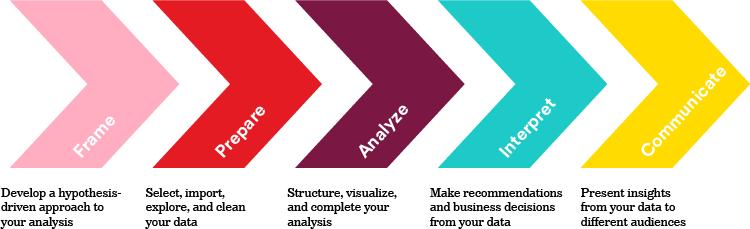

# Intro to Data Science

<!--
## Learning Objectives

*After this lesson, you will be able to:*

* Understand the data science workflow
* Have a data science development ecosystem ready to go

---

-->

# What is Data Science?

* The Harvard Business review called the industry the 'sexiest job of the 21st century'
* Glassdoor determined the profession to be among the most desirable in 2016 and 2017

Sounds cool, right? But... what is it?

## Data Science Examples

* Netflix recommendations engine
* Facebook determining if a photo contains your face
* A bank deciding whether to approve a credit card transaction

Common thread:

* All of those leverage data to make decisions

<!--
**Question:** What is an example of data science you have heard of? What about your stated example makes it be, well, data science?
-->

## Data Science Definition

Compliments of [GA's Standard Board](https://theindex.generalassemb.ly/why-we-need-to-redefine-data-science-7f05ab0286d4):

> Data science is the practice of: acquiring, organizing, and delivering complex data; discovering relationships and anomalies among variables; building and deploying machine learning models; and synthesizing data to influence decision-making.

**TL;DR:**

Data scientists:

* Use data of all kinds (numbers, text, images)
* Make explanations and predictive decisions - i.e. broadly leveraging data about prior events to inform future strategy

## Data Science Venn Diagram


Data science lives at the intersection of computational skills ("hacking skills"), math & statistics skills, and subject matter expertise.

A data scientist must be able to leverage maths/stats to develop models, computation skills to efficiently use those models, and subject matter competence to structure a problem and contextualize results.

:fire: **Danger Zone:** :fire: *"Through ignorance or malice this overlap of skills gives people the ability to create what appears to be a legitimate analysis without any understanding of how they got there or what they have created"* - [Drew Conway](http://drewconway.com/zia/2013/3/26/the-data-science-venn-diagram)

## Specific Data Scientist Roles

Just like after the rise of .com era where there was first just one "webmaster" role that then became front-end developer, back-end developer, roles etc., the data science industry is going through a similar period of  fragmentation where roles that were previously just "data scientist" are now broken up into specialities.

What does that break down to?

* Machine Learning Engineer
* Data Engineer
* Research Scientist/Applied Research Scientists
* Advanced Analyst

### Machine Learning Engineer

* Identify machine learning applications
* Work on production code
* Manage infrastructure and data pipeline
* *"Straddle the line between knowing the mathematics and coding the mathematics."* - eBay VP of engineering Japjit Tulsi

### Data Engineer

* Create the architecture that allows data acquisition and machine learning problems to run at scale
* Focus on the algorithm and the analysis
* Don't work as much on the actual code & software

### Research Scientist

* PhD-heavy
* Determines new algorithmic optimizations
* Focused on driving scientific discovery of knowledge
* Less concerned with immediate industrial application of that knowledge

#### Applied Research Scientists

* Specialized type of research scientist
* Backgrounds in both data science and computer science
* Invaluable members of any AI team
* *"They can both pitch in on data science *and* write code. Finding a good applied research scientist is worth her weight in gold."* - Japjit Tulsi

### Advanced Analysts

* Quantitative-minded
* Apply data descriptive and inferential exploratory data analysis and modeling (an approach to analyzing data sets to summarize their main characteristics)

## Quick Review

Data science is the practice of:

* Acquiring, organizing, and delivering complex data; discovering relationships and anomalies among variables
* Building and deploying machine learning models
* Synthesizing data to influence decision-making
* There are many different type of roles that comprise the umbrella of "data scientists"

---

# The Data Science Workflow

Today we'll focus on how to conduct exploratory data analysis for the purposes of structuring and then solving a data science problem.

With this in mind, let's define the data science workflow.



* Caveats
  * These are not hard-set rules
  * Really, they are just problem-solving guidelines. Every problem's different!
  * Some projects may not require every step
  * It's normal to repeat certain steps a few times
  * The process is iterative with new findings!
     * For example, when an analysis yields an unexpected result, you may revisit the preparation of data to assure that the steps were handled properly

Which step do you believe will be most challenging?

## Frame

Step 1 is "Frame the Problem".

Even though all data science projects have different characteristics, they start in the same place: with a problem. From this problem statement arises questions; questions we will ask the data in order to gain more information so we can attempt to find solutions to that problem.

> **Solving a data science task starts with a clearly defined problem**

Too often, situations will lack a driving objective. Haplessly exploring data without a determined goal produces poor results.

*"A problem well stated is half solved."* — Charles Kettering

Defining a question and tying future work against an objective is essential because problems that progress without a hypothesis to prove or disprove ultimately become circular. There are a near infinite number of spurious correlations or "interesting" ideas to consider. Only those that drive you further towards on outcome are useful.

## Prepare

* Consider the integrity of data. For example, there are different ways of reporting "No" ("N", "No") and missing values ("" vs "NA" vs "N/A"). It is quite common to have datasets where both "N" and "No" are used as the answer to a Yes/No question! That leads to messy analysis and must be corrected.

## Analyze

* Connecting your analysis to the initial question -- It is important that data was prepared properly before advancing to this step.

## Interpret

* Restate the hypothesis you are aiming to prove or disprove. Identify if the limited dataset provides you with anecdotes to validate or invalidate that statement.

## Communicate

* Both written and verbal!

---

# The Data Science Workflow: Applied

Let's apply our workflow above to a mental exercise.

Imagine that you work as a data scientist for a clothing retail company, Data Science Wearables (DSW). DSW is interested in improving its human resource operations. Specifically, we wants to reduce the cost of recruiting our in-store retail sales people (typically called "associates" in industry jingo).

You have a spreadsheet table of all of the company's retail sales associates. The first three rows look like this:

| Job Level | Current Employee | Reason for Termination | Years of Service | Candidate Source | Previous Employer | School | Time to Fill |
| --- | --- | --- | --- | --- | --- | --- | --- |
| Sales Associate | N  | New offer | 1.5 | Referral   | Jake's Hawaiian Shirts | University of Minnesota | 40 |
| Sales Associate | Y  | N/A       | 2.0 | Internship | N/A                    | University of Iowa      | 1 month |
| Sales Associate | No | Tardiness | 0.5 | Online     | Hats and Caps          | University of Nebraska  | 25 days |

The following table is a description of the fields (columns) of the data table. This is known as a **Data Dictionary**.

| Field | Description |
| :--- | :--- |
| Job Level | The role level. Our dataset is all current or former sales associates |
| Current Employee | If the individual is a current employee or not |
| Reason for Termination | If the employee no longer works at the retail store, this is why they left |
| Years of Service | How long did the employee work at DSW? |
| Candidate Source | Where did this employee learn of DSW? |
| Previous Employer | Where did the employer previously work? |
| School | Which school did the individual attend? |
| Time to Fill (Days) | How long did it take to fill this person's role?<br /> (Typically minimizing the time to fill a job is very important in lowering the cost to a company) |

## Step One: Frame

We know:

* We want to reduce costs associated with staffing

We don't know:

* What drives up costs of staffing?
* Is there an underlying reason for those costs?
* What hypothesis can we test to reduce costs?

Let's:

1. Identify what factors affect cost
2. Then, consider how those costs can be reduced
3. Finally, hypothesize a way to describe or predict if those given factors *can* be reduced

Let's presume the key factors driving up costs are: 

1. Employees turning over too soon (low total years of service) and 
2. A high time to fill (positions going unfilled, costing productivity and sales losses)

First we'll aim to minimize turnover. Let's hypothesize that we can explain how long an employee stays with the company based on their university, previous employment, and how they found our company.

## Step Two: Prepare

**Question:** What do you notice about the dataset?

Answer: There are inconsistencies in the dataset. 

1. For the `Current Employee` column, we would want to create a consistent standard: Just `Y` or `N`, not `Yes`, not `No`, would be easiest
1. For the `Time to Fill` column, the data is also inconsistent, some are in days, some are in months, and some don't have a unit. We would have to convert the data to be uniform (say, all in days)
1. For the entire table, we need to hypothesize why `N/A` values exist. Did the second candidate not have a previous employer, or was this data unavailable? (We don't know from just the information given)

These inconsistencies, and `N/A` missing values are incredibly common. In fact, this dataset is comparatively clean versus many other datasets.

In future lessons, we will discuss how to handle missing values and the importance of checking data integrity.

## Step Three: Analyze

We want to:

* Create meaning and conduct statistical description and inference for the data given

For example, the average Years of Service is `(1.5 + 2.0 + 0.5)/3 ≈ 1.33` years.

* Could we build a machine learning model to predict how long a person will stay in their role?
* The result might be based on their background (school, previous employers, and application source)

We may also be interested in visualizing relationships between our variables/columns. For example, do we anticipate that the correlation between Time to Fill and Years of Service is positive (when one increases, the other increases) or negative (when one increases, the other decreases)?

* Positive correlation: when one increases, the other increases
* Negative correlation: when one increases, the other decreases

Considering questions like this help us discover anomalies or intriguing relationships, and it is common in this step to reinforce and revisit the prior step as we discover these anomalies and relationships.

In this case, we can make the following observation on the data:

* Employees that had experience with DSW previously (`Internship` and `Referral`) seems to stay longer. This implies that **Candidate Source** seems to exercise an influence on how long an employee sticks around for
* The relationship between **Time to Fill** and **Years of Service** may make a U-shape:
   * An employee either previously knows of DSW (short time to fill) and stays for a while because they liked it,
   * or: DSW waited for the perfect candidate (long time to fill) and then they stayed for a while
* **School** does not seem to be a useful signal for employee longevity

## Step Four: Interpret

How do our results compare to our initial hypothesis?

What concrete actions do we recommend?

**Question:** Even with an extremely limited dataset (only 3 employees, or `n=3` in industry parlance), can you identify hypothesis-validating or invalidating ideas? (There are no definitively "right" or "wrong" answers here.)

At this stage, treat metrics and results like "check engine lights".

It appears many of our explanatory factors helped, but not all, and not in ways we may have anticipated. **School** does not seem to yield valuable insight, but knowing an employee has been referred or had experience with DSW previously is a key signal. Perhaps DSW should expand their internship and employee referral programs.

## Step Five: Communicate

Our preliminary conclusion can then be: The best candidates for DSW are those that have connected with the store in a previous way (internship, referral). Investing in these programs is recommended.

Now, how do you convince the company to believe you?

Visualizations of average employee tenure segmented by these factors are encouraged -- Remember that results may be only as convincing as they are conveyed to key stakeholders!

The process of communication requires honing a cohesive narrative that establishes a thesis and includes evidence to back up said statement. Backing up the statement includes statistical tests, visualizations, and model results.

The best practices you may have heard in the past about writing and speaking applies also to communicating with data. Rather than viewing data as a separate entity altogether ("I'm not a data person"), consider how data can aid your existing writing and speaking skills!

---

# Why Python for Data Science

This is a chart of what popular Python libraries over time:


Guess what? We can analyze this data!

* What's **pandas**?
  * A Python library for exploratory analysis in Data Science
  * So Python is super popular for Data Science!
* Easy to write
  * Data science is inherently a cross-functional discipline
  * Python is an "easy-enough" language that can be picked up by many folks -- this is key
* Open Source
  * New techniques for data analysis are discovered all the time! Developers from around the world implement these techniques in modules and libraries that you can download and use
  * In contrast to closed source software which costs $$$ (e.g. tools like SAS and SPSS), where you have to wait for a company to implement these techniques
  * When we use Python for data science, we heavily rely on open source libraries
  * Reading/writing CSVs, linear algebra, linear regressions, matrices...

## Getting Data Science Tools

The most important tools we need at a beginner stage of learning Data Science are:

* Pandas
   * The standard library for data exploration and manipulation in Python
* Jupyter Notebooks
   * The preferred integrated development environment (IDE) of data science
   * Make it easy to write and debug code while conveying the work and results we're formulating
   * We'll write our code in this!

So, the question becomes: **How do we install these tools?**

One alternative is to install [**Anaconda**](https://docs.anaconda.com/anaconda/install), a product that solves many of the headaches associated with getting all of the Python libraries for Data Science. Anaconda (maintained by Anaconda, Inc.), nicknamed "Conda", comes with many of the required modules, libraries, and tools we need to begin doing data science in Python.

However, a proper installation can be tricky to achieve and keeping the software maintained and updated can be bothersome.

## Kaggle

Another option is to use a hosted solution such as [Kaggle](https://www.kaggle.com/), which hosts these tools on the web, just like using Google Docs! This also allows you to *collaborate* with others on the same project, just like with Google Docs.

Kaggle is actually a community of data scientists, and a Google subsidiary, with all sorts of interesting data sets available for the community to analyze.

Using Kaggle the easiest approach to accessing data science tools and is the approach we will take in this course.

### Kaggle Setup

Well guess what!? You already signed up for a Kaggle account when the course began! Do make sure you can still login to your account. If you haven't yet signed up, go ahead and do it now.

The Kaggle signup process is easy:

1. Visit the [Kaggle](http://www.kaggle.com/) homepage

1. Click the <kbd>Register</kbd> button on the right top

1. Click "Register with your email" and sign up for an account as you would with any website
   * Be sure to write down your password somewhere safe

1. As soon as you complete the registration process, you are ready to login and use Kaggle!

In the next lesson, we'll take a tour through these tools.

---

# Summary

Data scientists:

* Use data of all kinds (numbers, text, images)
* Make explanations and predictive decisions

Data Science Workflow:

* Frame :arrow_right: Prepare :arrow_right: Analyze :arrow_right: Interpret :arrow_right: Communicate

Jupyter Notebooks and Pandas:

* Data Science industry standard tools
* Allows you to write interactive "notebooks" with embedded Python code
* We'll use Jupyter Notebooks as offered by Kaggle

---

# Additional Resources

* What is data science from GA's Standards Board [blog post](https://theindex.generalassemb.ly/why-we-need-to-redefine-data-science-7f05ab0286d4)
* Stack Overflow [blog](https://stackoverflow.blog/2017/09/06/incredible-growth-python/) (1) [posts](https://stackoverflow.blog/2017/09/14/python-growing-quickly/) (2) on Python's growth


<!--
**Anaconda** is a product that solves many of the headaches associated with getting all of the Python packages for Data Science.

Anaconda (maintained by Anaconda, Inc.), nicknamed "Conda", comes with many of the required modules, libraries, and tools we need to begin doing data science in Python.

How do we get Anaconda? 

Actually, we already installed it at Installfest!

To verify that Anaconda was installed properly, go into your Terminal and execute:

```zsh
PYENV_VERSION=anaconda3-2020.11 conda --version
```

and it should output `conda 4.x.x` (minor version differences are fine).

## What Have We Got Here?

Anaconda contains:

* Pandas
   * The standard tool for data exploration and manipulation in Python
* Jupyter Notebooks
   * The preferred integrated development environment (IDE) of data science
   * Make it easy to write and debug code while conveying the work and results we're formulating
   * We'll write our code in this!
* NumPy, SciPy, and other packages for statistical inference, visualization, and parallelizing operations, and [more](https://docs.anaconda.com/anaconda/packages/py3.8_osx-64/):
-->