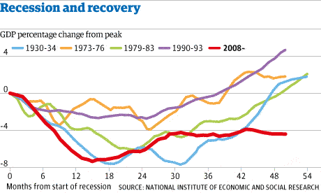

# Intro to Visualization

# Making Sense of a Data Set

Take a look at the following flight data.

We're only looking at 1/3 of this data set! Just looking at it in this form, it is hard to draw meaning from this data. Raw data contains a lot of information but isn't easily understandable!

## So What Is Data Visualization?

* An easy way to convey concepts from large data sets
* Charts, graphs, or illustrations
* Visualize large amounts of complex data

Because of the way the human brain processes information, charts or graphs that visualize large amounts of complex data are easier to understand than spreadsheets or reports.

## Criteria for Crafting a Good Visualization

Visualizations should follow three (plus one) rules. They should be:

1. Simplified
1. Easy to Interpret
1. Clearly Labeled
1. (Bonus) Interactive

---

# Chart Types

## How Do you Choose the Right Chart Type?

With so many chart types, it can be difficult to know how best to display your data.

When creating a visualization first think about the variables you are showing (words, categories, numbers, etc.), the volume of data, and the central point you are hoping to communicate.

## The Bar Chart

Bar charts are one of the most common ways of visualizing data. They make it easy to compare information, revealing highs and lows quickly.

Bar charts are most effective when you have numerical data that splits neatly into different categories.

Looking at this bar chart, what do you notice about this visualization?

(From: [https://fivethirtyeight.com/features/old-olympians-ride-horses-young-ones-do-flips/](https://fivethirtyeight.com/features/old-olympians-ride-horses-young-ones-do-flips/))

* What is happening with the ordering of the bars here? Why would the designer make that choice?
* How about the coloring? What do you notice about that?

### When to Use a Bar Chart

Bar charts are one of the most simple and frequently used chart types. They are useful for illustrating either one string or one numeric variable, quickly comparing information, or for show exact values.

When thinking about using a bar chart consider:

* Will you use vertical or horizontal bars?
* How will you number your axis (it is always best to start at zero)?
* How will you order your bars?

## The Pie Chart

Pie charts can be effective for proportions or percentages.

* Pie charts show the relationship of parts out of whole
* Why do they work well with proportions or percentages? Because those two types of information show the relationship of parts to a whole!

### When to Use the Pie Chart Type

Pie charts are commonly misused. They show a part-to-whole relationship, so they should be used to show the subdivision of these parts.

When thinking about using a pie chart, consider:

* The more variables you have, as in the more slices of your pie you'll have, the harder it is to read
* Area is _very_ difficult for the eye to read, so if any of your wedges are similarly sized think about a different chart type
* If you want to compare data, leave it to bars or stacked bars
* If your viewer has to work to translate pie wedges into relevant data or compare pie charts to one another, the key points you're trying to convey might go unnoticed!

## The Scatter Plot

This scatter plot uses a combination of text, coloring, and labelling to describe the data.

What is clear or unclear from this chart about the data set?

(From: [https://archive.nytimes.com/www.nytimes.com/interactive/2013/02/04/science/girls-lead-in-science-exam-but-not-in-the-united-states.html](https://archive.nytimes.com/www.nytimes.com/interactive/2013/02/04/science/girls-lead-in-science-exam-but-not-in-the-united-states.html))

* What is the midline doing here? How about the legend?

### When to Use a Scatter Plot

Scatter plots are a great way to give you a sense of trends, concentrations, and outliers, and are great to use while exploring your data. This will provide a clear idea of what you may want to investigate further.

When thinking about using a scatter plot consider:

* This chart type is not as common so can me more difficult for an audience to read
* If dots are covering up each other, consider a different chart type

## Exercise 1: Choosing a Chart

You need to chart annual sales in each state, for a grocery store chain. Which chart would you use?

* Bar chart
* Pie chart
* Scatter Plot
* Histogram

Answer

Bar Chart

## Histogram

* Histograms are useful when you want to see how your data are distributed across groups. 

### Bar Chart vs Histogram

**Important:** Histograms look similar to bar charts, but are not the same thing!

The main difference between a bar chart and histogram is that bar charts are used to compare **categorical** variables, while histograms are used to show a distribution of a **numerical** variable. 

* With bar charts, each column represents a group defined by a categorical variable
* With histograms, each column represents a group defined by a continuous, quantitative variable
* With a histogram, it can be appropriate to talk about the the tendency of the observations to fall more on the low end or the high end of the X axis.
* With bar charts, however, the X axis does not have a low end or a high end; because the labels on the X axis are *categorical* - not quantitative.
* When would you use a histogram? What about a bar chart?

## Exercise 2: Choosing a Chart

Given a population of 1000 people, what's their relationship of average income to education level?

* Bar chart
* Pie chart
* Scatter Plot
* Histogram

Answer

Scatter Plot

## The Line Chart

Line graphs are an excellent way to show change over time.

While bar charts can also show time, they don't show it in a *continuous* way, like a line chart.

### When to Use a Line Chart

Line charts are particularly good at showing how a variable change over time. They work best if you have one *date variable*, and one *number variable*.

When thinking about using a line chart consider:

* How many lines you'll need on your graph
  * The more overlapping lines there are, the harder your chart will be to read
* Consider how many colors you need to use for your lines.
  * Giving each line its own color forces the viewer to scan back and forth from the key to the graph
* Individual data points can be hard to read, but line charts are good for showing overall trends
* Similar to bar charts, try and start at 0 on your x axis unless you have a good reason not to

## Knowledge Check: Which type of chart?

Change in average income since 1960 for American adults?

* Bar chart
* Pie chart
* Scatter Plot
* Histogram
* Line chart

Answer

Line chart

---

# How to Choose the Right Chart

Check out [this series of charts](assets/series-of-charts.png)

* Which is easiest to view the data?
* It's subjective and depends on what you're trying to show! There are pros and cons to each.
* Choosing a chart type depends firstly on the data
* Secondly, it depends on the clearest way to convey your message
* The alignment of these two aspects will help you decide what type of visualization to use

## Visual Attributes of Good Data Visualization

Some attributes affect our brain more strongly.

In order of importance:

To learn more, take a look at [this article](http://mediashift.org/2016/02/checklist-does-your-data-visualization-say-what-you-think-it-says/), which talks about these visual attributes.

## Exploring Good Visualizations

Go to [https://www.reddit.com/r/dataisbeautiful/top/](https://www.reddit.com/r/dataisbeautiful/top/). These are all data visualizations created by people like you!

Pick one that you think is particularly good and one that is particular bad. Why is it good/bad?

---

# Charts & Code

There is an increasing array of libraries and tools to allow us to use code to create visualize data in compelling and approachable ways.

An understanding of chart types can help us become better at working with and displaying data using code.

Check out this complex chart that was made using Python.

*Source: u/dx034 on Reddit*

The next lesson is on Pandas and actually building some of these graphs!

---

# Summary

* The chart type you select should accurately represent the variables you are communicating in a way that is clearly readable for your audience
* Visual considerations include: position, color, order, size
* With data visualizations becoming increasingly popular, a clean and clear chart goes a long way in conveying a message from a data set

Now you know how to:

* Describe why data visualization is important for communicating results
* Identify how to select the correct visualization to use based on the data being presented
* Identify characteristics to clearly communicate through data visualizations

---

# Additional Resources

* A great short article on [when pie charts are better?](http://annkemery.com/pie-chart-guidelines/)
* [A gallery of charts](https://github.com/mbostock/d3/wiki/Gallery)
* [A Stats Video](https://www.youtube.com/watch?v=hVimVzgtD6w)
* [SAS: Data Viz](http://www.sas.com/en_us/insights/big-data/data-visualization.html)
* [A guide to when to use each chart](https://drive.google.com/file/d/0Bx2SHQGVqWasT1l4NWtLclJJcWM/view)
* [44 Types of Graphs](http://blog.visme.co/types-of-graphs/)
* [Advice on making good visualizations](https://www.gooddata.com/blog/8-ways-turn-good-data-great-visualizations)
* [Reddit's Data Is Beautiful Visualization Forum](http://reddit.com/r/dataisbeautiful)
