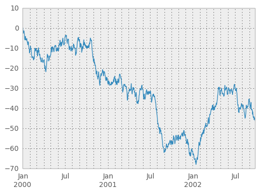

# Dates and Times in Pandas

## Learning Objectives

*After this lesson, you will be able to:*

* Handle time series data in Pandas
* Convert columns of dates and times into `Timestamp` objects using `to_datetime`
* Extract components, such as year and day, from a `Timestamp` object
* Create index of `Timestamp` objects, and understand their advantages as an index

---

# To the Notebook!

Let's proceed to the Jupyter Notebook for this lesson.

You can locate it inside your Kaggle account under <kbd>Code</kbd> :arrow_right: <kbd>Your Work</kbd> :arrow_right: <kbd>Shared With You</kbd>

You won't be able to make changes to that notebook (as it's the instructor's copy).

So, once you have it open, click the <kbd>Copy and Edit</kbd> button (upper right hand corner) to make a copy of the notebook, so that you can make changes to it!

<!--

```zsh
jupyter notebook datetime.ipynb
```

Below, we have included a review of the key concepts.

---

# How Do We Handle Time Series Data (Dates and Times)?

To handle time series data, we must:

* Import the data (usually as a string)
* Convert the data into a `Timestamp` object
* Handle missing values (sometimes)
* Understand how to slice and handle this `Timestamp` object

**Pro tip:** Time series information is very common in the financial industry (fintech/trading, etc).

## Why use Time Series Data?

**`Timestamp`** objects in pandas allow us to conduct analysis on _chronological data_.



* What's the X axis unit of this chart?
* What's the ordering of the data?
* Chronological data has an inherent order
* This is intuitive to a human, but a computer needs more help
* `Timestamp` objects handle things like leap years, working days, holidays, etc

## Converting to `Timestamp`

Let's take a look at the [`pandas.to_datetime` Documentation](https://pandas.pydata.org/pandas-docs/stable/reference/api/pandas.to_datetime.html)

The function signature is: 

```python
pandas.to_datetime(arg, errors='raise', dayfirst=False, yearfirst=False, utc=None, box=True, format=None, exact=True, unit=None, infer_datetime_format=False, origin='unix', cache=False)
```

and its job is to "Convert argument to datetime".

The basic way to use it:

1. Read in the dataset using `pd.read_csv()`
2. Use `pd.to_datetime(df['myColumn'])`
3. The returned `pd.Series` object will be converted to a `Timestamp` object!

## Things to Look Out For

**`to_datetime`** allows us to convert from string values to datetime values.

* Most of the time, it works very nicely
* At the end of the day, it's just a string parser
* Keep this in mind - always check the output column for `NaT` values
  * These are values that `pd.to_datetime` isn't able to convert
  * Make sure you have elegant, automated ways of handling/flagging these scenarios
  * One example may be a separate column flag, and a backfill/forwardfill strategy

## Why Does This Matter?

* Storing datetime information in a dataframe as a string:
  * Is very space inefficient
  * Doesn't allow us to easily _extract_ information from it (see 3NF image above)
  * Doesn't allow us to use linear algebra library (numpy!) advantages
    * _Note_: `Timestamp` (datetime) pandas objects are numpy objects!
  * A single `Timestamp` object allows _derivation_ of all other types (workdays, years, weeks, etc) - from a single object

-->
