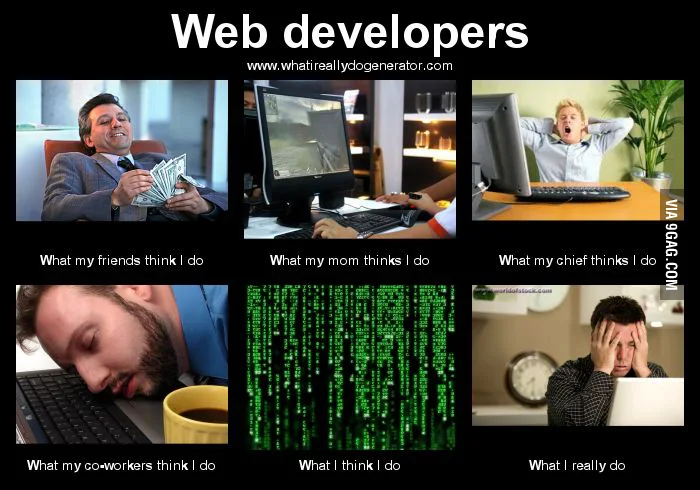

# Next Steps

## Lesson Objectives

*Today, we'll learn about:*

* Your possible next steps as a fledgling programmer

## Final Steps

You have 6 months of access to Github Enterprise... but you should not wait to archive the lesson materials. Don't wait!

* Download videos right away
   * That's a manual process -- click the :vhs: icon for each video and click <kbd>Download</kbd>
* Also, clone the `course-materials` repo, and you'll have a copy of all notes and code that was discussed during this course!

   ```
   git clone https://git.generalassemb.ly/PYTHR-2021-11/course-materials.git
   ```

   * **Protip:** You can view Markdown (`.md`) files in Visual Studio Code with the Preview button

## Celebrate

Reflect for a moment - you've:

* Learned the fundamentals of programming
   * Data types
   * Functions
   * Loops
   * Object oriented programming
   * File operations
   * Used your knowledge to build interactive programs
* Learned the basics of Web Development
   * Used and wrote simple web apps (API-based *and* HTML-based)
   * Understand the role of APIs in Web Development, from both the consumer side and producer side
   * Parse the complex data structures that are returned from APIs
   * Format an API request with query parameters
   * Find and use APIs to access specific types of data
   * Used Flask to handle HTTP requests
   * Implement index, show, create, update, and delete routes in API-based web applications
   * Implement index and show routes in HTML template-based web applications
* Learned the basics of Data Science
   * Use Pandas to explore data
   * Filter, sort, and group data to explore specific aspects of a data set
   * Clean a data set to deal with missing and nonstandard values
   * Create clear data visualizations to tell the story of a data set
   * Combine data from multiple sources into a single Data Frame
   * Synthesized insights from datasets

## Discussion: Introspection

* What part of the course did you enjoy the most?
* What did you find most intriguing?
* What caused the most struggle?

This isn't an all-frills exercise. It helps inform your future growth!

---

# So You Want to be a Data Scientist


## Data Science Core Skills

Data scientists need three core skills:

* **Coding Ability**
* **Mathematics and Statistics Proficiency**
* **Analytical Thinking**

### Coding Ability

We've started you down the road with coding ability! 

What you will need to continue to improve on over time:

* Can you write readable, maintainable, efficient code?
* Can you translate your ideas into programmatic thinking? (See Analytical Thinking below.)
* Continue to learn more Python
* Maybe pick up some SQL
* Other popular languages for Data Science: R & Scala

### Mathematics and Statistics Proficiency

You'll need a firm grasp of:

* Fundamental mathematics
   * Algebra
   * Calculus
   * Geometry
   * Trigonometry
   * Vectors
* [Linear Algebra](https://en.wikipedia.org/wiki/Linear_algebra)
   * Mathematics involving Matrixes -- grids of data
   * Remember the crazy [Transpose](https://en.wikipedia.org/wiki/Transpose) trick that we did in the Consumer Sales case study?
   * Consider taking a college 100/200 level "Intro to Linear Algebra" course
* [Probability & Statistics](https://en.wikipedia.org/wiki/Probability_and_statistics)
   * **This is the most important math to know for DS**
   * Consider taking a college 100/200 level "Intro to Statistics and Probability" course

An Example of a Statistics & Probability problem:

* You have a deck of cards:
   * There are 52 cards in a deck
   * 26 are red, and 26 are black. The 52 cards make up four suits (hearts, diamonds, spades, clubs)
   * There are 13 of each suit (ace-10, jack, queen, king)
   * It is a fair deck of cards

* What is the probability of drawing the 4 of spades OR a club?

   <details>
    <summary>Answer (SPOILER ALERT)</summary>

    The two separate probabilities are 1/52 and 13/52, and they're mutually exclusive, so you just add them: 14/52 ==> 7/26, or approximately 27%
   </details>

### Analytical Thinking

* Strong analytical thinking skills mean seeing beyond one issue at a time to develop a more cohesive view of a problem's complexity

* Can you break a big problem into manageable, component parts?

* How well can you structure a data science problem, to:
   * Target an analysis for high impact output? (Bang for the Buck)
   * Select metrics that align with those goals?

* Are you good at, or at least, enjoy:
   * Critical Thinking
      * Looking at a scenario and then formulating an understanding of how and why the problem exists
      * Ability to understand the full scope of a problem :arrow_right: key for developing an effective analysis
   * Curiosity
      * A curious nature and a desire to dig deeper to solve problems are key
   * Tenacity
      * Not all problems are straightforward, especially in the world of data science
      * Many challenges have multiple layers, each with their complex nature
   * Research
      * It is essential to be able to identify and use the most important data sets
      * The ability to uncover data through reputable sources is vital, making strong research skills an important trait for data scientists
   * Atttention to Detail
      * Data science involves analyzing and interpreting mountains of numbers and lots of small details
      * When handling large sets of data, it’s easy to overlook details that might be essential to success
      * Did anything jump out at you just now?

## Revisiting the Data Science Workflow

It's important to place our work into the broader picture of data science.

Let's recall our data science workflow:


### Another Way to Look at the Workflow

This is the same workflow just re-worded a bit:

1. **Identify** the problem
2. **Acquire** the right data
3. **Understand** the data (i.e. **Parse** the data)
4. **Mine** the data
5. **Refine** the data
6. **Build** a model
7. **Present** our work

### Where Have We Focused Our Work?

1. **Identify** the problem - **We did a bit**
   * Among various examples we identified the kind of problems and insights we'd like to get from the data
2. **Acquire** the right data - **We did a bit**
   * We **imported** data that was given to us in CSV files
   * In real life data won't just be handed to you, but at least you know that you can find data from [Kaggle](https://kaggle.com) and other places
3. **Understand** the data - **We did this!**
   * In many examples we used data dictionaries to understand the data contained in various columns
4. **Mine** the data - **We did this!** 
   * We did Exploratory Data Analysis to identify areas of interest in the data
5. **Refine** the data - **We did this!**
   * Among other techniques, we used `.map()` and `.apply()` to modify data like prices and color of products
6. ***Build** a model* - ???
7. **Present** our work - **We did a bit**
   * Maintaining clean Jupyter Notebooks (right?) and creating takeaway visualizations

***Whew***! We covered a lot of ground! Broadly, we call all of what we focused on **Exploratory Data Analysis** (EDA)

### Where We Didn't Focus

6. **Build** a model - **We never did this!**

<!--
> "Hey! I thought data science is Machine Learning Artificial Intelligence Neural Networks [on the Blockchain]!"
-->

In Data Science a **model** generally means:

* The digital representation of real data
* Can use it to predict new data
* Involves math and statistics heavily
* Might be constructed by a Machine Learning system
* Think about it conceptually like fitting a line to your data


(Image from: [Technology Networks](https://www.technologynetworks.com/informatics/articles/calculating-a-least-squares-regression-line-equation-example-explanation-310265))

```python
def estimated_grade(hours):
  if hours <= 0: return 0
  return min((8 * hours) + 20, 100)
```

(By the way, [here's how](https://stackoverflow.com/questions/37234163/how-to-add-a-line-of-best-fit-to-scatter-plot) to do a best-fit line in Pandas.)

Real models are of course a lot more complicated -- think about a multi-input equation that takes into account a house's address, square footage, # of bedrooms, # of bathrooms, age, etc., and uses that information (along with historical data) to forecast a price for that house.

## The Truth about Data Science (Shhhhh)

*Apologies in Advance for this One*


* EDA is typically **80%** of a data science problem
   * The steps you take to figure things out in EDA ultimately have a outsized impact on the result you will achieve
   * Many businesses are sitting on latent and rich ($$$) relationships in their data that a Pandas expert can unlock
   * In giving you an "Intro to Data Science" we focused on the area you can make the greatest impact right away
* Modeling is **20%**
   * There are more pre-requisites when it comes to modeling -- hence we do not focus on it in this Introduction to Data Science
   * Many companies will structure teams such that some individuals focus 100% of their time on this 20% of the problem (due to its specialized nature)

## What to Learn Next?

### Guided Instructions

You are now well-prepared to enter the General Assembly courses on Data Science:

* 10-week part-time data science (60hrs)
* Data Science Intensive, a full-time, three month program (480hrs)
   * Also available in "Flex" part-time format

Or you can look into self-paced and online programs at places like:

* DataCamp
* DataQuest
* Coursera

### Some Subjects to Look Into

#### Data Acquisition and Analysis

Python is an extremely flexible tool for data analysis needs, and can provide a level of depth and customization that can be difficult to impossible to achieve with non-programming technologies.

* Python Libraries of Note:
   * **SQLAlchemy** -
      * Python Database toolkit
      * For acquiring data from databases
   * **Requests** - **We did a bit!**
      * Making web requests -  calling APIs
      * For acquiring data from web APIs
   * **BeautifulSoup**
      * For acquiring data by scraping web pages and parsing HTML

However, a well-rounded Data Analyst can enhance their skills with other commonly used tools:

* SQL databases
* Tableau or Power BI for self-serve data dashboards and visualizations
* Excel for accessible, dynamic spreadsheets and workbooks

#### Data Visualization

Although we've used Pandas' basic plotting features, there's a lot more to learn in **matplotlib**. Consider the following aspects of data visualization:

* Modifying display properties to create dynamic, engaging visuals
* Explore the wide range of visualization types available
* Combine multiple charts in a single visualization
* Apply regression analysis to a data set to plot the line of best fit

* Python Libraries of Note:
   * **Seaborn**
      * Creates visualizations of greater complexity than Pandas
      * [Seaborn docs](https://seaborn.pydata.org/)

#### Data Engineering

Data science techniques like neural networks may get the spotlight, but models are only as reliable as the data they're given. Data Engineering is attracting more attention as the necessary foundation for effective, advanced data modeling. Data engineering involves deeper study of:

* Handling missing values in a data set
* Standardizing data formats and values between multiple sources
* Feature engineering to create more robust data sets

* Python Libraries of Note:
   * **NumPy**
      * Numerical computation, particularly linear algebra
   * **Statsmodels:**
      * Traditional statistic inference techniques, like linear regression

#### Data Modelling

Although advanced data science requires more statistics and mathematical foundations, there are a large collection of Python libraries that make complex data modeling accessible to anyone comfortable learning new Python libraries.

* Python Libraries of Note:
   * **SciPy**
      * SciPy is built on top of NumPy and imports many numpy functions
      * Aimed at scientists/engineers with more rigorous theoretical mathematics, especially statistics
      * Using SciPy is a bit overkill when you only need NumPy
      * [NumPy vs SciPy](https://www.freelancinggig.com/blog/2018/12/09/what-is-the-difference-between-numpy-and-scipy/)
      * From the SciPy docs: [FAQ on NumPy and SciPy](https://www.scipy.org/scipylib/faq.html)
   * **Keras**
      * Python interface for artificial neural networks. 
   * **SciKit-Learn:**
      * All-purpose machine learning model construction
   * **PyTorch** | **TensorFlow** | **MxNet**
      * Neural network research and model construction

#### Basic Web Development

* HTML & CSS: very useful for Data Scientists, so you can produce web pages that normal people can view
* Javascript
   * Useful for embedding visualizations into your web pages
   * [D3](https://d3js.org/) is a good Javascript library to try out
   * [D3 Examples](https://observablehq.com/@d3/gallery)

---

# So You Want to be a Web Developer

You now know the basic ideas behind web developement! There's still a lot of blanks to fill in, but you're now well-positioned to continue your studies.

You've learned the difference between "web sites", built simply with HTML, which present static information (like a restaurant's site, for example), and "web apps", which layers on a programming language like Python in order to presents dynamic information. On a web app, the information on that page can be different a few minutes from now, like the [Toronto Star](https://thestar.com) (my hometown paper).

Web Developers can be roughly grouped into the following types:

* Front End
   * More design/user-interation focused
   * HTML
   * CSS - To make your pages look good
   * Javascript - To create dynamic web pages with movement and animation
* Back End
   * More process/data focused
   * Python, PHP, Java, Ruby, etc
   * Javascript on the backend with Node
   * Databases
      * SQL: Postgres, MySQL
      * NoSQL: MongoDB
* Full-Stack
   * Basically a Jack of all trades
   * As a beginner, you have to learn a little about both the front- and back-end anyway

## The Truth about Web Development (Shhhhh)

*Apologies in Advance for this One...* [Source](https://9gag.com/gag/2828244)



The truth is far simpler: If you want to be a web developer, what you are in for is **constant and lifelong learning**.

## What to Learn Next?

### Guided Instructions

You are now well-prepared to enter the General Assembly courses on Web Development:

* Start Here: 10-week part-time Front End Web Development (60hrs)
* Sequel 1: 10-week part-time Javascript Development (60hrs)
* Sequel 2: 10-week part-time React Development (40hrs)
* Software Engineering Intensive: Full-time, three month program (480hrs)
   * Also available in "Flex" part-time format

Or you can look into self-paced and online programs on sites like Udemy, EdX, etc!

### Some Subjects to Look Into

#### Front-End Web Development

We got a crash course in HTML to understand the concept of templates and creating a user interface, but there's a lot more to learn before we can create attractive, user-friendly web applications:

* HTML Forms to create POST/PUT/PATCH requests from a user-friendly web page (instead of a tool like Insomnia)
* CSS and CSS Frameworks to style applications
   * Bootstrap
   * Materialize
   * Tailwind
* JavaScript to create dynamic web pages that respond to user actions
* Much down the road eventually learn advanced Javascript using popular libraries like React, Vue, or Angular

#### Persistent Data Storage

While `.csv` files provide a convenient, accessible way to store information, they're no substitute for a properly managed, permanent database such as a SQL database.

Consider the following next-steps when you build Flask applications:

* Use a relational database that connects tables together with SQL, like Postgres or MySQL
* Connect with these databases using a library such as SQLAlchemy
* Access cloud-based data storage solutions
* Implement Users with encrypted passwords and access restrictions (quite advanced)
* Utilize sessions to allow users to log-in and maintain application state (quite advanced)
* Later down the road learn about NoSQL type of databases like MongoDB

#### Opinionated Web Development Frameworks

Once you understand the concepts of CRUD operations and RESTful routes, you'll begin to notice that most web applications follow similar patterns, as all web apps basically serve similar needs. 

Flask is a very do-it-yourself library that requires us to set up all the routing and CRUD operations ourselves, while Django is a popular alternative with plug-and-play solutions for these common needs, and is suitable for creating very large commercial-grade applications.

The Djangobook.com and official Django documentation are great sources to start learning to create web apps the Django way.

#### Intermediate API Development

The Flask API apps that we created aren't nearly as complex or customizable as the APIs we encounter in the wild. Think about how you would add the following features to your Flask APIs:

* Query parameters to help filter and search for results
* Implement API keys (stored in a database) to restrict and monitor requests
* Paginate index results instead of dumping the entire collection at once

---

# So You Don't Want to be a Data Scientist or a Web Developer

What kind of other programmers/developers are there?

* Mobile Development
   * iOS (Swift, Objective-C, others)
   * Android (Java, Kotlin, others)
   * Javascript & React Native
      * Will also need to know the basics of HTML/CSS
* Game Development
   * Pygame! ([Games made with PyGame](https://itch.io/games/made-with-pygame))
      * [Creating a Zelda style game in Python](https://www.youtube.com/watch?v=QU1pPzEGrqw) - 7.5 hr Youtube tutorial
   * C/C++
   * Computer Graphics
      * Requires knowlege of at least Linear Algebra, Calculus, and Physics!
* Desktop Development
   * Windows Applications
      * C#/C++
      * [Write your first Windows 10 application](https://docs.microsoft.com/en-us/learn/modules/write-your-first-windows10-app/)
   * Mac Applications
      * Swift (for macOS and iOS)
* System Administration
   * If you like messing around with automating workloads/installing stuff/networking
   * Shell scripts (`bash`/`zsh`)
   * Ruby/Python/Perl scripts
   * "DevOps" with Chef/Puppet/Ansible/Docker/Kubernetes
   * Working in the "Cloud"
* Scientific/Engineering Development/Embedded Software
   * Will require deeper domain knowledge, may involve getting a degree
   * Python/C/C++/Matlab/Mathematica

Some of the best programmers around are completely self-taught. Don't be intimidated! It might take lots of time and study, but it's doable if you have a burning desire and curiosity.

> Do not get married to a specific language or framework/platform -- learn different stuff to see how everything influences each other!

---

# How to Learn?

There's an abundance of resources, which can seem overwhelming, but it's actually a huge benefit.

* Consume relevant content about what you want to learn (courses, videos, books, etc)
* Learn by doing
   * Learning requires consuming and producing. (Probably most effectively in 50/50 balance)
   * Identify a singular learning goal & pair learning with an immediate project (perhaps with the assistance of your employer)
   * Have frequent **projects** and **exercises** to practice
   * Make mistakes (seriously!)
   * You now easily do your own Data analysis project! Take a look at a [COVID data set](https://www.kaggle.com/imdevskp/corona-virus-report), or do an analysis for a friend who likes [Board Games](https://www.kaggle.com/gabrio/board-games-dataset) or [Pokemon](https://www.kaggle.com/abcsds/pokemon), for example!
* Attend Meetups, Hackathons, and other networking opportunities to learn, meet, and share
* Share with your network
   * Keep your friends and coworkers engaged on what you're doing and learning
   * Opportunities are sometimes spurious - luck favours the prepared!
* If there's a lack of discipline and support when learning:
   * Work together in study groups
* Be active on Github
   * I mean the global github.com, not the GA one we used in this course
   * Monitor repos of interest
   * Contribute to discussions on issues
* Contribute to Open Source!
   * If you find a bug, you can fix it and submit a **Pull Request** on Github
   * You can also contribute to documentation!
* Start a blog
   * Blogs are very common in technology circles
   * They demonstrate your learning process
   * They help you retain information
* Be entrepreneurial!
   * Don't need to have *permission from anybody* to create

---

# Next Up: Graduation!

:mortar_board: